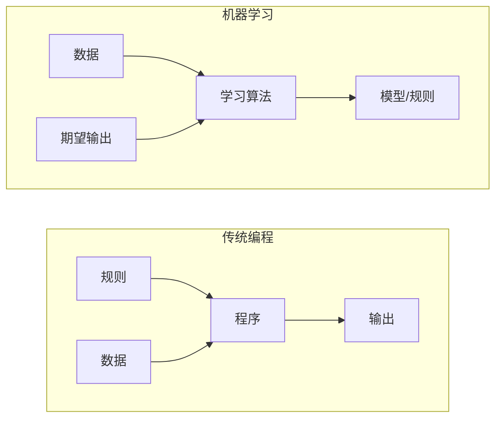
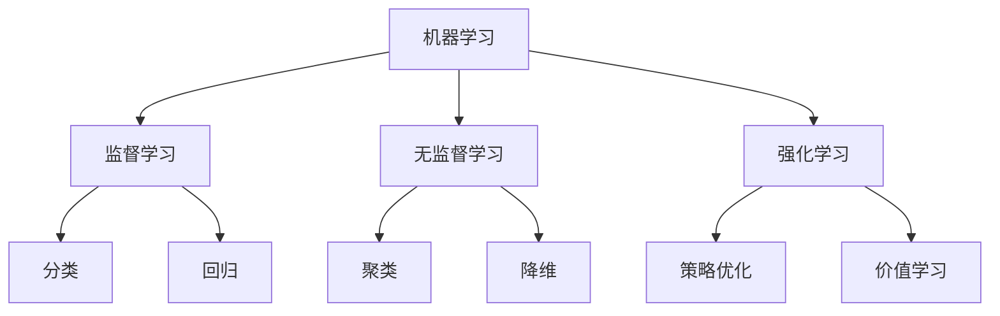
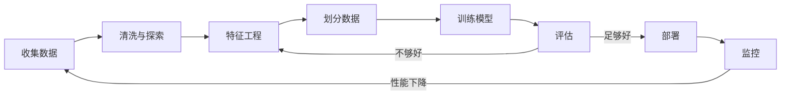
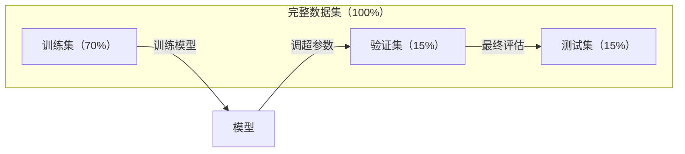
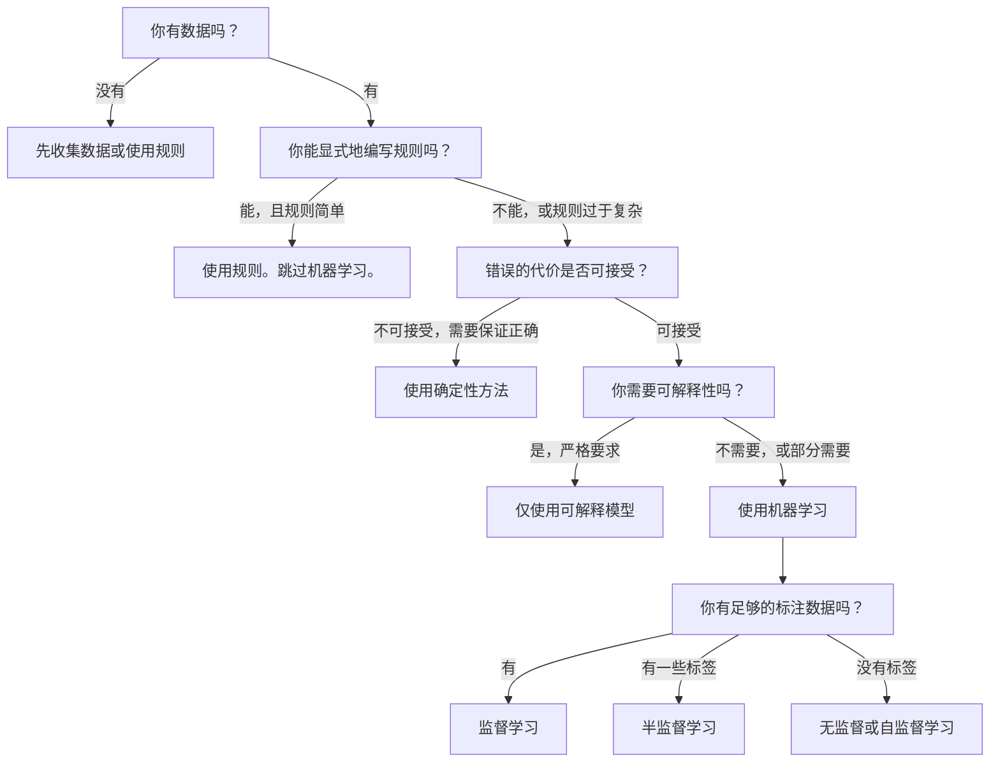

# 什么是机器学习

> 机器学习是教计算机从数据中发现模式，而不是手工编写规则。

**类型：** 学习
**语言：** Python
**前置条件：** 第一阶段（数学基础）
**时间：** 约 45 分钟

## 学习目标

- 解释监督学习、无监督学习和强化学习之间的区别，并识别给定问题适用于哪种类型
- 从零实现一个最近质心分类器，并与随机基线进行对比评估
- 区分分类和回归任务，并为每种任务选择合适的损失函数
- 评估给定的业务问题是否适合使用机器学习，还是更适合用确定性规则解决

## 问题

你想构建一个垃圾邮件过滤器。传统做法：坐下来编写数百条规则。"如果邮件包含'免费赢钱'，标记为垃圾邮件。如果感叹号超过3个，标记为垃圾邮件。"你花了几周时间编写规则。然后垃圾邮件发送者改变了措辞。你的规则失效了。你又编写更多规则。这个循环永无止境。

机器学习颠覆了这种做法。你不再编写规则，而是给计算机提供数千封已标注的邮件（"垃圾邮件"或"非垃圾邮件"），让它自行找出规则。计算机能找到你从未想到的模式。当垃圾邮件发送者改变策略时，你只需要用新数据重新训练，而不是重写代码。

从"编写规则"到"从数据中学习"的转变，是机器学习的核心。每一个推荐引擎、语音助手、自动驾驶汽车和语言模型都是这样工作的。

## 概念

### 从数据中学习，而非从规则中学习

传统编程和机器学习以相反的方向解决问题。



传统编程：你编写规则。程序将规则应用到数据上产生输出。

机器学习：你提供数据和期望的输出。算法从中发现规则。

训练得到的"模型"本身就是规则，以数字（权重、参数）的形式编码。它从见过的样本中泛化，对从未见过的数据做出预测。

### 机器学习的三种类型



**监督学习**：你拥有输入-输出对。模型学习将输入映射到输出。
- "这里有 10,000 张标记为猫或狗的照片。学会区分它们。"
- "这里有房屋特征和价格。学会预测价格。"

**无监督学习**：你只有输入，没有标签。模型自行发现结构。
- "这里有 10,000 条客户购买记录。找出自然的分组。"
- "这里有 1,000 维的数据点。在保留结构的前提下降维到 2 维。"

**强化学习**：智能体在环境中采取行动，并接收奖励或惩罚。它学习一种最大化总奖励的策略。
- "玩这个游戏。赢 +1，输 -1。找出制胜策略。"
- "控制这个机器臂。捡起物体 +1，每秒浪费 -0.01。"

你在实践中构建的大多数内容都使用监督学习。无监督学习常用于预处理和数据探索。强化学习支撑着游戏 AI、机器人以及语言模型中的 RLHF。

### 三大类型之外

以上三类区分清晰，但真实世界中的机器学习往往是交叉的。

**半监督学习**使用少量有标注数据和大量无标注数据。你可能只有 100 张标注的医学影像和 100,000 张未标注的。技术包括：

- **标签传播：** 构建相似数据点之间的图。标签通过图从已标注节点传播到未标注邻居。
- **伪标签法：** 先在标注数据上训练模型，用模型预测未标注数据的标签，然后在全部数据上重新训练。模型自己引导生成训练集。
- **一致性正则化：** 模型对输入及该输入的轻微扰动版本应给出相同的预测。即使没有标签，这种方法也有效。

**自监督学习**从数据本身创建监督信号，完全不需要人工标签。模型从数据的结构中为自己创建预测任务。

- **掩码语言建模（BERT）：** 隐藏句子中 15% 的词语，训练模型预测缺失的词。"标签"来自原始文本本身。
- **对比学习（SimCLR）：** 取一张图片，创建两个增强版本。训练模型识别它们来自同一张图片，同时将它们与其他图片的增强版本区分开来。
- **下一词预测（GPT）：** 给定所有前面的词，预测下一个词。每份文本文档都成为一个训练样本。

这些并非独立于三大类别之外的分类，而是结合了监督和无监督思想的策略。自监督学习在技术上是监督学习（模型需要预测某些东西），但标签是自动生成的，而非人工标注。

### 分类 vs 回归

这是监督学习的两个主要任务。

| 方面 | 分类 | 回归 |
|--------|---------------|------------|
| 输出 | 离散类别 | 连续数值 |
| 示例 | "这封邮件是垃圾邮件吗？" | "房价是多少？" |
| 输出空间 | {猫, 狗, 鸟} | 任意实数 |
| 损失函数 | 交叉熵、准确率 | 均方误差、MAE |
| 决策方式 | 类别之间的边界 | 拟合数据的曲线 |

分类回答"属于哪一类？"回归回答"有多少？"

有些问题可以两种方式建模。预测股票涨跌是分类，预测具体价格是回归。

### 机器学习工作流

每个机器学习项目都遵循相同的流程，无论使用什么算法。



**收集数据**：获取原始数据。数据越多几乎总是越好，但质量比数量更重要。

**清洗与探索**：处理缺失值、删除重复项、可视化分布、发现异常。这一步通常占总项目时间的 60-80%。

**特征工程**：将原始数据转换为模型可以使用的特征。将日期转换为星期几，对数值列进行归一化，对分类变量编码。好的特征比复杂的算法更重要。

**划分数据**：划分为训练集、验证集和测试集。模型在训练数据上学习，你在验证数据上调超参数，在测试数据上报告最终性能。

**训练模型**：将训练数据馈入算法。算法调整内部参数以最小化损失函数。

**评估**：在验证/测试数据上衡量性能。如果性能不可接受，回到前面尝试不同的特征、算法或超参数。

**部署**：将模型投入生产，在新数据上做出预测。

**监控**：跟踪长期性能。数据分布会变化（数据漂移），模型会退化。当性能下降时，重新训练。

### 训练集、验证集和测试集划分

这是初学者最常犯错误的一个重要概念。你必须用模型在训练中从未见过的数据来评估它，否则你衡量的只是记忆，而不是学习。



| 划分 | 用途 | 使用时机 | 典型大小 |
|-------|---------|-----------|-------------|
| 训练集 | 模型从此数据中学习 | 训练期间 | 60-80% |
| 验证集 | 调超参数、比较模型 | 每次训练运行后 | 10-20% |
| 测试集 | 最终无偏性能估计 | 仅一次，在最后 | 10-20% |

测试集是神圣的。你只能看一次。如果你不断根据测试集表现调整模型，你实际上是在用测试集进行训练，你的报告数字就毫无意义了。

对于小数据集，使用 k 折交叉验证：将数据分成 k 份，在 k-1 份上训练，在剩余的一份上验证，轮换并取平均结果。

### 过拟合 vs 欠拟合


**欠拟合**：模型过于简单，无法捕捉数据中的模式。用一条直线去拟合曲线关系。训练误差高，测试误差高。

**过拟合**：模型过于复杂，记住了训练数据，包括其中的噪声。一条扭来扭去的曲线穿过每个训练点，但对新数据无效。训练误差低，测试误差高。

**良好拟合**：模型捕捉到真实模式，而不记忆噪声。训练误差和测试误差都在合理范围内且较低。

过拟合的迹象：
- 训练准确率远高于验证准确率
- 模型在训练数据上表现良好，但在新数据上表现不佳
- 增加训练数据能提升性能（说明模型之前是在记忆，而非学习）

过拟合的解决方法：
- 获取更多训练数据
- 降低模型复杂度（更少的参数、更简单的架构）
- 正则化（对大权重施加惩罚）
- Dropout（训练期间随机将神经元输出置零）
- 早停法（当验证误差开始上升时停止训练）

欠拟合的解决方法：
- 使用更复杂的模型
- 添加更多特征
- 减少正则化
- 训练更长时间

### 偏差-方差权衡

这是过拟合与欠拟合背后的数学框架。

**偏差**：来自模型中错误假设的误差。当真实关系是非线性时，线性模型具有高偏差。高偏差导致欠拟合。

**方差**：来自对训练数据中小波动的敏感性的误差。高方差的模型在不同数据子集上训练时会给出非常不同的预测。高方差导致过拟合。

| 模型复杂度 | 偏差 | 方差 | 结果 |
|-----------------|------|----------|--------|
| 过低（用线性模型拟合曲线数据） | 高 | 低 | 欠拟合 |
| 恰好 | 中等 | 中等 | 良好泛化 |
| 过高（用 20 次多项式拟合 10 个点） | 低 | 高 | 过拟合 |

总误差 = 偏差^2 + 方差 + 不可约噪声

你无法减少不可约噪声（它是数据本身的随机性）。你希望找到偏差^2 + 方差最小化的最佳平衡点。

### 没有免费午餐定理

没有一个算法能对所有问题都表现最佳。在一个问题类别上表现好的算法，在另一个类别上可能表现很差。这就是为什么数据科学家会尝试多种算法并比较结果。

在实践中，选择取决于：
- 你有多少数据
- 有多少特征
- 关系是线性的还是非线性的
- 你是否需要可解释性
- 你能负担多少计算资源

### 何时不应使用机器学习

机器学习功能强大，但并非总是正确的工具。在伸手拿模型之前，先问问自己是否真的需要它。

**在以下情况下不应使用机器学习：**

- **规则简单且定义明确。** 税务计算、排序算法、单位换算。如果你能用几个 if 语句写出逻辑，加上模型只会增加复杂度而无益处。
- **没有数据或数据极少。** 机器学习需要示例来学习。只有 10 个数据点，你训练不出任何有意义的东西。先收集数据。
- **出错的代价是灾难性的，且你需要确保正确性。** 医疗剂量计算、核反应堆控制、密码学验证。机器学习模型是概率性的，它们有时会出错。如果"偶尔错误"不可接受，请使用确定性方法。
- **查表或启发式方法已能解决问题。** 如果一个简单的阈值或表格能覆盖 99% 的情况，加机器学习只会增加维护成本而无实质改进。
- **你无法解释决策，而可解释性是必需的。** 受监管行业（贷款、保险、刑事司法）有时要求每个决策都必须完全可解释。有些机器学习模型是可解释的（线性回归、小型决策树），但大多数不是。
- **问题的变化速度比你重新训练的速度更快。** 如果规则每天都在变，而重新训练需要一周，那么模型永远都是过时的。

使用这个决策流程图：



## 动手实现

`code/ml_intro.py` 中的代码从零实现了一个最近质心分类器，这是最简单的机器学习算法。它展示了核心思想：从数据中学习，然后用它对新的数据进行预测。

### 步骤 1：从零实现最近质心分类器

最近质心分类器计算训练数据中每个类别的中心（均值）。预测时，它将每个新点分配给中心最近的类别。

```python
class NearestCentroid:
    def fit(self, X, y):
        self.classes = np.unique(y)
        self.centroids = np.array([
            X[y == c].mean(axis=0) for c in self.classes
        ])

    def predict(self, X):
        distances = np.array([
            np.sqrt(((X - c) ** 2).sum(axis=1))
            for c in self.centroids
        ])
        return self.classes[distances.argmin(axis=0)]
```

这就是整个算法。`fit` 计算两个均值，`predict` 计算距离。没有梯度下降，没有迭代，没有超参数。

### 步骤 2：在合成数据上训练

我们生成一个二维分类数据集，包含两个略微重叠的类别。质心分类器在类别中心之间画出一条线性决策边界。

```python
rng = np.random.RandomState(42)
X_class0 = rng.randn(100, 2) + np.array([1.0, 1.0])
X_class1 = rng.randn(100, 2) + np.array([-1.0, -1.0])
X = np.vstack([X_class0, X_class1])
y = np.array([0] * 100 + [1] * 100)
```

### 步骤 3：与基线对比

每个机器学习模型都应该与一个简单的基线对比。这里的基线预测是随机猜测类别。如果你的机器学习模型不能打败随机猜测，那一定是哪里出了问题。

```python
baseline_preds = rng.choice([0, 1], size=len(y_test))
baseline_acc = np.mean(baseline_preds == y_test)
```

在这个干净的数据集上，质心分类器应该能达到约 90%+ 的准确率。随机基线大约为 50%。

### 这为什么重要

最近质心分类器极其简单。它没有超参数，没有迭代，没有梯度下降。然而它捕捉到了机器学习的根本模式：

1. **从**训练数据中**学习**一个表示（质心）
2. 用那个表示对新数据进行**预测**（最近距离）
3. 与基线对比进行**评估**（随机猜测）

每个机器学习算法，从逻辑回归到 Transformer，都遵循同样的三步模式。表示变得更复杂，但工作流程不变。

### 步骤 4：质心分类器的局限性

最近质心分类器假设每个类别形成一个单一的团簇。它画出的决策边界是线性的。以下情况会失败：

- 类别有多个簇群（例如，数字"1"可以以多种不同方式书写）
- 决策边界是非线性的（例如，一个类别包围另一个类别）
- 特征的量纲差异很大（距离会被量纲最大的特征主导）

这些局限性正是驱动你学习其他每种算法的动力。K 近邻算法能处理多个簇群，决策树能处理非线性边界，特征缩放解决量纲问题。每一课都建立在前一课的局限性之上。

## 使用它

scikit-learn 提供了 `NearestCentroid` 和合成数据生成器：

```python
from sklearn.neighbors import NearestCentroid
from sklearn.datasets import make_classification
from sklearn.model_selection import train_test_split

X, y = make_classification(
    n_samples=500, n_features=2, n_redundant=0,
    n_clusters_per_class=1, random_state=42
)
X_train, X_test, y_train, y_test = train_test_split(X, y, test_size=0.3)

clf = NearestCentroid()
clf.fit(X_train, y_train)
print(f"Accuracy: {clf.score(X_test, y_test):.3f}")
```

## 交付成果

本课程生成 `outputs/prompt-ml-problem-framer.md` —— 一个将模糊的业务问题转化为具体机器学习任务的提示词。给它一个问题描述（"我们想减少客户流失"或"预测下个季度的需求"），它会识别学习类型、定义预测目标、列出候选特征、选择成功指标、建立基线，并标记潜在陷阱，如数据泄露或类别不平衡。在任何机器学习项目开始时使用它，避免做出错误的设计。

## 关键术语

| 术语 | 人们怎么说 | 它实际是什么意思 |
|------|----------------|----------------------|
| 模型 | "这个 AI" | 一个带有可学习参数、将输入映射到输出的数学函数 |
| 训练 | "教 AI" | 运行优化算法来调整模型参数，使预测结果与已知输出匹配 |
| 特征 | "输入列" | 数据中一个可衡量的属性，模型用它来做预测 |
| 标签 | "答案" | 训练样本的已知输出，用于计算误差信号 |
| 超参数 | "可调整的设置" | 训练前设定的、控制学习过程的参数（学习率、层数） |
| 损失函数 | "模型有多错" | 衡量预测输出与实际输出之间差距的函数，训练的目标是最小化它 |
| 过拟合 | "它把试卷背下来了" | 模型学到了训练数据特有的噪声，而非通用模式，因此在新数据上失效 |
| 欠拟合 | "它根本没学到东西" | 模型过于简单，无法捕捉数据中的真实模式 |
| 泛化 | "它在新数据上也能用" | 模型对未在训练中出现过的数据做出准确预测的能力 |
| 交叉验证 | "在不同分块上测试" | 反复将数据分成训练/测试折并取平均结果，得到更稳健的性能估计 |
| 正则化 | "让权重保持较小" | 在损失函数中添加惩罚项，阻止模型过于复杂 |
| 数据漂移 | "世界变了" | 输入数据的统计分布随时间变化，导致模型性能下降 |

## 练习

1. 取任意数据集（如 Iris、Titanic），按 70/15/15 划分为训练/验证/测试集。解释为什么不应该在测试集上调超参数。
2. 列出三个真实世界的问题。对每个问题，判断是分类、回归还是聚类，是监督还是无监督。
3. 一个模型在训练数据上达到 99% 准确率，但在测试数据上只有 60%。诊断问题并列出三种可能的修复方法。

## 延伸阅读

- [An Introduction to Statistical Learning](https://www.statlearning.com/) - 免费的教材，涵盖所有经典机器学习方法及实用示例
- [Google 的机器学习速成课程](https://developers.google.com/machine-learning/crash-course) - 简洁直观的机器学习概念入门
- [Scikit-learn 用户指南](https://scikit-learn.org/stable/user_guide.html) - 在 Python 中实现机器学习的实用参考
