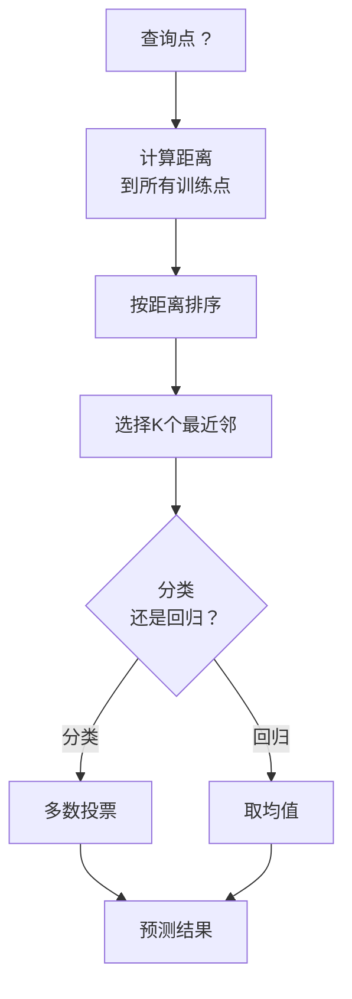
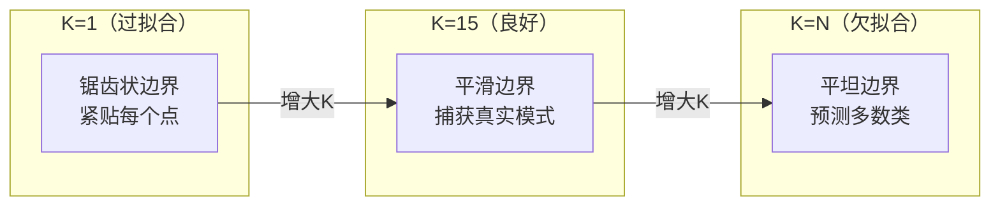
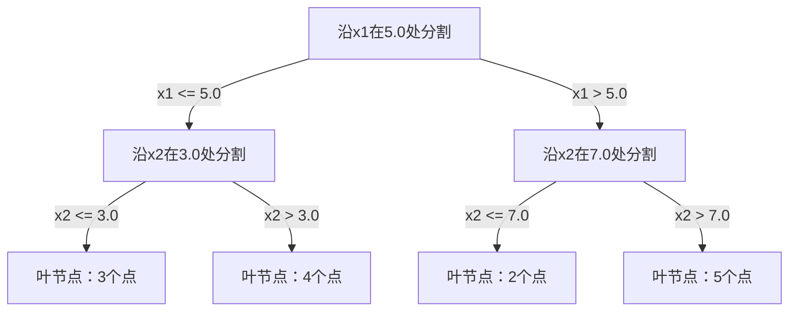

# K-最近邻与距离度量

> 存储一切。通过观察邻居来预测。最简单但确实有效的算法。

**类型：** 构建
**语言：** Python
**前置条件：** 第一阶段（第14课 范数与距离）
**时间：** 约90分钟

## 学习目标

- 从零实现KNN分类和回归，支持可配置的K值和距离加权投票
- 比较L1、L2、余弦距离和闵可夫斯基距离度量，并为给定的数据类型选择合适的度量
- 解释维度灾难，并演示为什么KNN在高维空间中性能下降
- 构建KD树以实现高效的最近邻搜索，并分析它在什么情况下优于暴力搜索

## 问题描述

你有一个数据集。一个新的数据点到达了。你需要对它进行分类或预测其值。与其从数据中学习参数（像线性回归或SVM那样），你只需找到训练集中离新点最近的K个点，让它们投票。

这就是K-最近邻。没有训练阶段。没有需要学习的参数。没有需要最小化的损失函数。你只需要存储整个训练集，在预测时计算距离。

这听起来太简单了，不像能工作的样子。但KNN在许多问题上出奇地具有竞争力，尤其是中小规模数据集，深入理解它还能揭示一些基本概念：距离度量的选择（连接第一阶段第14课）、维度灾难，以及惰性学习与急切学习的区别。

KNN在现代AI中也随处可见，只是换了个名字。向量数据库对嵌入向量进行KNN搜索。检索增强生成（RAG）找到K个最近的文档块。推荐系统找到相似的用户或物品。算法是一样的，只是规模和数据结构不同。

## 概念讲解

### KNN的工作原理

给定一个有标签的数据点集合和一个新的查询点：

1. 计算查询点到数据集中每个点的距离
2. 按距离排序
3. 取K个最近的点
4. 对于分类：K个邻居中的多数投票
5. 对于回归：K个邻居值的平均（或加权平均）



这就是整个算法。不需要拟合。不需要梯度下降。不需要训练轮次。

### 选择K值

K是唯一的超参数。它控制偏差-方差权衡：

| K值 | 行为 |
|---|------|
| K = 1 | 决策边界紧贴每个点。零训练误差。高方差。过拟合 |
| 小K值 (3-5) | 对局部结构敏感。能捕获复杂边界 |
| 大K值 | 边界更平滑。对噪声更鲁棒。可能欠拟合 |
| K = N | 对所有点都预测多数类。最大偏差 |

对于N个点的数据集，常见的起点是 K = sqrt(N)。对于二分类，使用奇数K以避免平票。



### 距离度量

距离函数定义了什么是"近"。不同的度量产生不同的邻居，进而产生不同的预测。

**L2（欧几里得距离）** 是默认选择。直线距离。

```
d(a, b) = sqrt(sum((a_i - b_i)^2))
```

对特征尺度敏感。在使用L2与KNN之前，始终对特征进行标准化。

**L1（曼哈顿距离）** 对绝对差求和。比L2更鲁棒，因为它不对差值平方。

```
d(a, b) = sum(|a_i - b_i|)
```

**余弦距离** 衡量向量之间的角度，忽略大小。对于文本和嵌入数据至关重要。

```
d(a, b) = 1 - (a · b) / (||a|| * ||b||)
```

**闵可夫斯基距离** 用参数p泛化了L1和L2。

```
d(a, b) = (sum(|a_i - b_i|^p))^(1/p)

p=1: 曼哈顿距离
p=2: 欧几里得距离
p->inf: 切比雪夫距离（最大绝对差）
```

根据数据类型选择度量：

| 数据类型 | 最佳度量 | 原因 |
|-----------|------------|-----|
| 数值特征，尺度相似 | L2（欧几里得） | 默认选择，适用于空间数据 |
| 数值特征，有离群值 | L1（曼哈顿） | 鲁棒，不放大较大差异 |
| 文本嵌入 | 余弦距离 | 模长是噪声，方向才是含义 |
| 高维稀疏数据 | 余弦或L1 | L2受维度灾难影响 |
| 混合类型 | 自定义距离 | 按特征类型组合不同度量 |

### 加权KNN

标准KNN对所有K个邻居给予相同权重。但距离为0.1的邻居应该比距离为5.0的邻居更重要。

**距离加权KNN** 按距离的倒数对每个邻居进行加权：

```
weight_i = 1 / (distance_i + epsilon)

对于分类：加权投票
对于回归：    加权平均 = sum(w_i * y_i) / sum(w_i)
```

epsilon防止查询点与训练点完全匹配时出现除以零的情况。

加权KNN对K值的选择不那么敏感，因为远距离邻居的贡献无论如何都非常小。

### 维度灾难

KNN在高维空间中性能下降。这不是一个模糊的担忧，而是一个数学事实。

**问题1：距离趋于相等。** 随着维度增加，最大距离与最小距离的比值趋近于1。所有点与查询点都变得同样"远"。

```
在d维中，对于随机均匀分布的点：

d=2:    max_dist / min_dist = 差异很大
d=100:  max_dist / min_dist ~ 1.01
d=1000: max_dist / min_dist ~ 1.001

当所有距离几乎相等时，"最近"就失去了意义。
```

**问题2：体积爆炸。** 要在数据的一个固定比例内捕获K个邻居，你需要将搜索半径扩展到覆盖特征空间的更大比例。高维空间中的"邻域"包含了空间的大部分。

**问题3：角落主导。** 在d维的单位超立方体中，大部分体积集中在角落附近，而不是中心。内切于立方体的球体包含的体积占比随着d的增长趋近于零。

实践中的影响：KNN在最多约20-50个特征时表现良好。超过这个范围，你需要在应用KNN之前进行降维（PCA、UMAP、t-SNE），或者使用利用数据内在低维性的树搜索结构。

### KD树：快速最近邻搜索

暴力KNN计算查询点到每个训练点的距离。每个查询的复杂度是O(n * d)。对于大数据集，这太慢了。

KD树递归地沿特征轴划分空间。在每一层，它沿一个维度在中位数值处进行分割。



要找到最近邻，遍历树到包含查询点的叶节点，然后回溯并检查相邻分区，仅当它们可能包含更近的点时才检查。

平均查询时间：对于低维数据为O(log n)。但KD树在高维（d > 20）时会退化到O(n)，因为回溯时剪枝的分支越来越少。

### 球树：在中维空间中更好

球树将数据划分为嵌套的超球体，而不是轴对齐的矩形框。每个节点定义一个球（中心 + 半径），包含该子树中的所有点。

相比KD树的优势：
- 在中维空间中表现更好（最多约50维）
- 处理非轴对齐结构
- 更紧凑的包围体积意味着搜索中更多分支被剪枝

KD树和球树都是精确算法。对于真正大规模搜索（数百万个点，数百维），需要使用近似最近邻方法（HNSW、IVF、乘积量化）。这些在第一阶段第14课中介绍。

### 惰性学习 vs 急切学习

KNN是一个惰性学习器：训练时不做事，预测时做所有工作。大多数其他算法（线性回归、SVM、神经网络）是急切学习器：它们在训练时进行大量计算以构建紧凑模型，然后预测很快。

| 方面 | 惰性（KNN） | 急切（SVM、神经网络） |
|--------|------------|------------------------|
| 训练时间 | O(1) 仅存储数据 | O(n * epochs) |
| 预测时间 | O(n * d) 每个查询 | O(d) 或 O(参数量) |
| 预测时内存 | 存储整个训练集 | 仅存储模型参数 |
| 适应新数据 | 即时添加点 | 重新训练模型 |
| 决策边界 | 隐式，即时计算 | 显式，训练后固定 |

惰性学习在以下情况下理想：
- 数据集频繁变化（无需重新训练即可添加/删除点）
- 你只需要对极少数查询进行预测
- 你想要零训练时间
- 数据集足够小，暴力搜索足够快

### KNN回归

与多数投票不同，KNN回归对K个邻居的目标值取平均。

```
prediction = (1/K) * sum(y_i for i in K nearest neighbors)

或使用距离加权：
prediction = sum(w_i * y_i) / sum(w_i)
其中 w_i = 1 / distance_i
```

KNN回归产生分段常数（或使用加权时分段平滑）的预测。它无法外推到训练数据范围之外。如果训练目标都在0到100之间，KNN永远不会预测200。

## 构建实现

### 第1步：距离函数

实现L1、L2、余弦和闵可夫斯基距离。这些直接连接到第一阶段第14课。

```python
import math

def l2_distance(a, b):
    return math.sqrt(sum((ai - bi) ** 2 for ai, bi in zip(a, b)))

def l1_distance(a, b):
    return sum(abs(ai - bi) for ai, bi in zip(a, b))

def cosine_distance(a, b):
    dot_val = sum(ai * bi for ai, bi in zip(a, b))
    norm_a = math.sqrt(sum(ai ** 2 for ai in a))
    norm_b = math.sqrt(sum(bi ** 2 for bi in b))
    if norm_a == 0 or norm_b == 0:
        return 1.0
    return 1.0 - dot_val / (norm_a * norm_b)

def minkowski_distance(a, b, p=2):
    if p == float('inf'):
        return max(abs(ai - bi) for ai, bi in zip(a, b))
    return sum(abs(ai - bi) ** p for ai, bi in zip(a, b)) ** (1 / p)
```

### 第2步：KNN分类器和回归器

构建完整的KNN，支持可配置的K值、距离度量和可选的距离加权。

```python
class KNN:
    def __init__(self, k=5, distance_fn=l2_distance, weighted=False,
                 task="classification"):
        self.k = k
        self.distance_fn = distance_fn
        self.weighted = weighted
        self.task = task
        self.X_train = None
        self.y_train = None

    def fit(self, X, y):
        self.X_train = X
        self.y_train = y

    def predict(self, X):
        return [self._predict_one(x) for x in X]
```

### 第3步：KD树用于高效搜索

从零构建KD树，递归地在每个维度的中位数上进行分割。

```python
class KDTree:
    def __init__(self, X, indices=None, depth=0):
        # 递归划分数据
        self.axis = depth % len(X[0])
        # 沿当前轴的中位数分割
        ...

    def query(self, point, k=1):
        # 遍历到叶节点，然后回溯
        ...
```

完整的实现（包括所有辅助方法和演示）见 `code/knn.py`。

### 第4步：特征缩放

KNN需要特征缩放，因为距离对特征量纲敏感。取值范围从0到1000的特征会主导取值范围从0到1的特征。

```python
def standardize(X):
    n = len(X)
    d = len(X[0])
    means = [sum(X[i][j] for i in range(n)) / n for j in range(d)]
    stds = [
        max(1e-10, (sum((X[i][j] - means[j]) ** 2 for i in range(n)) / n) ** 0.5)
        for j in range(d)
    ]
    return [[((X[i][j] - means[j]) / stds[j]) for j in range(d)] for i in range(n)], means, stds
```

## 使用方式

使用scikit-learn：

```python
from sklearn.neighbors import KNeighborsClassifier
from sklearn.preprocessing import StandardScaler
from sklearn.pipeline import Pipeline

clf = Pipeline([
    ("scaler", StandardScaler()),
    ("knn", KNeighborsClassifier(n_neighbors=5, metric="euclidean")),
])
clf.fit(X_train, y_train)
print(f"Accuracy: {clf.score(X_test, y_test):.4f}")
```

当数据集足够大且维度足够低时，scikit-learn会自动使用KD树或球树。对于高维数据，它会回退到暴力搜索。你可以通过 `algorithm` 参数控制这一点。

对于大规模最近邻搜索（数百万个向量），使用FAISS、Annoy或向量数据库：

```python
import faiss

index = faiss.IndexFlatL2(dimension)
index.add(embeddings)
distances, indices = index.search(query_vectors, k=5)
```

## 练习题

1. 在一个3类的2D数据集上实现KNN分类。绘制K=1、K=5、K=15和K=N时的决策边界。观察从过拟合到欠拟合的转变。

2. 在2、5、10、50、100和500维中生成1000个随机点。对每个维度，计算最大成对距离与最小成对距离的比值。绘制比值与维度的关系图以可视化维度灾难。

3. 在一个文本分类问题上比较L1、L2和余弦距离用于KNN（使用TF-IDF向量）。哪种度量准确率最高？为什么余弦距离在文本中往往胜出？

4. 实现KD树，并在2D、10D和50D中对1k、10k和100k个点的数据集测量查询时间与暴力搜索的对比。在哪个维度KD树不再比暴力搜索快？

5. 为 y = sin(x) + 噪声 构建加权KNN回归器。与K=3、10、30时的未加权KNN比较。展示加权产生了更平滑的预测，尤其是在较大的K值下。

## 关键术语

| 术语 | 实际含义 |
|------|----------------------|
| K-最近邻 | 通过找到K个最接近的训练点来预测的非参数算法 |
| 惰性学习 | 训练时不做计算。所有工作在预测时完成。KNN是典型例子 |
| 急切学习 | 训练时大量计算以构建紧凑模型。大多数ML算法是急切的 |
| 维度灾难 | 在高维空间中，距离趋于相等且邻域扩展覆盖大部分空间，使KNN失效 |
| KD树 | 递归沿特征轴划分空间的二叉树。低维空间中查询复杂度O(log n) |
| 球树 | 嵌套超球体的树结构。在中维空间中（最多约50维）比KD树表现更好 |
| 加权KNN | 邻居按距离倒数加权。更近的邻居对预测有更大影响 |
| 特征缩放 | 将特征归一化到可比较的范围。KNN等基于距离的方法必需 |
| 多数投票 | 通过统计K个邻居中最常见的类别来进行分类 |
| 暴力搜索 | 计算到每个训练点的距离。每个查询O(n*d)。精确但大数据集慢 |
| 近似最近邻 | 近似最近邻算法（HNSW、LSH、IVF），比精确搜索快得多 |
| 沃罗诺伊图 | 空间划分，每个区域包含所有最接近某个训练点的点。K=1的KNN产生沃罗诺伊边界 |

## 延伸阅读

- [Cover & Hart: Nearest Neighbor Pattern Classification (1967)](https://ieeexplore.ieee.org/document/1053964) - KNN的奠基论文，证明了其错误率最多是贝叶斯最优错误率的两倍
- [Friedman, Bentley, Finkel: An Algorithm for Finding Best Matches in Logarithmic Expected Time (1977)](https://dl.acm.org/doi/10.1145/355744.355745) - 原始KD树论文
- [Beyer et al.: When Is "Nearest Neighbor" Meaningful? (1999)](https://link.springer.com/chapter/10.1007/3-540-49257-7_15) - 对KNN中维度灾难的正式分析
- [scikit-learn Nearest Neighbors文档](https://scikit-learn.org/stable/modules/neighbors.html) - 包含算法选择的实用指南
- [FAISS: A Library for Efficient Similarity Search](https://github.com/facebookresearch/faiss) - Meta的十亿级近似最近邻搜索库
