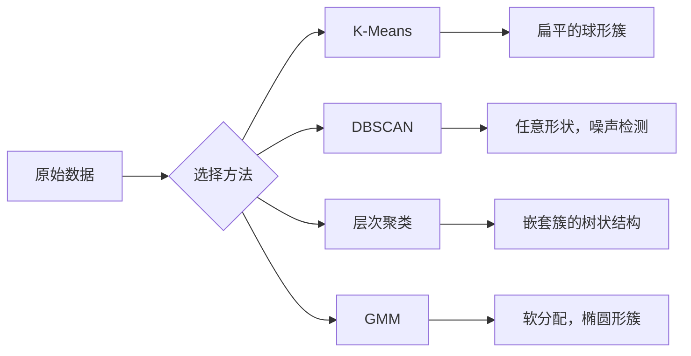

# 无监督学习

> 没有标签，没有老师。算法自己发现结构。

**类型：** 构建
**语言：** Python
**前置条件：** 第一阶段（范数与距离、概率与分布），第二阶段第1-6课
**时间：** 约90分钟

## 学习目标

- 从零实现K-Means、DBSCAN和高斯混合模型，并比较它们的聚类行为
- 使用轮廓系数和肘部法则评估聚类质量，并选择最优K值
- 解释DBSCAN何时优于K-Means，并识别哪种算法能处理非球形聚类和离群点
- 使用聚类方法构建异常检测流水线，标记偏离正常模式的点

## 问题描述

到目前为止的每个机器学习课程都假设有标签数据："这是输入，这是正确的输出"。在现实世界中，标签是昂贵的。医院拥有数百万条患者记录，但没有人手动为每条记录打上疾病类别的标签。电商网站有数百万条用户会话记录，但没有人手动标记客户细分。安全团队有网络日志，但没有人标记每个异常。

无监督学习在没有被告知要寻找什么的情况下发现模式。它分组相似的数据点，发现隐藏的结构，并找出异常。如果说监督学习是带着答案课本学习，那么无监督学习就是盯着原始数据直到模式自己显现出来。

关键问题：没有标签，你无法直接衡量"正确"或"错误"。你需要不同的工具来评估算法找到的结构是否有意义。

## 概念讲解

### 聚类：将相似的事物分组在一起

聚类将每个数据点分配到一个组（簇）中，使得同一组内的点比与其他组中的点更相似。问题始终是："相似"意味着什么？



### K-Means：主力算法

K-Means将数据划分为恰好K个簇。每个簇有一个质心（质量中心），每个点属于最近的质心。

Lloyd算法：

1. 选择K个随机点作为初始质心
2. 将每个数据点分配到最近的质心
3. 将每个质心重新计算为其分配点的均值
4. 重复步骤2-3直到分配不再变化

目标函数（惯性）衡量每个点到其分配质心的总平方距离。K-Means最小化这个值，但只能找到局部最小值。不同的初始化可能产生不同的结果。

### 选择K值

两种标准方法：

**肘部法则：** 对K = 1, 2, 3, ..., n运行K-Means。绘制惯性 vs K值的关系图。寻找"肘部"——增加更多簇后惯性不再显著减少的那个点。

**轮廓系数：** 对于每个点，衡量它与其自身簇的相似度（a）与最近其他簇的相似度（b）。轮廓系数为 (b - a) / max(a, b)，范围从-1（错误的簇）到+1（聚类良好）。对所有点取平均得到全局分数。

### DBSCAN：基于密度的聚类

K-Means假设簇是球形的，并且需要你预先指定K。DBSCAN不做这两个假设。它将密集区域（间隔稀疏区域）识别为簇。

两个参数：
- **eps**：邻域半径
- **min_samples**：形成密集区域所需的最小点数

三种类型的点：
- **核心点**：在eps距离内至少有min_samples个点
- **边界点**：在核心点的eps范围内，但本身不是核心点
- **噪声点**：既不是核心点也不是边界点。这些是离群点。

DBSCAN将彼此在eps范围内的核心点连接到同一簇中。边界点加入附近核心点的簇。噪声点不属于任何簇。

优势：发现任意形状的簇，自动确定簇的数量，识别离群点。弱点：难以处理密度差异较大的簇。

### 层次聚类

构建嵌套簇的树（树状图）。

凝聚式（自底向上）：
1. 从每个点作为自己的簇开始
2. 合并两个最近的簇
3. 重复直到只剩一个簇
4. 在期望的层次截断树状图以获得K个簇

簇之间的"接近度"可以通过以下方式衡量：
- **单链接**：两个簇中任意两点之间的最小距离
- **完全链接**：任意两点之间的最大距离
- **平均链接**：所有点对之间的平均距离
- **Ward方法**：导致簇内方差总增幅最小的合并

### 高斯混合模型（GMM）

K-Means给出硬分配：每个点恰好属于一个簇。GMM给出软分配：每个点有属于每个簇的概率。

GMM假设数据由K个高斯分布的混合生成，每个高斯分布有自己的均值和协方差。期望最大化（EM）算法交替进行：

- **E步**：计算每个点属于每个高斯分布的概率
- **M步**：更新每个高斯分布的均值、协方差和混合权重以最大化数据的似然

GMM可以建模椭圆形簇（而不像K-Means那样仅限于球形），并且自然处理重叠簇。

### 何时使用哪种方法

| 方法 | 最适合 | 避免使用的情况 |
|--------|----------|------------|
| K-Means | 大数据集，球形簇，已知K | 不规则形状，存在离群点 |
| DBSCAN | 未知K，任意形状，离群点检测 | 密度变化大，极高维度 |
| 层次聚类 | 小数据集，需要树状图，未知K | 大数据集（O(n^2)内存） |
| GMM | 重叠簇，需要软分配 | 极大数据集，维度太高 |

### 使用聚类进行异常检测

聚类天然支持异常检测：
- **K-Means**：远离任何质心的点是异常
- **DBSCAN**：噪声点根据定义为异常
- **GMM**：在所有高斯分布下概率都很低的点是异常

## 构建实现

### 第1步：从零实现K-Means

```python
import math
import random


def euclidean_distance(a, b):
    return math.sqrt(sum((ai - bi) ** 2 for ai, bi in zip(a, b)))


def kmeans(data, k, max_iterations=100, seed=42):
    random.seed(seed)
    n_features = len(data[0])

    centroids = random.sample(data, k)

    for iteration in range(max_iterations):
        clusters = [[] for _ in range(k)]
        assignments = []

        for point in data:
            distances = [euclidean_distance(point, c) for c in centroids]
            nearest = distances.index(min(distances))
            clusters[nearest].append(point)
            assignments.append(nearest)

        new_centroids = []
        for cluster in clusters:
            if len(cluster) == 0:
                new_centroids.append(random.choice(data))
                continue
            centroid = [
                sum(point[j] for point in cluster) / len(cluster)
                for j in range(n_features)
            ]
            new_centroids.append(centroid)

        if all(
            euclidean_distance(old, new) < 1e-6
            for old, new in zip(centroids, new_centroids)
        ):
            print(f"  在第 {iteration + 1} 轮收敛")
            break

        centroids = new_centroids

    return assignments, centroids
```

### 第2步：肘部法则和轮廓系数

```python
def compute_inertia(data, assignments, centroids):
    total = 0.0
    for point, cluster_id in zip(data, assignments):
        total += euclidean_distance(point, centroids[cluster_id]) ** 2
    return total


def silhouette_score(data, assignments):
    n = len(data)
    if n < 2:
        return 0.0

    clusters = {}
    for i, c in enumerate(assignments):
        clusters.setdefault(c, []).append(i)

    if len(clusters) < 2:
        return 0.0

    scores = []
    for i in range(n):
        own_cluster = assignments[i]
        own_members = [j for j in clusters[own_cluster] if j != i]

        if len(own_members) == 0:
            scores.append(0.0)
            continue

        a = sum(euclidean_distance(data[i], data[j]) for j in own_members) / len(own_members)

        b = float("inf")
        for cluster_id, members in clusters.items():
            if cluster_id == own_cluster:
                continue
            avg_dist = sum(euclidean_distance(data[i], data[j]) for j in members) / len(members)
            b = min(b, avg_dist)

        if max(a, b) == 0:
            scores.append(0.0)
        else:
            scores.append((b - a) / max(a, b))

    return sum(scores) / len(scores)


def find_best_k(data, max_k=10):
    print("肘部法则:")
    inertias = []
    for k in range(1, max_k + 1):
        assignments, centroids = kmeans(data, k)
        inertia = compute_inertia(data, assignments, centroids)
        inertias.append(inertia)
        print(f"  K={k}: 惯性={inertia:.2f}")

    print("\n轮廓系数:")
    for k in range(2, max_k + 1):
        assignments, centroids = kmeans(data, k)
        score = silhouette_score(data, assignments)
        print(f"  K={k}: 轮廓系数={score:.4f}")

    return inertias
```

### 第3步：从零实现DBSCAN

```python
def dbscan(data, eps, min_samples):
    n = len(data)
    labels = [-1] * n
    cluster_id = 0

    def region_query(point_idx):
        neighbors = []
        for i in range(n):
            if euclidean_distance(data[point_idx], data[i]) <= eps:
                neighbors.append(i)
        return neighbors

    visited = [False] * n

    for i in range(n):
        if visited[i]:
            continue
        visited[i] = True

        neighbors = region_query(i)

        if len(neighbors) < min_samples:
            labels[i] = -1
            continue

        labels[i] = cluster_id
        seed_set = list(neighbors)
        seed_set.remove(i)

        j = 0
        while j < len(seed_set):
            q = seed_set[j]

            if not visited[q]:
                visited[q] = True
                q_neighbors = region_query(q)
                if len(q_neighbors) >= min_samples:
                    for nb in q_neighbors:
                        if nb not in seed_set:
                            seed_set.append(nb)

            if labels[q] == -1:
                labels[q] = cluster_id

            j += 1

        cluster_id += 1

    return labels
```

### 第4步：高斯混合模型（EM算法）

```python
def gmm(data, k, max_iterations=100, seed=42):
    random.seed(seed)
    n = len(data)
    d = len(data[0])

    indices = random.sample(range(n), k)
    means = [list(data[i]) for i in indices]
    variances = [1.0] * k
    weights = [1.0 / k] * k

    def gaussian_pdf(x, mean, variance):
        d = len(x)
        coeff = 1.0 / ((2 * math.pi * variance) ** (d / 2))
        exponent = -sum((xi - mi) ** 2 for xi, mi in zip(x, mean)) / (2 * variance)
        return coeff * math.exp(max(exponent, -500))

    for iteration in range(max_iterations):
        responsibilities = []
        for i in range(n):
            probs = []
            for j in range(k):
                probs.append(weights[j] * gaussian_pdf(data[i], means[j], variances[j]))
            total = sum(probs)
            if total == 0:
                total = 1e-300
            responsibilities.append([p / total for p in probs])

        old_means = [list(m) for m in means]

        for j in range(k):
            r_sum = sum(responsibilities[i][j] for i in range(n))
            if r_sum < 1e-10:
                continue

            weights[j] = r_sum / n

            for dim in range(d):
                means[j][dim] = sum(
                    responsibilities[i][j] * data[i][dim] for i in range(n)
                ) / r_sum

            variances[j] = sum(
                responsibilities[i][j]
                * sum((data[i][dim] - means[j][dim]) ** 2 for dim in range(d))
                for i in range(n)
            ) / (r_sum * d)
            variances[j] = max(variances[j], 1e-6)

        shift = sum(
            euclidean_distance(old_means[j], means[j]) for j in range(k)
        )
        if shift < 1e-6:
            print(f"  GMM在第 {iteration + 1} 轮收敛")
            break

    assignments = []
    for i in range(n):
        assignments.append(responsibilities[i].index(max(responsibilities[i])))

    return assignments, means, weights, responsibilities
```

### 第5步：生成测试数据并运行一切

```python
def make_blobs(centers, n_per_cluster=50, spread=0.5, seed=42):
    random.seed(seed)
    data = []
    true_labels = []
    for label, (cx, cy) in enumerate(centers):
        for _ in range(n_per_cluster):
            x = cx + random.gauss(0, spread)
            y = cy + random.gauss(0, spread)
            data.append([x, y])
            true_labels.append(label)
    return data, true_labels


def make_moons(n_samples=200, noise=0.1, seed=42):
    random.seed(seed)
    data = []
    labels = []
    n_half = n_samples // 2
    for i in range(n_half):
        angle = math.pi * i / n_half
        x = math.cos(angle) + random.gauss(0, noise)
        y = math.sin(angle) + random.gauss(0, noise)
        data.append([x, y])
        labels.append(0)
    for i in range(n_half):
        angle = math.pi * i / n_half
        x = 1 - math.cos(angle) + random.gauss(0, noise)
        y = 1 - math.sin(angle) - 0.5 + random.gauss(0, noise)
        data.append([x, y])
        labels.append(1)
    return data, labels


if __name__ == "__main__":
    centers = [[2, 2], [8, 3], [5, 8]]
    data, true_labels = make_blobs(centers, n_per_cluster=50, spread=0.8)

    print("=== K-Means在3个团状数据上 ===")
    assignments, centroids = kmeans(data, k=3)
    print(f"  质心: {[[round(c, 2) for c in cent] for cent in centroids]}")
    sil = silhouette_score(data, assignments)
    print(f"  轮廓系数: {sil:.4f}")

    print("\n=== 肘部法则 ===")
    find_best_k(data, max_k=6)

    print("\n=== DBSCAN在3个团状数据上 ===")
    db_labels = dbscan(data, eps=1.5, min_samples=5)
    n_clusters = len(set(db_labels) - {-1})
    n_noise = db_labels.count(-1)
    print(f"  发现 {n_clusters} 个簇, {n_noise} 个噪声点")

    print("\n=== GMM在3个团状数据上 ===")
    gmm_assignments, gmm_means, gmm_weights, _ = gmm(data, k=3)
    print(f"  均值: {[[round(m, 2) for m in mean] for mean in gmm_means]}")
    print(f"  权重: {[round(w, 3) for w in gmm_weights]}")
    gmm_sil = silhouette_score(data, gmm_assignments)
    print(f"  轮廓系数: {gmm_sil:.4f}")

    print("\n=== DBSCAN在月牙形数据上（非球形簇）===")
    moon_data, moon_labels = make_moons(n_samples=200, noise=0.1)
    moon_db = dbscan(moon_data, eps=0.3, min_samples=5)
    n_moon_clusters = len(set(moon_db) - {-1})
    n_moon_noise = moon_db.count(-1)
    print(f"  发现 {n_moon_clusters} 个簇, {n_moon_noise} 个噪声点")

    print("\n=== K-Means在月牙形数据上（将无法正确分离）===")
    moon_km, moon_centroids = kmeans(moon_data, k=2)
    moon_sil = silhouette_score(moon_data, moon_km)
    print(f"  轮廓系数: {moon_sil:.4f}")
    print("  K-Means分割月牙形效果很差，因为它们不是球形的")

    print("\n=== 使用DBSCAN进行异常检测 ===")
    anomaly_data = list(data)
    anomaly_data.append([20.0, 20.0])
    anomaly_data.append([-5.0, -5.0])
    anomaly_data.append([15.0, 0.0])
    anomaly_labels = dbscan(anomaly_data, eps=1.5, min_samples=5)
    anomalies = [
        anomaly_data[i]
        for i in range(len(anomaly_labels))
        if anomaly_labels[i] == -1
    ]
    print(f"  检测到 {len(anomalies)} 个异常")
    for a in anomalies[-3:]:
        print(f"    点 {[round(v, 2) for v in a]}")
```

## 使用方式

使用scikit-learn，相同的算法只需一行代码：

```python
from sklearn.cluster import KMeans, DBSCAN, AgglomerativeClustering
from sklearn.mixture import GaussianMixture
from sklearn.metrics import silhouette_score as sklearn_silhouette

km = KMeans(n_clusters=3, random_state=42).fit(data)
db = DBSCAN(eps=1.5, min_samples=5).fit(data)
agg = AgglomerativeClustering(n_clusters=3).fit(data)
gmm_model = GaussianMixture(n_components=3, random_state=42).fit(data)
```

从零实现版本精确展示了这些库在计算什么。K-Means在分配和重新计算之间迭代。DBSCAN从密集种子扩展簇。GMM在期望和最大化之间交替。库版本增加了数值稳定性、更智能的初始化（K-Means++）和GPU加速，但核心逻辑是相同的。

## 成果交付

本课程产出了K-Means、DBSCAN和GMM的可工作的从零实现。聚类代码可以作为更高级无监督方法的基础复用。

## 练习题

1. 实现K-Means++初始化：不是随机选择质心，而是随机选择第一个质心，之后每个质心以与其到最近已有质心的平方距离成比例的概率被选择。比较其收敛速度与随机初始化的差异。
2. 向代码中添加层次凝聚聚类。实现Ward链接并生成树状图（作为合并的嵌套列表）。在不同层次截断并与K-Means结果比较。
3. 构建一个简单的异常检测流水线：在同一数据上运行DBSCAN和GMM，标记两种方法都认为是离群点的数据点（DBSCAN中的噪声，GMM中的低概率）。衡量重叠度并讨论两种方法何时存在分歧。

## 关键术语

| 术语 | 人们怎么说 | 实际含义 |
|------|----------------|----------------------|
| 聚类 | "将相似的事物分组" | 将数据划分为子集，其中组内相似性超过组间相似性，由特定距离度量衡量 |
| 质心 | "簇的中心" | 分配给一个簇的所有点的均值；在K-Means中用作簇的代表 |
| 惯性 | "簇的紧密程度" | 每个点到其分配质心的平方距离之和；越低越紧密 |
| 轮廓系数 | "簇的分离程度" | 对每个点，(b - a) / max(a, b)，其中a是平均簇内距离，b是平均最近簇距离 |
| 核心点 | "密集区域中的点" | 在DBSCAN中，在eps距离内至少有min_samples个邻居的点 |
| EM算法 | "软K-Means" | 期望最大化：迭代计算隶属概率（E步）并更新分布参数（M步） |
| 树状图 | "簇的树" | 显示层次聚类中簇合并的顺序和距离的树状图 |
| 异常 | "离群点" | 不符合预期模式的数据点，被DBSCAN识别为噪声或被GMM识别为低概率 |

## 延伸阅读

- [Stanford CS229 - Unsupervised Learning](https://cs229.stanford.edu/notes2022fall/main_notes.pdf) - Andrew Ng关于聚类和EM的讲义
- [scikit-learn Clustering Guide](https://scikit-learn.org/stable/modules/clustering.html) - 所有聚类算法的实用比较，包含可视化示例
- [DBSCAN原始论文 (Ester et al., 1996)](https://www.aaai.org/Papers/KDD/1996/KDD96-037.pdf) - 提出基于密度的聚类的论文
