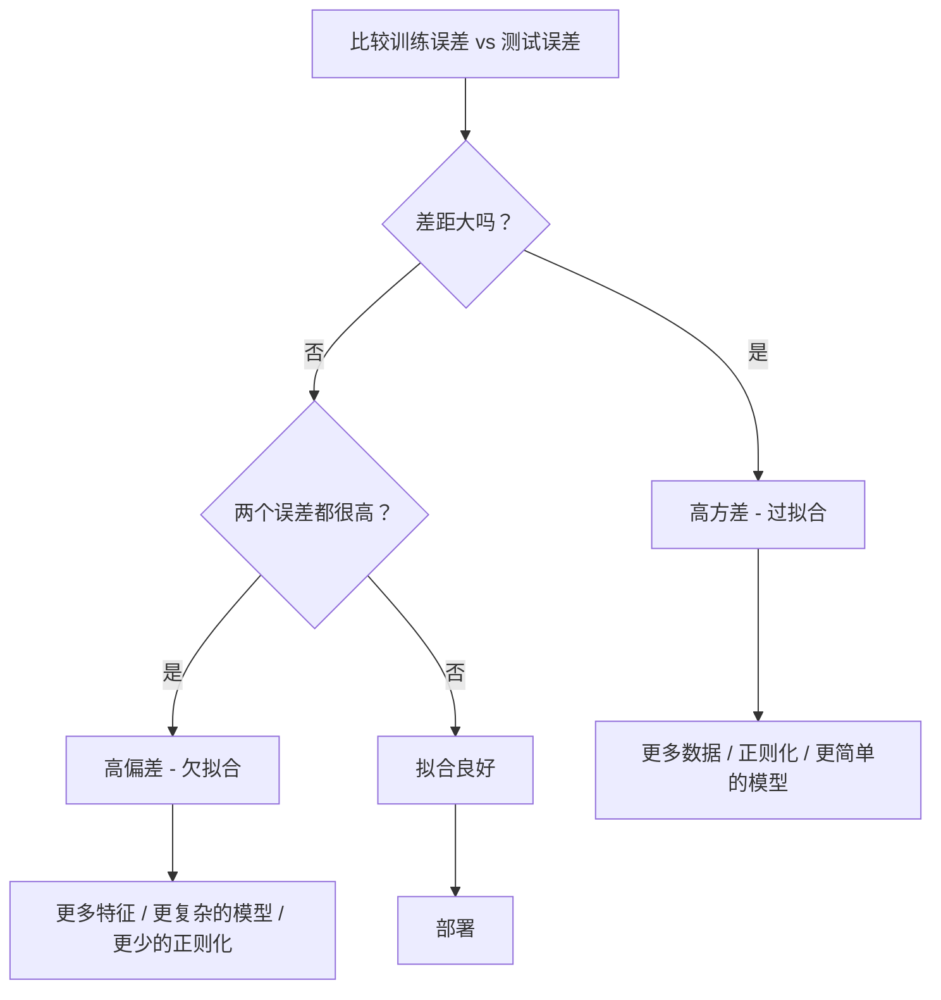
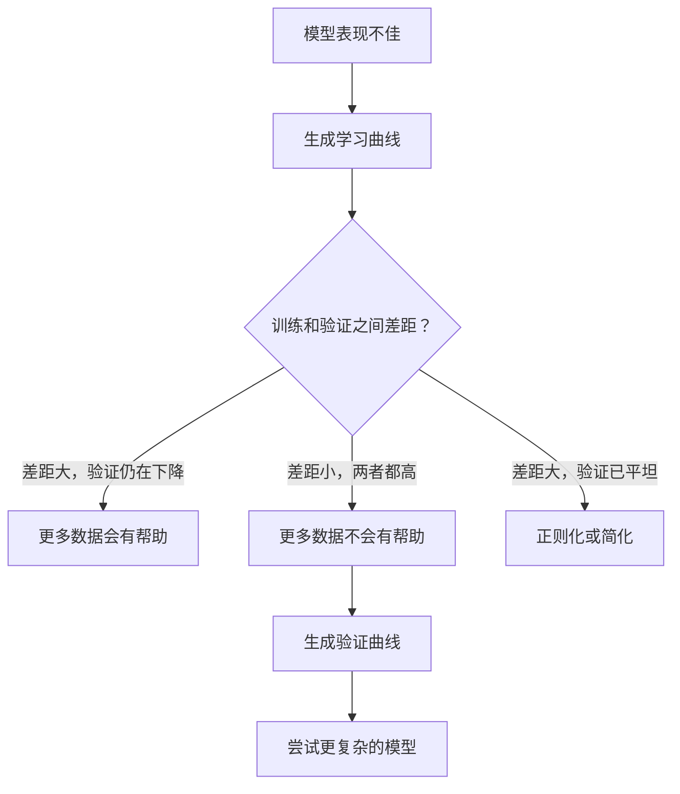

# 偏差-方差权衡

> 每个模型误差都来自三个来源之一：偏差、方差或噪声。你只能控制前两个。

**类型：** 学习
**语言：** Python
**前置知识：** 第二阶段，第 01-09 课（机器学习基础、回归、分类、评估）
**时间：** 约 75 分钟

## 学习目标

- 推导期望预测误差的偏差-方差分解，并解释不可约噪声的作用
- 通过训练误差和测试误差的模式诊断模型是欠拟合（高偏差）还是过拟合（高方差）
- 解释正则化技术（L1、L2、Dropout、早停法）如何用偏差换取方差
- 实现实验以可视化不同复杂度模型之间的偏差-方差权衡

## 问题

你训练了一个模型。它在测试数据上有一些误差。这些误差从何而来？

如果你的模型过于简单（在曲线数据集上使用线性回归），它会持续错过真实的模式。这是偏差。如果你的模型过于复杂（在 15 个数据点上使用 20 次多项式），它会完美拟合训练数据，但在新数据上给出截然不同的预测。这是方差。

在固定模型容量下，你无法同时最小化两者。降低偏差，方差就会增加。降低方差，偏差就会增加。理解这种权衡是机器学习中最有用的诊断技能。它告诉你应该让模型变得更复杂还是更简单，应该获取更多数据还是设计更好的特征，应该增加还是减少正则化。

## 概念

### 偏差：系统性误差

偏差衡量的是模型平均预测值与真实值之间的差距。如果你在从同一分布中抽取的多个不同训练集上训练同一个模型并取预测的平均值，偏差就是该平均值与真实值之间的差距。

高偏差意味着模型过于僵化，无法捕捉真实模式。用一条直线来拟合抛物线——无论给多少数据，它总是会错过曲线。这就是欠拟合。

```
高偏差（欠拟合）：
  模型总是预测大致相同的错误值。
  训练误差：高
  测试误差：高
  两者之间的差距：小
```

### 方差：对训练数据的敏感性

方差衡量的是当你在不同数据子集上训练时，预测值的变化有多大。如果训练集的微小变化导致模型的巨大变化，方差就很高。

高方差意味着模型在拟合训练数据中的噪声，而不是底层信号。一个 20 次多项式会穿过每一个训练点，但在它们之间剧烈震荡。这就是过拟合。

```
高方差（过拟合）：
  模型完美拟合训练数据但在新数据上失败。
  训练误差：低
  测试误差：高
  两者之间的差距：大
```

### 分解公式

对于任意点 x，在平方损失下的期望预测误差可以精确分解为：

```
期望误差 = 偏差² + 方差 + 不可约噪声

其中：
  偏差²   = (E[f_hat(x)] - f(x))²
  方差    = E[(f_hat(x) - E[f_hat(x)])²]
  噪声    = E[(y - f(x))²]             (sigma²)
```

- `f(x)` 是真实函数
- `f_hat(x)` 是模型的预测值
- `E[...]` 是不同训练集上的期望
- `y` 是观测标签（真实函数加上噪声）

噪声项是不可约的。对于有噪数据，没有任何模型能做到比 sigma² 更好。你的工作是在偏差² 和方差之间找到合适的平衡。

### 模型复杂度与误差


经典的 U 形曲线：

| 复杂度 | 偏差 | 方差 | 总误差 |
|-----------|------|----------|-------------|
| 过低 | 高 | 低 | 高（欠拟合） |
| 恰到好处 | 中等 | 中等 | 最低 |
| 过高 | 低 | 高 | 高（过拟合） |

### 正则化作为偏差-方差控制手段

正则化通过故意增加偏差来降低方差。它约束模型使其不能追逐噪声。

- **L2（岭回归）：** 将所有权重向零收缩。保留所有特征但减少它们的影响。
- **L1（Lasso）：** 将某些权重精确地推至零。实现特征选择。
- **Dropout：** 在训练过程中随机禁用神经元。强制产生冗余表示。
- **早停法：** 在模型完全拟合训练数据之前停止训练。

正则化强度（lambda、dropout 率、训练轮数）直接控制你在偏差-方差曲线上的位置。更强的正则化意味着更高的偏差和更低的方差。

### 双重下降：现代视角

经典理论认为：过了最佳平衡点后，增加复杂度总是有害的。但自 2019 年以来的研究表明了一些意想不到的现象。如果你将模型容量继续增加到远超插值阈值（模型有足够参数完美拟合训练数据的地方）之后，测试误差可能会再次下降。


这种"双重下降"现象解释了为什么参数远多于训练样本的大规模过参数化神经网络仍然能够很好地泛化。经典的偏差-方差权衡并没有错，但在现代场景下它是不完整的。

关于双重下降的关键观察：
- 它在线性模型、决策树和神经网络中都会发生
- 在插值区域，更多数据反而可能有害（样本层面的双重下降）
- 更多训练轮数也可能导致它（轮数层面的双重下降）
- 正则化可以平滑峰值但不能消除它

为什么会发生这种情况？在插值阈值处，模型刚好有足够的容量来拟合所有训练点。它被迫采纳一个非常特定的解，穿过每一个点，数据的微小扰动会导致拟合的巨大变化。这正是方差达到峰值的地方。超过阈值后，模型有大量可能的解可以完美拟合数据。学习算法（例如带有隐式正则化的梯度下降）倾向于选择其中最简单的解。这种对简单解的隐式偏好正是过参数化模型能够泛化的原因。

| 状态 | 参数 vs 样本 | 行为 |
|--------|----------------------|----------|
| 欠参数化 | p << n | 经典权衡适用 |
| 插值阈值 | p ~ n | 方差达到峰值，测试误差飙升 |
| 过参数化 | p >> n | 隐式正则化起作用，测试误差下降 |

实际应用：如果你使用神经网络或大型树集成，不要在插值阈值处停下来。要么远远低于它（使用显式正则化），要么远远超过它。最差的位置正好在阈值处。

### 诊断你的模型



| 症状 | 诊断 | 修复方案 |
|---------|-----------|-----|
| 训练误差高，测试误差高 | 偏差 | 更多特征，更复杂的模型，更少的正则化 |
| 训练误差低，测试误差高 | 方差 | 更多数据，正则化，更简单的模型，dropout |
| 训练误差低，测试误差低 | 拟合良好 | 发布上线 |
| 训练误差下降，测试误差上升 | 正在过拟合 | 早停法 |

### 实用策略

**当偏差是问题时：**
- 添加多项式或交互特征
- 使用更灵活的模型（用树集成替代线性模型）
- 减少正则化强度
- 训练更长时间（如果尚未收敛）

**当方差是问题时：**
- 获取更多训练数据
- 使用 Bagging（随机森林）
- 增加正则化（更高的 lambda，更多的 dropout）
- 特征选择（移除噪声特征）
- 使用交叉验证及早发现

### 集成方法与方差降低

集成方法是对抗方差最实用的工具。

**Bagging（Bootstrap 聚合）**在训练数据的不同自助采样上训练多个模型，然后取预测值的平均。每个单独的模型都有高方差，但平均值有低得多的方差。随机森林就是将 Bagging 应用于决策树。

它为什么在数学上有效：如果你平均 N 个独立的预测，每个有方差 sigma²，那么平均值的方差是 sigma² / N。这些模型并非真正独立（它们都看到相似的数据），所以减少幅度小于 1/N，但仍然很显著。

**Boosting**通过顺序构建模型来降低偏差，每个新模型关注集成的当前误差。梯度提升和 AdaBoost 是主要的例子。如果添加太多模型，Boosting 可能会过拟合，因此需要早停或正则化。

| 方法 | 主要效果 | 偏差变化 | 方差变化 |
|--------|---------------|-------------|-----------------|
| Bagging | 降低方差 | 不变 | 降低 |
| Boosting | 降低偏差 | 降低 | 可能增加 |
| 堆叠 | 降低两者 | 取决于元学习器 | 取决于基模型 |
| Dropout | 隐式 Bagging | 略微增加 | 降低 |

**实用规则：** 如果你的基模型有高方差（深树、高次多项式），使用 Bagging。如果你的基模型有高偏差（浅树桩、简单线性模型），使用 Boosting。

### 学习曲线

学习曲线绘制训练误差和验证误差作为训练集大小的函数。它们是你拥有的最实用的诊断工具。与单一的训练/测试比较不同，学习曲线展示了你模型的轨迹，并告诉你更多数据是否会有帮助。


如何解读：

| 场景 | 训练误差 | 验证误差 | 差距 | 含义 | 应对措施 |
|----------|---------------|-----------------|-----|---------------|------------|
| 高偏差 | 高 | 高 | 小 | 模型无法捕捉数据模式 | 更多特征，复杂模型，减少正则化 |
| 高方差 | 低 | 高 | 大 | 模型在记忆训练数据 | 更多数据，正则化，简化模型 |
| 良好拟合 | 中等 | 中等 | 小 | 模型泛化良好 | 发布上线 |
| 高方差，正在改善 | 低 | 随数据量增加而下降 | 正在缩小 | 数据可以解决的方差问题 | 收集更多数据 |
| 高偏差，已平坦 | 高 | 高且平坦 | 小且平坦 | 更多数据不会有用 | 更换模型架构 |

关键洞察：如果两条曲线都已经趋于平稳，差距很小但两个误差都很高，那么多数据是无用的——你需要一个更好的模型。如果差距很大且仍在缩小，那么更多数据会有帮助。

### 如何生成学习曲线

有两种方法：

**方法一：改变训练集大小，固定模型。** 保持模型和超参数不变。在越来越大的训练数据子集上训练。在每个规模上测量训练误差和验证误差。这就是标准的学习曲线。

**方法二：改变模型复杂度，固定数据。** 保持数据不变。扫描一个复杂度参数（多项式次数、树深度、层数）。在每个复杂度上测量训练误差和验证误差。这是验证曲线，直接展示偏差-方差权衡。

两种方法互相补充。第一种告诉你更多数据是否会有帮助。第二种告诉你换一个不同的模型是否会有帮助。在做出下一步决策之前，两种都运行一遍。



## 动手实现

`code/bias_variance.py` 中的代码运行完整的偏差-方差分解实验。以下是逐步的方法说明。

### 步骤 1：从已知函数生成合成数据

我们使用 `f(x) = sin(1.5x) + 0.5x` 并添加高斯噪声。知道真实函数使我们能够计算精确的偏差和方差。

```python
def true_function(x):
    return np.sin(1.5 * x) + 0.5 * x

def generate_data(n_samples=30, noise_std=0.5, x_range=(-3, 3), seed=None):
    rng = np.random.RandomState(seed)
    x = rng.uniform(x_range[0], x_range[1], n_samples)
    y = true_function(x) + rng.normal(0, noise_std, n_samples)
    return x, y
```

### 步骤 2：自助采样与多项式拟合

对于每个多项式次数，我们抽取多个自助训练集，拟合多项式，并在固定的测试网格上记录预测值。这给出了每个测试点上预测值的分布。

```python
def fit_polynomial(x_train, y_train, degree, lam=0.0):
    X = np.column_stack([x_train ** d for d in range(degree + 1)])
    if lam > 0:
        penalty = lam * np.eye(X.shape[1])
        penalty[0, 0] = 0
        w = np.linalg.solve(X.T @ X + penalty, X.T @ y_train)
    else:
        w = np.linalg.lstsq(X, y_train, rcond=None)[0]
    return w
```

我们在 200 个不同的自助样本上拟合。每个自助样本来自相同的底层分布，但包含不同的数据点。

### 步骤 3：计算偏差²、方差分解

通过在每个测试点有 200 组预测值，我们可以直接从定义计算分解：

```python
mean_pred = predictions.mean(axis=0)
bias_sq = np.mean((mean_pred - y_true) ** 2)
variance = np.mean(predictions.var(axis=0))
total_error = np.mean(np.mean((predictions - y_true) ** 2, axis=1))
```

- `mean_pred` 是从自助样本中估计出的 E[f_hat(x)]
- `bias_sq` 是平均预测值与真实值之间的平方差距
- `variance` 是自助样本间预测值的平均散布程度
- `total_error` 应约等于 bias_sq + variance + noise

### 步骤 4：学习曲线

学习曲线在保持模型复杂度固定的情况下扫描训练集大小。它们展示你的模型是受数据限制还是受容量限制。

```python
def demo_learning_curves():
    sizes = [10, 15, 20, 30, 50, 75, 100, 150, 200, 300]
    degree = 5

    for n in sizes:
        train_errors = []
        test_errors = []
        for seed in range(50):
            x_train, y_train = generate_data(n_samples=n, seed=seed * 100)
            w = fit_polynomial(x_train, y_train, degree)
            train_pred = predict_polynomial(x_train, w)
            train_mse = np.mean((train_pred - y_train) ** 2)
            test_pred = predict_polynomial(x_test, w)
            test_mse = np.mean((test_pred - y_test) ** 2)
            train_errors.append(train_mse)
            test_errors.append(test_mse)
        # 多次运行的平均给出了学习曲线的点
```

对于高方差模型（5 次多项式，数据量小），你会看到：
- 训练误差开始时较低，随着更多数据使记忆变得更困难而增加
- 测试误差开始时较高，随着模型获取更多信号而下降
- 差距随着更多数据而缩小

对于高偏差模型（1 次多项式），两个误差都快速收敛到相同的高值，更多数据没有帮助。

### 步骤 5：正则化扫描

代码还包含 `demo_regularization_sweep()`，它固定一个高次多项式（15 次）并扫描岭回归正则化强度从 0.001 到 100。这从不同角度展示了偏差-方差权衡：不是通过改变模型复杂度，而是通过改变约束强度。

```python
def demo_regularization_sweep():
    alphas = [0.001, 0.005, 0.01, 0.05, 0.1, 0.5, 1.0, 5.0, 10.0, 50.0, 100.0]
    for alpha in alphas:
        results = bias_variance_decomposition([15], lam=alpha)
        r = results[15]
        print(f"alpha={alpha:.3f}  bias={r['bias_sq']:.4f}  var={r['variance']:.4f}")
```

在低 alpha 时，15 次多项式几乎不受约束。方差占主导地位，因为模型在每个自助样本中追逐噪声。在高 alpha 时，惩罚如此强烈，以至于模型实际上变成了一个几乎常数的函数。偏差占主导地位。最优 alpha 位于这两个极端之间。

这与改变多项式次数时看到的 U 形曲线相同，但由连续旋钮而非离散旋钮控制。在实践中，正则化是控制权衡的首选方式，因为它允许在不改变特征集的情况下进行细粒度控制。

## 实际应用

sklearn 提供了 `learning_curve` 和 `validation_curve` 来自动化这些诊断，无需编写自助循环。

### 验证曲线：扫描模型复杂度

```python
from sklearn.model_selection import validation_curve
from sklearn.pipeline import make_pipeline
from sklearn.preprocessing import PolynomialFeatures
from sklearn.linear_model import Ridge

degrees = list(range(1, 16))
train_scores_all = []
val_scores_all = []

for d in degrees:
    pipe = make_pipeline(PolynomialFeatures(d), Ridge(alpha=0.01))
    train_scores, val_scores = validation_curve(
        pipe, X, y, param_name="polynomialfeatures__degree",
        param_range=[d], cv=5, scoring="neg_mean_squared_error"
    )
    train_scores_all.append(-train_scores.mean())
    val_scores_all.append(-val_scores.mean())
```

这直接给出了偏差-方差权衡曲线。在验证分数相对于训练分数最差的地方，方差占主导。在两者都差的地方，偏差占主导。

### 学习曲线：扫描训练集大小

```python
from sklearn.model_selection import learning_curve

pipe = make_pipeline(PolynomialFeatures(5), Ridge(alpha=0.01))
train_sizes, train_scores, val_scores = learning_curve(
    pipe, X, y, train_sizes=np.linspace(0.1, 1.0, 10),
    cv=5, scoring="neg_mean_squared_error"
)
train_mse = -train_scores.mean(axis=1)
val_mse = -val_scores.mean(axis=1)
```

将 `train_mse` 和 `val_mse` 相对于 `train_sizes` 绘制出来。曲线形状告诉你关于模型的一切。

### 带正则化扫描的交叉验证

```python
from sklearn.model_selection import cross_val_score

alphas = [0.001, 0.01, 0.1, 1.0, 10.0, 100.0]
for alpha in alphas:
    pipe = make_pipeline(PolynomialFeatures(10), Ridge(alpha=alpha))
    scores = cross_val_score(pipe, X, y, cv=5, scoring="neg_mean_squared_error")
    print(f"alpha={alpha:>7.3f}  MSE={-scores.mean():.4f} +/- {scores.std():.4f}")
```

这为固定的模型复杂度扫描正则化强度。你会看到相同的偏差-方差权衡：低 alpha 意味着高方差，高 alpha 意味着高偏差。

### 综合在一起：完整的诊断工作流程

在实践中，你按顺序运行这些诊断：

1. 训练你的模型。计算训练误差和测试误差。
2. 如果两者都很高：你有偏差问题。跳到步骤 4。
3. 如果训练误差低但测试误差高：你有方差问题。生成学习曲线看更多数据是否有帮助。如果没有，则正则化。
4. 生成验证曲线，扫描你的主要复杂度参数。找到最佳平衡点。
5. 在最佳平衡点，生成学习曲线。如果差距仍然很大，你需要更多数据或正则化。
6. 尝试使用 `cross_val_score` 以不同的 alpha 值运行 Ridge/Lasso。选择交叉验证误差最低的 alpha。

对于大多数表格数据集，这只需要 10-15 分钟的计算，但可以节省数小时的猜测时间。

## 输出产出

本课产出：`outputs/prompt-model-diagnostics.md`

## 练习

1. 使用 `noise_std=0`（无噪声）运行分解。不可约误差项会怎样？最优复杂度会改变吗？

2. 将训练集大小从 30 增加到 300。方差分量如何受影响？最优多项式次数会偏移吗？

3. 在实验中添加 L2 正则化（岭回归）。对于固定的高次多项式（15 次），将 lambda 从 0 扫描到 100。绘制偏差²和方差作为 lambda 的函数。

4. 将真实函数从多项式改为 `sin(x)`。偏差-方差分解如何改变？是否仍然存在明确的最优次数？

5. 实现一个简单的自助聚合（Bagging）包装器：在自助样本上训练 10 个模型并取平均预测值。展示这能减少方差而不会大幅增加偏差。

## 关键术语

| 术语 | 人们常说什么 | 实际含义 |
|------|----------------|----------------------|
| 偏差 | "模型太简单了" | 由错误假设引起的系统性误差。模型平均预测与真实值之间的差距。 |
| 方差 | "模型过拟合了" | 来自对训练数据敏感性的误差。预测值在不同训练集之间的变化程度。 |
| 不可约误差 | "数据中的噪声" | 来自真实数据生成过程中随机性的误差。任何模型都无法消除它。 |
| 欠拟合 | "没有学到足够的东西" | 模型有高偏差。即使在训练数据上也错过了真实模式。 |
| 过拟合 | "在记忆数据" | 模型有高方差。它拟合了训练数据中的噪声，这些噪声不能泛化。 |
| 正则化 | "约束模型" | 添加惩罚项以减少模型复杂度，用偏差换取更低的方差。 |
| 双重下降 | "更多参数可能有帮助" | 当模型容量远超插值阈值时，测试误差再次下降。 |
| 模型复杂度 | "模型的灵活性" | 模型拟合任意模式的能力。由架构、特征或正则化控制。 |

## 进一步阅读

- [Hastie, Tibshirani, Friedman: 统计学习基础，第 7 章](https://hastie.su.domains/ElemStatLearn/) -- 偏差-方差分解的权威性论述
- [Belkin 等，调和现代机器学习实践与偏差-方差权衡 (2019)](https://arxiv.org/abs/1812.11118) -- 双重下降论文
- [Nakkiran 等，深度双重下降 (2019)](https://arxiv.org/abs/1912.02292) -- 轮数层面和样本层面的双重下降
- [Scott Fortmann-Roe: 理解偏差-方差权衡](http://scott.fortmann-roe.com/docs/BiasVariance.html) -- 清晰的视觉解释
