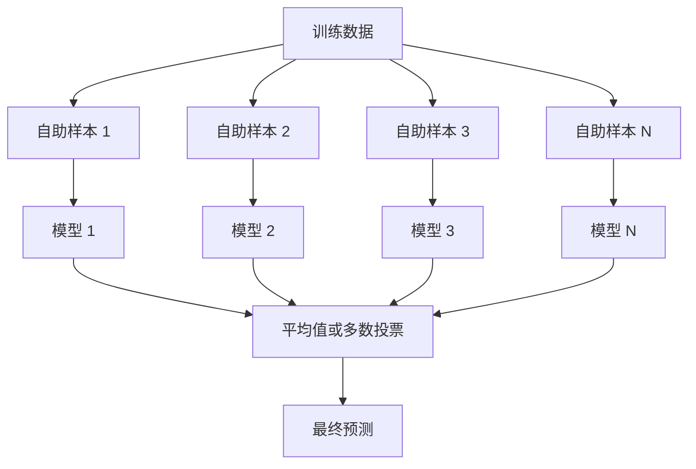
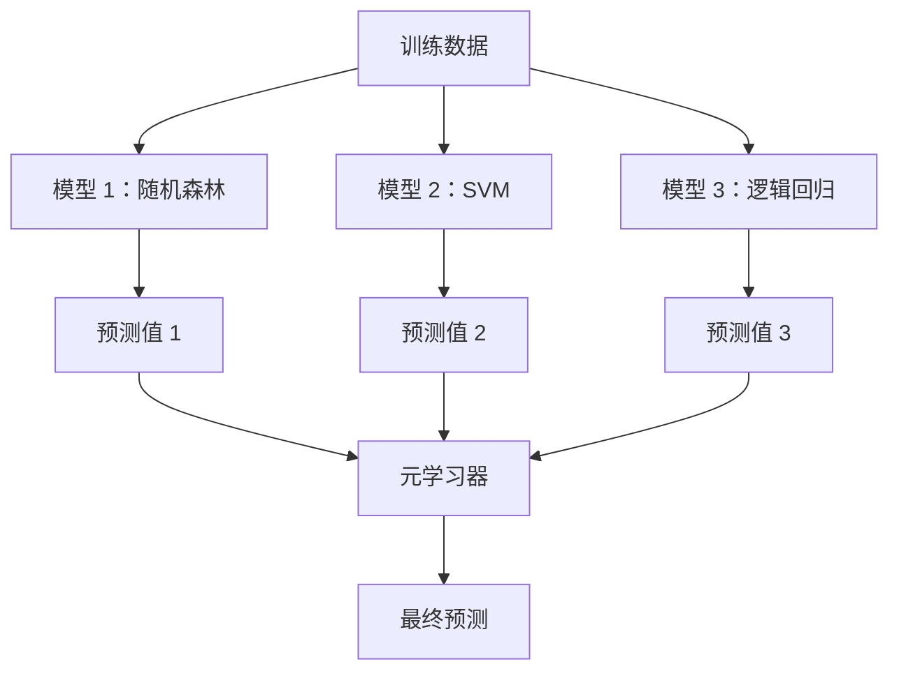

# 集成方法

> 一组弱学习器，正确组合起来，就成为一个强学习器。这不是一个比喻。这是一个定理。

**类型：** 构建
**语言：** Python
**前置知识：** 第二阶段，第 10 课（偏差-方差权衡）
**时间：** 约 120 分钟

## 学习目标

- 从头实现 AdaBoost 和梯度提升，并解释 Boosting 如何顺序地降低偏差
- 构建一个 Bagging 集成并演示如何通过平均去相关模型来降低方差而不增加偏差
- 比较 Bagging、Boosting 和堆叠（Stacking），从每种方法针对的误差分量角度进行分析
- 评估集成多样性，并解释为什么多数投票准确率会随着更多独立弱学习器的加入而提高

## 问题

单棵决策树训练快且易于解释，但它会过拟合。单个线性模型在复杂边界上欠拟合。你可以花几天时间设计完美的模型架构。或者，你可以组合一堆不完美的模型，得到比它们中任何一个单独模型都更好的结果。

集成方法正是做这件事。它们是在表格数据上赢得 Kaggle 竞赛的最可靠技术，它们驱动着大多数生产环境中的机器学习系统，并且它们生动地展示了偏差-方差权衡的实际运作。Bagging 降低方差。Boosting 降低偏差。堆叠学习在哪些输入上信任哪些模型。

## 概念

### 为什么集成有效

假设你有 N 个独立的分类器，每个准确率为 p > 0.5。多数投票的准确率为：

```
P(多数正确) = sum over k > N/2 of C(N,k) * p^k * (1-p)^(N-k)
```

对于 21 个每个 60% 准确率的分类器，多数投票准确率约为 74%。用 101 个分类器，它上升到 84%。当模型犯不同的错误时，误差会互相抵消。

关键要求是**多样性**。如果所有模型都犯相同的错误，组合它们没有任何帮助。集成之所以有效，是因为它们通过以下方式产生多样化的模型：

- 不同的训练子集（Bagging）
- 不同的特征子集（随机森林）
- 顺序误差纠正（Boosting）
- 不同的模型家族（堆叠）

### Bagging（Bootstrap 聚合）

Bagging 通过在每个模型上使用不同的训练数据自助采样来创造多样性。



自助样本是从原始数据中有放回地抽取的，大小与原始数据相同。约 63.2% 的唯一样本出现在每个自助样本中。剩下的 36.8%（袋外样本）提供了一个免费的验证集。

Bagging 降低方差而不大幅增加偏差。每棵单独的树对其自助样本过拟合，但每棵树的过拟合方式不同，因此平均化会抵消噪声。

**随机森林**是 Bagging 加上一个额外的变化：在每个分裂点，只考虑随机的特征子集。这迫使树之间产生更大的多样性。对于分类，典型的候选特征数量是 `sqrt(n_features)`；对于回归，是 `n_features / 3`。

### Boosting（顺序误差纠正）

Boosting 顺序训练模型。每个新模型专注于之前的模型弄错了的样本。


Boosting 降低偏差。每个新模型纠正集成到目前为止的系统性误差。最终预测是所有模型的加权和，更好的模型获得更高的权重。

权衡之处在于：Boosting 如果运行太多轮可能会过拟合，因为它持续拟合越来越难的样本，其中一些可能是噪声。

### AdaBoost

AdaBoost（自适应 Boosting）是第一个实用的 Boosting 算法。它适用于任何基学习器，通常是决策树桩（深度为 1 的树）。

算法：

```
1. 初始化样本权重：w_i = 1/N 对所有 i

2. For t = 1 to T:
   a. 在加权数据上训练弱学习器 h_t
   b. 计算加权误差：
      err_t = sum(w_i * I(h_t(x_i) != y_i)) / sum(w_i)
   c. 计算模型权重：
      alpha_t = 0.5 * ln((1 - err_t) / err_t)
   d. 更新样本权重：
      w_i = w_i * exp(-alpha_t * y_i * h_t(x_i))
   e. 将权重归一化使总和为 1

3. 最终预测：H(x) = sign(sum(alpha_t * h_t(x)))
```

误差更低的模型获得更高的 alpha。误分类的样本获得更高的权重，以便下一个模型专注于它们。

### 梯度提升（Gradient Boosting）

梯度提升将 Boosting 推广到任意损失函数。它不是对样本重新加权，而是将每个新模型拟合到当前集成残差（损失函数的负梯度）上。

```
1. 初始化：F_0(x) = argmin_c sum(L(y_i, c))

2. For t = 1 to T:
   a. 计算伪残差：
      r_i = -dL(y_i, F_{t-1}(x_i)) / dF_{t-1}(x_i)
   b. 将一棵树 h_t 拟合到残差 r_i
   c. 找到最优步长：
      gamma_t = argmin_gamma sum(L(y_i, F_{t-1}(x_i) + gamma * h_t(x_i)))
   d. 更新：
      F_t(x) = F_{t-1}(x) + learning_rate * gamma_t * h_t(x)

3. 最终预测：F_T(x)
```

对于平方误差损失，伪残差就是实际残差：`r_i = y_i - F_{t-1}(x_i)`。每棵树实际上是在拟合前一个集成的误差。

学习率（缩减率）控制每棵树的贡献量。较小的学习率需要更多的树，但泛化效果更好。典型值：0.01 到 0.3。

### XGBoost：为什么它在表格数据上占主导地位

XGBoost（极限梯度提升）是带有工程优化的梯度提升，使其快速、准确且抗过拟合：

- **带正则化的目标函数：** 对叶子权重的 L1 和 L2 惩罚防止单棵树过于自信
- **二阶近似：** 同时使用损失函数的一阶和二阶导数，给出更好的分裂决策
- **稀疏感知分裂：** 原生处理缺失值，通过为每个分裂学习缺失数据的最佳方向
- **列子采样：** 像随机森林一样，在每个分裂点对特征进行采样以增加多样性
- **加权分位数草图：** 在分布式数据上高效地为连续特征找到分裂点
- **缓存感知的块结构：** 内存布局针对 CPU 缓存行进行了优化

对于表格数据，XGBoost（及其后继者 LightGBM）始终优于神经网络。这种情况短期内不会改变。如果你的数据适合放在包含行和列的表格中，从梯度提升开始。

### 堆叠（Stacking，元学习）

堆叠使用多个基模型的预测作为元学习器的特征。



元学习器学习在哪些输入上信任哪个基模型。如果随机森林在某些区域更好而 SVM 在其他区域更好，元学习器将学会相应地分配权重。

为避免数据泄漏，基模型的预测必须通过对训练集进行交叉验证来生成。绝不能在同一数据上训练基模型和生成元特征。

### 投票法

最简单的集成方法：直接组合预测。

- **硬投票：** 对类别标签进行多数投票。
- **软投票：** 对预测概率取平均，选择平均概率最高的类别。通常更好，因为它使用了置信度信息。

## 动手实现

### 步骤 1：决策树桩（基学习器）

`code/ensembles.py` 中的代码从头实现一切。我们从决策树桩开始：只有一次分裂的树。

```python
class DecisionStump:
    def __init__(self):
        self.feature_idx = None
        self.threshold = None
        self.polarity = 1
        self.alpha = None

    def fit(self, X, y, weights):
        n_samples, n_features = X.shape
        best_error = float("inf")

        for f in range(n_features):
            thresholds = np.unique(X[:, f])
            for thresh in thresholds:
                for polarity in [1, -1]:
                    pred = np.ones(n_samples)
                    pred[polarity * X[:, f] < polarity * thresh] = -1
                    error = np.sum(weights[pred != y])
                    if error < best_error:
                        best_error = error
                        self.feature_idx = f
                        self.threshold = thresh
                        self.polarity = polarity

    def predict(self, X):
        n = X.shape[0]
        pred = np.ones(n)
        idx = self.polarity * X[:, self.feature_idx] < self.polarity * self.threshold
        pred[idx] = -1
        return pred
```

### 步骤 2：从头实现 AdaBoost

```python
class AdaBoostScratch:
    def __init__(self, n_estimators=50):
        self.n_estimators = n_estimators
        self.stumps = []
        self.alphas = []

    def fit(self, X, y):
        n = X.shape[0]
        weights = np.full(n, 1 / n)

        for _ in range(self.n_estimators):
            stump = DecisionStump()
            stump.fit(X, y, weights)
            pred = stump.predict(X)

            err = np.sum(weights[pred != y])
            err = np.clip(err, 1e-10, 1 - 1e-10)

            alpha = 0.5 * np.log((1 - err) / err)
            weights *= np.exp(-alpha * y * pred)
            weights /= weights.sum()

            stump.alpha = alpha
            self.stumps.append(stump)
            self.alphas.append(alpha)

    def predict(self, X):
        total = sum(a * s.predict(X) for a, s in zip(self.alphas, self.stumps))
        return np.sign(total)
```

### 步骤 3：从头实现梯度提升

```python
class GradientBoostingScratch:
    def __init__(self, n_estimators=100, learning_rate=0.1, max_depth=3):
        self.n_estimators = n_estimators
        self.lr = learning_rate
        self.max_depth = max_depth
        self.trees = []
        self.initial_pred = None

    def fit(self, X, y):
        self.initial_pred = np.mean(y)
        current_pred = np.full(len(y), self.initial_pred)

        for _ in range(self.n_estimators):
            residuals = y - current_pred
            tree = SimpleRegressionTree(max_depth=self.max_depth)
            tree.fit(X, residuals)
            update = tree.predict(X)
            current_pred += self.lr * update
            self.trees.append(tree)

    def predict(self, X):
        pred = np.full(X.shape[0], self.initial_pred)
        for tree in self.trees:
            pred += self.lr * tree.predict(X)
        return pred
```

### 步骤 4：与 sklearn 对比

代码验证了我们从零开始的实现与 sklearn 的 `AdaBoostClassifier` 和 `GradientBoostingClassifier` 产生相似的准确率，并并排比较所有方法。

## 实际应用

### 每种方法的使用场景

| 方法 | 降低什么 | 最适合 | 注意 |
|--------|---------|----------|---------------|
| Bagging / 随机森林 | 方差 | 噪声数据，多特征 | 对偏差没有帮助 |
| AdaBoost | 偏差 | 干净数据，简单基学习器 | 对异常值和噪声敏感 |
| 梯度提升 | 偏差 | 表格数据，竞赛 | 训练慢，不调参容易过拟合 |
| XGBoost / LightGBM | 两者 | 生产环境表格数据 | 超参数很多 |
| 堆叠 | 两者 | 追求最后 1-2% 准确率 | 复杂，有元学习器过拟合风险 |
| 投票法 | 方差 | 快速组合多样化模型 | 仅在模型多样化时有效 |

### 表格数据生产环境技术栈

对于大多数表格预测问题，按以下顺序尝试：

1. 使用默认参数的 **LightGBM 或 XGBoost**
2. 调优 n_estimators、learning_rate、max_depth、min_child_weight
3. 如果需要最后的 0.5%，构建包含 3-5 个多样化模型的堆叠集成
4. 全程使用交叉验证

在表格数据上，神经网络几乎总是比梯度提升差，尽管持续有研究尝试。TabNet、NODE 和类似架构偶尔能匹敌但很少能击败一个调优良好的 XGBoost。

## 输出产出

本课产出 `outputs/prompt-ensemble-selector.md` —— 一个帮助为给定数据集选择正确集成方法的提示词。描述你的数据（大小、特征类型、噪声水平、类别平衡）和你要解决的问题。该提示词会走过决策清单、推荐方法、建议起始超参数，并警告该方法的常见错误。还会产生包含完整选择指南的 `outputs/skill-ensemble-builder.md`。

## 练习

1. 修改 AdaBoost 实现以在每轮后跟踪训练准确率。绘制准确率相对于估计器数量的图。它何时收敛？

2. 通过在回归树中添加随机特征子采样，从头实现一个随机森林。训练 100 棵树，使用 `max_features=sqrt(n_features)` 并取平均预测值。比较与单棵树相比的方差降低。

3. 在梯度提升实现中，添加早停法：在每轮后跟踪验证损失，当连续 10 轮没有改善时停止。它实际上需要多少棵树？

4. 使用三个基模型（逻辑回归、决策树、k-近邻）和一个逻辑回归元学习器构建一个堆叠集成。使用 5 折交叉验证生成元特征。与每个单独的基模型进行比较。

5. 在相同数据集上用默认参数运行 XGBoost。将其准确率与你的从头梯度提升进行比较。两者都计时。速度差异有多大？

## 关键术语

| 术语 | 人们常说什么 | 实际含义 |
|------|----------------|----------------------|
| Bagging | "在随机子集上训练" | Bootstrap 聚合：在自助样本上训练模型，平均预测以降低方差 |
| Boosting | "专注于困难样本" | 顺序训练模型，每个模型纠正集成至今的误差，以降低偏差 |
| AdaBoost | "对数据重新加权" | 通过样本权重更新实现 Boosting；误分类的点获得更高权重用于下一个学习器 |
| 梯度提升 | "拟合残差" | 通过将每个新模型拟合到损失函数的负梯度上来实现 Boosting |
| XGBoost | "Kaggle 武器" | 带正则化、二阶优化和系统级速度技巧的梯度提升 |
| 堆叠（Stacking） | "模型堆在模型之上" | 使用基模型的预测作为元学习器的输入特征 |
| 随机森林 | "很多随机化的树" | 带决策树的 Bagging，在每个分裂点添加随机特征子采样以增加多样性 |
| 集成多样性 | "犯不同的错误" | 模型必须在错误上不相关，集成才能优于单独模型 |
| 袋外误差 | "免费验证" | 未进入自助采样的样本（约 36.8%）作为验证集，无需额外留出数据 |

## 进一步阅读

- [Schapire & Freund: Boosting: 基础与算法](https://mitpress.mit.edu/9780262526036/) -- AdaBoost 创建者所著的书
- [Friedman: 贪心函数逼近：梯度提升机 (2001)](https://statweb.stanford.edu/~jhf/ftp/trebst.pdf) -- 原始梯度提升论文
- [Chen & Guestrin: XGBoost (2016)](https://arxiv.org/abs/1603.02754) -- XGBoost 论文
- [Wolpert: 堆叠泛化 (1992)](https://www.sciencedirect.com/science/article/abs/pii/S0893608005800231) -- 原始堆叠论文
- [scikit-learn 集成方法](https://scikit-learn.org/stable/modules/ensemble.html) -- 实用参考
