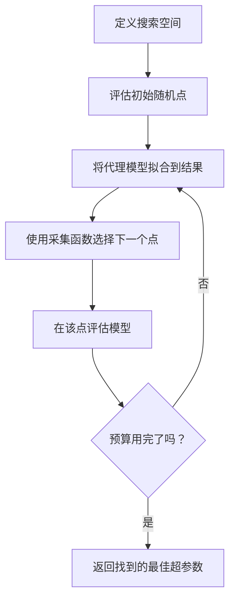
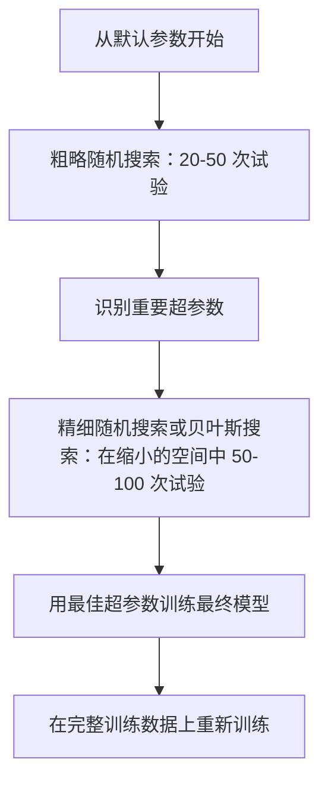
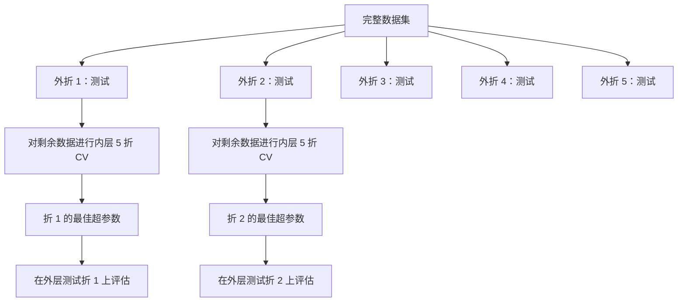

# 超参数调优

> 超参数是你在训练开始前调节的旋钮。调好它们是平庸模型和优秀模型之间的区别。

**类型：** 构建
**语言：** Python
**前置知识：** 第二阶段，第 11 课（集成方法）
**时间：** 约 90 分钟

## 学习目标

- 从头实现网格搜索、随机搜索和贝叶斯优化，并比较它们的样本效率
- 解释为什么当大多数超参数具有低有效维度时，随机搜索优于网格搜索
- 使用代理模型和采集函数构建一个贝叶斯优化循环来指导搜索
- 设计一个通过适当交叉验证避免对验证集过拟合的超参数调优策略

## 问题

你的梯度提升模型有一个学习率、树的数量、最大深度、每叶最小样本数、子采样率和列采样率。这是六个超参数。如果每个都有 5 个合理的值，网格有 5^6 = 15,625 种组合。训练每个需要 10 秒。尝试所有组合需要 43 小时的计算时间。

网格搜索是显而易见的做法，但在规模上也是最差的。随机搜索用更少的计算做更好。贝叶斯优化通过从过去的评估中学习做得更好。知道使用哪种策略，以及哪些超参数真正重要，可以节省数天的 GPU 资源浪费。

## 概念

### 参数 vs 超参数

参数在训练过程中被学习（权重、偏置、分裂阈值）。超参数在训练开始前设置，控制学习如何发生。

| 超参数 | 控制什么 | 典型范围 |
|---------------|-----------------|---------------|
| 学习率 | 每次更新的步长 | 0.001 到 1.0 |
| 树的数量/轮数 | 训练多长时间 | 10 到 10,000 |
| 最大深度 | 模型复杂度 | 1 到 30 |
| 正则化（lambda） | 防过拟合 | 0.0001 到 100 |
| 批量大小 | 梯度估计的噪声 | 16 到 512 |
| Dropout 率 | 被丢弃的神经元比例 | 0.0 到 0.5 |

### 网格搜索

网格搜索评估指定值的每一种组合。它是穷尽的且易于理解，但随着超参数数量呈指数级扩展。

```
2 个超参数的网格：

  learning_rate: [0.01, 0.1, 1.0]
  max_depth:     [3, 5, 7]

  评估次数：3 x 3 = 9 种组合

  (0.01, 3)  (0.01, 5)  (0.01, 7)
  (0.1,  3)  (0.1,  5)  (0.1,  7)
  (1.0,  3)  (1.0,  5)  (1.0,  7)
```

网格搜索有一个根本缺陷：如果一个超参数重要而另一个不重要，大多数评估都被浪费了。从 9 次评估中，你只得到了重要参数的 3 个唯一值。

### 随机搜索

随机搜索从分布中采样超参数而非使用网格。在相同的 9 次评估预算下，你得到每个超参数的 9 个唯一值。


为什么随机搜索优于网格搜索（Bergstra & Bengio, 2012）：

- 大多数超参数具有低有效维度。对于给定问题，6 个中超参数通常只有 1-2 个真正重要。
- 网格搜索在不重要的维度上浪费评估。
- 随机搜索在相同预算下更密集地覆盖重要维度。
- 在 60 次随机试验中，你有 95% 的概率在最优解的 5% 范围内找到一个点（如果在搜索空间中存在的话）。

### 贝叶斯优化

随机搜索忽略结果。它不学习高学习率导致发散或深度 3 始终优于深度 10 的信息。贝叶斯优化使用过去的评估来决定下一步在哪里搜索。



两个关键组件：

**代理模型：** 一个评估成本低的模型（通常是高斯过程），用于近似昂贵的目标函数。它给出搜索空间中任意点的预测值和不确定性估计。

**采集函数：** 通过平衡利用（在已知好点附近搜索）和探索（在不确定性高的地方搜索）来决定下一步在哪里评估。常见选择：

- **期望改进（EI）：** 在该点我们期望比当前最优改进多少？
- **上置信界（UCB）：** 预测值加上不确定性的倍数。更高的 UCB 意味着有前景或尚未探索。
- **改进概率（PI）：** 该点击败当前最优的概率是多少？

贝叶斯优化通常用比随机搜索少 2-5 倍的评估次数找到更好的超参数。拟合代理模型的开销与训练实际模型相比可以忽略不计。

### 早停法

不是每一次训练运行都需要完成。如果某个配置在 10 个轮次后明显很糟糕，就停止它并继续尝试。这就是超参数搜索上下文中的早停法。

策略：
- **基于耐心：** 如果验证损失连续 N 轮没有改善就停止
- **中位数剪枝：** 如果试验的中间结果比同阶段已完成试验的中位数差就停止
- **Hyperband：** 给大量配置分配小预算，然后逐步为最好的配置增加预算

Hyperband 特别有效。它从 81 个配置开始，每个 1 个轮次，保留前三分之一，给它们 3 个轮次，保留前三分之一，以此类推。这比用完整预算评估所有配置快了 10-50 倍。

### 学习率调度器

学习率几乎总是最重要的超参数。与其保持固定，调度器在训练过程中调整它。

| 调度器 | 公式 | 使用场景 |
|-----------|---------|-------------|
| 阶梯衰减 | 每 N 轮乘以 0.1 | 经典 CNN 训练 |
| 余弦退火 | lr * 0.5 * (1 + cos(pi * t / T)) | 现代默认方案 |
| 预热 + 衰减 | 线性增加然后余弦衰减 | Transformer |
| One-cycle | 一个周期内先增后减 | 快速收敛 |
| 平台期衰减 | 当指标停滞时按因子减少 | 安全默认方案 |

### 超参数重要性

并非所有超参数同等重要。对随机森林（Probst 等，2019）和梯度提升的研究显示出一致的模式：

**高重要性：**
- 学习率（始终首先调优）
- 估计器数量/轮数（使用早停法代替调优）
- 正则化强度

**中重要性：**
- 最大深度/层数
- 每叶最小样本数/权重衰减
- 子采样率

**低重要性：**
- 最大特征数（对随机森林）
- 具体激活函数的选择
- 批量大小（在合理范围内）

先调重要的，其余的保持默认值。

### 实用策略



具体工作流程：

1. **从库默认参数开始。** 它们由经验丰富的从业者选择，通常已经达到 80% 的效果。
2. **粗略随机搜索。** 宽范围，20-50 次试验。使用早停法快速终止糟糕的运行。
3. **分析结果。** 哪些超参数与性能相关？缩小搜索空间。
4. **精细搜索。** 在缩小的空间中进行贝叶斯优化或针对性的随机搜索。50-100 次试验。
5. **在全部训练数据上重新训练**，使用找到的最佳超参数。

### 交叉验证集成

在单个验证分割上调优超参数是有风险的。最佳超参数可能过拟合到特定的验证折。嵌套交叉验证通过使用两个循环来解决这个问题：

- **外层循环**（评估）：将数据分为训练+验证和测试。报告无偏性能。
- **内层循环**（调优）：将训练+验证分为训练和验证。找到最佳超参数。



每个外折独立地找到自己的最佳超参数。外层得分是泛化性能的无偏估计。

使用 sklearn：

```python
from sklearn.model_selection import cross_val_score, GridSearchCV
from sklearn.ensemble import GradientBoostingRegressor

inner_cv = GridSearchCV(
    GradientBoostingRegressor(),
    param_grid={
        "learning_rate": [0.01, 0.05, 0.1],
        "max_depth": [2, 3, 5],
        "n_estimators": [50, 100, 200],
    },
    cv=5,
    scoring="neg_mean_squared_error",
)

outer_scores = cross_val_score(
    inner_cv, X, y, cv=5, scoring="neg_mean_squared_error"
)

print(f"嵌套 CV MSE: {-outer_scores.mean():.4f} +/- {outer_scores.std():.4f}")
```

这很昂贵（5 外折 x 5 内折 x 27 个网格点 = 675 次模型拟合），但它给你一个值得信赖的性能估计。在论文中报告最终结果时或当决策风险很高时使用它。

### 实用技巧

**从学习率开始。** 对于基于梯度的方法，它总是最重要的超参数。一个糟糕的学习率让其他一切都变得无关紧要。将其他超参数固定在默认值，首先扫描学习率。

**对学习率和正则化使用对数均匀分布。** 0.001 和 0.01 之间的差异与 0.1 和 1.0 之间的差异同样重要。线性搜索在较大端浪费预算。

**使用早停法代替调优 n_estimators。** 对于 Boosting 和神经网络，将 n_estimators 或 epochs 设置得很高，让早停法决定何时停止。这从搜索中移除了一个超参数。

**预算分配。** 将 60% 的调优预算花在前 2 个最重要的超参数上。将剩余的 40% 花在其他所有参数上。前 2 个参数解释了大部分性能变化。

**尺度很重要。** 绝不在对数尺度上搜索批量大小（16、32、64 这类线性间距即可）。始终在对数尺度上搜索学习率。将搜索分布匹配到超参数影响模型的方式。

| 模型类型 | 首要超参数 | 推荐搜索方法 | 预算 |
|-----------|--------------------|--------------------|--------|
| 随机森林 | n_estimators, max_depth, min_samples_leaf | 随机搜索，50 次试验 | 低（训练快） |
| 梯度提升 | learning_rate, n_estimators, max_depth | 贝叶斯，100 次试验 + 早停 | 中 |
| 神经网络 | learning_rate, weight_decay, batch_size | 贝叶斯或随机，100+ 次试验 | 高（训练慢） |
| SVM | C, gamma（RBF 核） | 对数尺度的网格，25-50 次试验 | 低（2 个参数） |
| Lasso/Ridge | alpha | 对数尺度的一维搜索，20 次试验 | 非常低 |
| XGBoost | learning_rate, max_depth, subsample, colsample | 贝叶斯，100-200 次试验 + 早停 | 中 |

**不确定时：** 使用随机搜索，试验次数至少是超参数数量的 2 倍（例如，6 个超参数 = 至少 12 次试验）。你会惊讶地发现，50 次试验的随机搜索经常胜过精心设计的网格搜索。

## 动手实现

### 步骤 1：从头实现网格搜索

`code/tuning.py` 中的代码从头实现了网格搜索、随机搜索和一个简单的贝叶斯优化器。

```python
def grid_search(model_fn, param_grid, X_train, y_train, X_val, y_val):
    keys = list(param_grid.keys())
    values = list(param_grid.values())
    best_score = -float("inf")
    best_params = None
    n_evals = 0

    for combo in itertools.product(*values):
        params = dict(zip(keys, combo))
        model = model_fn(**params)
        model.fit(X_train, y_train)
        score = evaluate(model, X_val, y_val)
        n_evals += 1

        if score > best_score:
            best_score = score
            best_params = params

    return best_params, best_score, n_evals
```

### 步骤 2：从头实现随机搜索

```python
def random_search(model_fn, param_distributions, X_train, y_train,
                  X_val, y_val, n_iter=50, seed=42):
    rng = np.random.RandomState(seed)
    best_score = -float("inf")
    best_params = None

    for _ in range(n_iter):
        params = {k: sample(v, rng) for k, v in param_distributions.items()}
        model = model_fn(**params)
        model.fit(X_train, y_train)
        score = evaluate(model, X_val, y_val)

        if score > best_score:
            best_score = score
            best_params = params

    return best_params, best_score, n_iter
```

### 步骤 3：贝叶斯优化（简化版）

核心思想：将高斯过程拟合到已观测的（超参数，分数）对，然后使用采集函数决定下一步查看哪里。

```python
class SimpleBayesianOptimizer:
    def __init__(self, search_space, n_initial=5):
        self.search_space = search_space
        self.n_initial = n_initial
        self.X_observed = []
        self.y_observed = []

    def _kernel(self, x1, x2, length_scale=1.0):
        dists = np.sum((x1[:, None, :] - x2[None, :, :]) ** 2, axis=2)
        return np.exp(-0.5 * dists / length_scale ** 2)

    def _fit_gp(self, X_new):
        X_obs = np.array(self.X_observed)
        y_obs = np.array(self.y_observed)
        y_mean = y_obs.mean()
        y_centered = y_obs - y_mean

        K = self._kernel(X_obs, X_obs) + 1e-4 * np.eye(len(X_obs))
        K_star = self._kernel(X_new, X_obs)

        L = np.linalg.cholesky(K)
        alpha = np.linalg.solve(L.T, np.linalg.solve(L, y_centered))
        mu = K_star @ alpha + y_mean

        v = np.linalg.solve(L, K_star.T)
        var = 1.0 - np.sum(v ** 2, axis=0)
        var = np.maximum(var, 1e-6)

        return mu, var

    def _expected_improvement(self, mu, var, best_y):
        sigma = np.sqrt(var)
        z = (mu - best_y) / (sigma + 1e-10)
        ei = sigma * (z * norm_cdf(z) + norm_pdf(z))
        return ei

    def suggest(self):
        if len(self.X_observed) < self.n_initial:
            return sample_random(self.search_space)

        candidates = [sample_random(self.search_space) for _ in range(500)]
        X_cand = np.array([to_vector(c) for c in candidates])
        mu, var = self._fit_gp(X_cand)
        ei = self._expected_improvement(mu, var, max(self.y_observed))
        return candidates[np.argmax(ei)]

    def observe(self, params, score):
        self.X_observed.append(to_vector(params))
        self.y_observed.append(score)
```

高斯过程代理在每个候选点给出两个信息：预测分数（mu）和不确定性（var）。期望改进平衡了这两者：它倾向于模型预测高分数或不确定性高的点。早期，大多数点具有高不确定性，因此优化器进行探索。后期，它聚焦于最有前景的区域。

### 步骤 4：比较所有方法

在相同的合成目标函数上运行所有三种方法并进行比较。此比较使用一个简化的包装器，直接用目标函数（不涉及模型训练）调用每个优化器，因此 API 与上述基于模型的实现有所不同：

```python
def synthetic_objective(params):
    lr = params["learning_rate"]
    depth = params["max_depth"]
    return -(np.log10(lr) + 2) ** 2 - (depth - 4) ** 2 + 10

param_grid = {
    "learning_rate": [0.001, 0.01, 0.1, 1.0],
    "max_depth": [2, 3, 4, 5, 6, 7, 8],
}

grid_best = None
grid_score = -float("inf")
grid_history = []
for combo in itertools.product(*param_grid.values()):
    params = dict(zip(param_grid.keys(), combo))
    score = synthetic_objective(params)
    grid_history.append((params, score))
    if score > grid_score:
        grid_score = score
        grid_best = params

param_dist = {
    "learning_rate": ("log_float", 0.001, 1.0),
    "max_depth": ("int", 2, 8),
}

rand_best = None
rand_score = -float("inf")
rand_history = []
rng = np.random.RandomState(42)
for _ in range(28):
    params = {k: sample(v, rng) for k, v in param_dist.items()}
    score = synthetic_objective(params)
    rand_history.append((params, score))
    if score > rand_score:
        rand_score = score
        rand_best = params

optimizer = SimpleBayesianOptimizer(param_dist, n_initial=5)
bayes_history = []
for _ in range(28):
    params = optimizer.suggest()
    score = synthetic_objective(params)
    optimizer.observe(params, score)
    bayes_history.append((params, score))
bayes_score = max(s for _, s in bayes_history)

print(f"{'方法':<20} {'最佳分数':>12} {'评估次数':>12}")
print("-" * 50)
print(f"{'网格搜索':<20} {grid_score:>12.4f} {len(grid_history):>12}")
print(f"{'随机搜索':<20} {rand_score:>12.4f} {len(rand_history):>12}")
print(f"{'贝叶斯优化':<20} {bayes_score:>12.4f} {len(bayes_history):>12}")
```

在相同预算下，贝叶斯优化通常最快找到最佳分数，因为它不会在明显糟糕的区域浪费评估。随机搜索比网格搜索覆盖更多搜索空间。网格搜索只有在你只有很少的超参数且能够负担穷举搜索时才会胜出。

## 实际应用

### Optuna 实战

Optuna 是严肃超参数调优的推荐库。它开箱即用地支持剪枝、分布式搜索和可视化。

```python
import optuna

def objective(trial):
    lr = trial.suggest_float("learning_rate", 1e-4, 1e-1, log=True)
    n_est = trial.suggest_int("n_estimators", 50, 500)
    max_depth = trial.suggest_int("max_depth", 2, 10)

    model = GradientBoostingRegressor(
        learning_rate=lr,
        n_estimators=n_est,
        max_depth=max_depth,
    )
    model.fit(X_train, y_train)
    return mean_squared_error(y_val, model.predict(X_val))

study = optuna.create_study(direction="minimize")
study.optimize(objective, n_trials=100)

print(f"最佳参数: {study.best_params}")
print(f"最佳 MSE: {study.best_value:.4f}")
```

关键 Optuna 特性：
- `suggest_float(..., log=True)` 用于最好在对数尺度上搜索的参数（学习率、正则化）
- `suggest_int` 用于整数参数
- `suggest_categorical` 用于离散选择
- 内置 MedianPruner 用于对糟糕试验的早停
- `study.trials_dataframe()` 用于分析

### 带剪枝的 Optuna

剪枝会提前停止没有前景的试验，节省大量计算。以下是模式：

```python
import optuna
from sklearn.model_selection import cross_val_score

def objective(trial):
    params = {
        "learning_rate": trial.suggest_float("lr", 1e-4, 0.5, log=True),
        "max_depth": trial.suggest_int("max_depth", 2, 10),
        "n_estimators": trial.suggest_int("n_estimators", 50, 500),
        "subsample": trial.suggest_float("subsample", 0.5, 1.0),
    }

    model = GradientBoostingRegressor(**params)
    scores = cross_val_score(model, X_train, y_train, cv=3,
                             scoring="neg_mean_squared_error")
    mean_score = -scores.mean()

    trial.report(mean_score, step=0)
    if trial.should_prune():
        raise optuna.TrialPruned()

    return mean_score

pruner = optuna.pruners.MedianPruner(n_startup_trials=10, n_warmup_steps=5)
study = optuna.create_study(direction="minimize", pruner=pruner)
study.optimize(objective, n_trials=200)
```

`MedianPruner` 如果试验的中间值比同阶段所有已完成试验的中位数差，就停止该试验。剪枝需要调用 `trial.report()` 来报告中间指标，以及 `trial.should_prune()` 来检查试验是否应该被停止。`n_startup_trials=10` 确保在剪枝启动前至少有 10 个试验完整完成。这通常节省 40-60% 的总计算量。

### sklearn 内置调优器

对于快速实验，sklearn 提供了 `GridSearchCV`、`RandomizedSearchCV` 和 `HalvingRandomSearchCV`：

```python
from sklearn.model_selection import RandomizedSearchCV
from scipy.stats import loguniform, randint

param_dist = {
    "learning_rate": loguniform(1e-4, 0.5),
    "max_depth": randint(2, 10),
    "n_estimators": randint(50, 500),
}

search = RandomizedSearchCV(
    GradientBoostingRegressor(),
    param_dist,
    n_iter=100,
    cv=5,
    scoring="neg_mean_squared_error",
    random_state=42,
    n_jobs=-1,
)
search.fit(X_train, y_train)
print(f"最佳参数: {search.best_params_}")
print(f"最佳 CV MSE: {-search.best_score_:.4f}")
```

对学习率和正则化使用 scipy 的 `loguniform`。对整数超参数使用 `randint`。`n_jobs=-1` 标志在所有 CPU 核心上并行化。

### 超参数调优中的常见错误

**通过预处理造成的数据泄漏。** 如果你在交叉验证之前在整个数据集上拟合缩放器，来自验证折的信息会泄漏到训练中。始终将预处理放在 `Pipeline` 中，使其仅在训练折上拟合。

**对验证集过拟合。** 运行数千次试验实际上是在验证集上训练。使用嵌套交叉验证进行最终性能估计，或者保留一个在调优过程中从未接触过的单独测试集。

**搜索范围太窄。** 如果你的最佳值位于搜索空间的边界，说明你搜索得不够广。最优值可能在你搜索范围之外。始终检查最佳参数是否在边缘处。

**忽略交互效应。** 在 Boosting 中，学习率和估计器数量有很强的交互。低学习率需要更多估计器。独立调优它们比一起调优给出更差的结果。

**不对迭代模型使用早停法。** 对于梯度提升和神经网络，将 n_estimators 或 epochs 设置为一个高值并使用早停法。这比将迭代次数作为超参数调优严格更好。

## 练习

1. 用相同的总预算（例如 50 次评估）运行网格搜索和随机搜索。比较找到的最佳分数。用不同种子运行实验 10 次。随机搜索获胜的频率是多少？

2. 从头实现 Hyperband。从 81 个配置开始，每个训练 1 个轮次。每轮保留前 1/3 并将其预算增加三倍。比较总计算量（所有配置的所有轮次总和）与用完整预算运行 81 个配置。

3. 为第 11 课的梯度提升实现添加一个学习率调度器（余弦退火）。与固定学习率相比，它有帮助吗？

4. 使用 Optuna 在真实数据集（例如 sklearn 的乳腺癌数据集）上调优 RandomForestClassifier。使用 `optuna.visualization.plot_param_importances(study)` 查看哪些超参数最重要。它是否与本课的重要性排名匹配？

5. 实现一个简单的采集函数（期望改进）并演示探索 vs 利用。绘制代理模型的均值和不确定性，并展示 EI 选择下一步评估的位置。

## 关键术语

| 术语 | 人们常说什么 | 实际含义 |
|------|----------------|----------------------|
| 超参数 | "你选择的一个设置" | 训练前设置的、控制学习过程的值，不从数据中学习 |
| 网格搜索 | "尝试每一种组合" | 在指定参数网格上的穷举搜索。指数级成本。 |
| 随机搜索 | "就是随机采样" | 从分布中采样超参数。比网格搜索更好地覆盖重要维度。 |
| 贝叶斯优化 | "智能搜索" | 使用目标函数的代理模型来决定下一步评估的位置，平衡探索和利用 |
| 代理模型 | "一个廉价的近似" | 一个模型（通常是高斯过程），从已观测的评估中近似昂贵的目标函数 |
| 采集函数 | "下一步在哪里采样" | 通过平衡期望改进和不确定性来评估候选点的得分。EI 和 UCB 是常见选择。 |
| 早停法 | "停止浪费时间" | 当验证性能不再改善时提前终止训练 |
| Hyperband | "锦标赛式淘汰配置" | 自适应资源分配：以小额预算启动大量配置，保留最好的并增加它们的预算 |
| 学习率调度器 | "在训练过程中改变学习率" | 一个在训练过程中调整学习率以实现更好收敛的函数 |

## 进一步阅读

- [Bergstra & Bengio: 超参数优化的随机搜索 (2012)](https://jmlr.org/papers/v13/bergstra12a.html) -- 证明随机搜索优于网格搜索的论文
- [Snoek 等，机器学习算法的实用贝叶斯优化 (2012)](https://arxiv.org/abs/1206.2944) -- 面向机器学习的贝叶斯优化
- [Li 等，Hyperband: 一种基于 Bandit 的新方法 (2018)](https://jmlr.org/papers/v18/16-558.html) -- Hyperband 论文
- [Optuna: 下一代超参数优化框架](https://arxiv.org/abs/1907.10902) -- Optuna 论文
- [Probst 等，可调性：超参数的重要性 (2019)](https://jmlr.org/papers/v20/18-444.html) -- 哪些超参数重要
