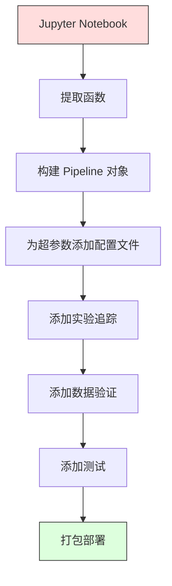

# 机器学习流水线

> 一个模型不是一个产品。一个流水线才是。流水线涵盖从原始数据到部署预测的一切，每一步都必须是可复现的。

**类型：** 构建
**语言：** Python
**前置知识：** 第二阶段，第 12 课（超参数调优）
**时间：** 约 120 分钟

## 学习目标

- 从头构建一个机器学习流水线，将缺失值填充、缩放、编码和模型训练串联成一个可复现的对象
- 识别数据泄漏场景，并解释流水线如何通过仅在训练数据上拟合变换器来防止泄漏
- 构建一个 ColumnTransformer，对数值特征和类别特征应用不同的预处理
- 实现流水线序列化，并演示相同的已拟合流水线在训练和生产环境中产生一致的结果

## 问题

你有一个 Notebook：加载数据，用中位数填充缺失值，缩放特征，训练一个模型，打印准确率。它能工作。你发布上线了。

一个月后，有人重新训练模型，却得到了不同的结果。中位数是在整个数据集（包括测试数据）上计算的（数据泄漏）。缩放参数没有被保存，因此推理时使用了不同的统计量。特征工程代码在训练和服务之间被复制粘贴，两个副本产生了差异。一个类别列在生产环境中出现了编码器从未见过的新值。

这些不是假设场景。它们是机器学习系统在生产环境中失败的最常见原因。流水线通过将每个转换步骤打包成一个单一的、有序的、可复现的对象来解决所有这些问题。

## 概念

### 什么是流水线

流水线是一系列有序的数据转换后跟一个模型。每一步都将前一步的输出作为输入。整个流水线在训练数据上一次性拟合。在推理时，同一个已拟合的流水线转换新数据并产生预测。


流水线保证：
- 转换仅在训练数据上拟合（无泄漏）
- 相同的转换在推理时被应用
- 整个对象可以序列化并作为一个工件部署
- 交叉验证时在每个折上应用流水线，防止细微的泄漏

### 数据泄漏：沉默的杀手

当测试集或未来数据的信息污染训练时，就会发生数据泄漏。流水线防止了最常见的形式。

**有泄漏（错误）：**
```python
X = df.drop("target", axis=1)
y = df["target"]

scaler = StandardScaler()
X_scaled = scaler.fit_transform(X)

X_train, X_test = X_scaled[:800], X_scaled[800:]
y_train, y_test = y[:800], y[800:]
```

缩放器看到了测试数据。均值和标准差包含了测试样本。这夸大了准确率估计。

**正确做法：**
```python
X_train, X_test = X[:800], X[800:]

scaler = StandardScaler()
X_train_scaled = scaler.fit_transform(X_train)
X_test_scaled = scaler.transform(X_test)
```

使用流水线，你不需要考虑这些。流水线会自动处理。

### sklearn 流水线

sklearn 的 `Pipeline` 将变换器和一个估计器串联起来。它暴露 `.fit()`、`.predict()` 和 `.score()`，按顺序应用所有步骤。

```python
from sklearn.pipeline import Pipeline
from sklearn.preprocessing import StandardScaler
from sklearn.linear_model import LogisticRegression

pipe = Pipeline([
    ("scaler", StandardScaler()),
    ("model", LogisticRegression()),
])

pipe.fit(X_train, y_train)
predictions = pipe.predict(X_test)
```

当你调用 `pipe.fit(X_train, y_train)` 时：
1. Scaler 在 X_train 上调用 `fit_transform`
2. 模型在缩放后的 X_train 上调用 `fit`

当你调用 `pipe.predict(X_test)` 时：
1. Scaler 在 X_test 上调用 `transform`（而非 fit_transform）
2. 模型在缩放后的 X_test 上调用 `predict`

缩放器在拟合期间永远不会看到测试数据。这正是关键所在。

### ColumnTransformer：为不同列构建不同的流水线

真实数据集有数值列和类别列，需要不同的预处理。`ColumnTransformer` 处理这种情况。

```python
from sklearn.compose import ColumnTransformer
from sklearn.preprocessing import StandardScaler, OneHotEncoder
from sklearn.impute import SimpleImputer

numeric_pipe = Pipeline([
    ("impute", SimpleImputer(strategy="median")),
    ("scale", StandardScaler()),
])

categorical_pipe = Pipeline([
    ("impute", SimpleImputer(strategy="most_frequent")),
    ("encode", OneHotEncoder(handle_unknown="ignore")),
])

preprocessor = ColumnTransformer([
    ("num", numeric_pipe, ["age", "income", "score"]),
    ("cat", categorical_pipe, ["city", "gender", "plan"]),
])

full_pipeline = Pipeline([
    ("preprocess", preprocessor),
    ("model", GradientBoostingClassifier()),
])
```

OneHotEncoder 中的 `handle_unknown="ignore"` 对生产环境至关重要。当出现一个新类别（模型从未见过的城市）时，它生成一个零向量而不是崩溃。

### 实验追踪

流水线使训练可复现，但你还需要追踪各次实验之间发生的事情：使用了哪些超参数、哪个数据集版本、指标是多少、正在运行哪个代码。

**MLflow** 是最常见的开源解决方案：

```python
import mlflow

with mlflow.start_run():
    mlflow.log_param("max_depth", 5)
    mlflow.log_param("n_estimators", 100)
    mlflow.log_param("learning_rate", 0.1)

    pipe.fit(X_train, y_train)
    accuracy = pipe.score(X_test, y_test)

    mlflow.log_metric("accuracy", accuracy)
    mlflow.sklearn.log_model(pipe, "model")
```

每次运行都被记录为参数、指标、工件和完整模型。你可以比较运行、复现任何实验、部署任何模型版本。

**Weights & Biases (wandb)** 通过托管仪表板提供相同的功能：

```python
import wandb

wandb.init(project="my-pipeline")
wandb.config.update({"max_depth": 5, "n_estimators": 100})

pipe.fit(X_train, y_train)
accuracy = pipe.score(X_test, y_test)

wandb.log({"accuracy": accuracy})
```

### 模型版本管理

在实验追踪之后，你需要管理模型版本。哪个模型在生产环境中？哪个在预发布环境中？上周的是哪个？

MLflow 的模型注册表提供：
- **版本追踪：** 每个保存的模型获得一个版本号
- **阶段转换：** "预发布"、"生产"、"已归档"
- **审批工作流：** 模型必须被显式提升到生产环境
- **回滚：** 立即切换回之前版本

### 使用 DVC 进行数据版本管理

代码用 git 管理版本。数据也应该管理版本，但 git 无法处理大文件。DVC（数据版本控制）解决了这个问题。

```
dvc init
dvc add data/training.csv
git add data/training.csv.dvc data/.gitignore
git commit -m "追踪训练数据"
dvc push
```

DVC 将实际数据存储在远程存储（S3、GCS、Azure）中，并在 git 中保留一个记录哈希值的小型 `.dvc` 文件。当你检出一个 git 提交时，`dvc checkout` 恢复使用过的确切数据。

这意味着每个 git 提交都同时固定了代码和数据。完全的复现性。

### 可复现的实验

一个可复现的实验需要四样东西：

1. **固定的随机种子：** 为 numpy、random 和框架（torch、sklearn）设置种子
2. **锁定的依赖项：** 带有精确版本的 requirements.txt 或 poetry.lock
3. **版本化的数据：** DVC 或类似工具
4. **配置文件：** 所有超参数在一个配置文件中定义，不硬编码

```python
import numpy as np
import random

def set_seed(seed=42):
    random.seed(seed)
    np.random.seed(seed)
    try:
        import torch
        torch.manual_seed(seed)
        torch.cuda.manual_seed_all(seed)
        torch.backends.cudnn.deterministic = True
    except ImportError:
        pass
```

### 从 Notebook 到生产流水线



典型的演进过程：

1. **Notebook 探索：** 快速实验、可视化、特征想法
2. **提取函数：** 将预处理、特征工程、评估移到可导入模块中
3. **构建流水线：** 将转换串联到 sklearn Pipeline 或自定义类中
4. **配置管理：** 将所有超参数移到 YAML/JSON 配置文件中
5. **实验追踪：** 添加 MLflow 或 wandb 日志记录
6. **数据验证：** 在训练前检查数据的模式、分布和缺失值模式
7. **测试：** 变换器的单元测试，完整流水线的集成测试
8. **部署：** 序列化流水线，用 API（FastAPI、Flask）包装，容器化

### 常见的流水线错误

| 错误 | 为什么不好 | 修复方案 |
|---------|-------------|-----|
| 在划分数据前对整个数据集拟合 | 数据泄漏 | 使用 Pipeline 配合 cross_val_score |
| 特征工程在流水线之外 | 训练和服务时的转换不同 | 将所有转换放入 Pipeline |
| 不处理未知类别 | 生产环境遇到新值时崩溃 | OneHotEncoder(handle_unknown="ignore") |
| 硬编码列名 | 模式改变时崩溃 | 从配置中使用列名列表 |
| 无数据验证 | 在不良数据上静默产生错误预测 | 在预测前添加模式检查 |
| 训练/服务偏差 | 模型在生产环境中看到不同的特征 | 训练和服务使用同一个 Pipeline 对象 |

## 动手实现

`code/pipeline.py` 中的代码从头构建了一个完整的机器学习流水线：

### 步骤 1：自定义变换器

```python
class CustomTransformer:
    def __init__(self):
        self.means = None
        self.stds = None

    def fit(self, X):
        self.means = np.mean(X, axis=0)
        self.stds = np.std(X, axis=0)
        self.stds[self.stds == 0] = 1.0
        return self

    def transform(self, X):
        return (X - self.means) / self.stds

    def fit_transform(self, X):
        return self.fit(X).transform(X)
```

### 步骤 2：从头实现流水线

```python
class PipelineFromScratch:
    def __init__(self, steps):
        self.steps = steps

    def fit(self, X, y=None):
        X_current = X.copy()
        for name, step in self.steps[:-1]:
            X_current = step.fit_transform(X_current)
        name, model = self.steps[-1]
        model.fit(X_current, y)
        return self

    def predict(self, X):
        X_current = X.copy()
        for name, step in self.steps[:-1]:
            X_current = step.transform(X_current)
        name, model = self.steps[-1]
        return model.predict(X_current)
```

### 步骤 3：带流水线的交叉验证

代码演示了如何通过流水线进行交叉验证来防止数据泄漏：缩放器在每个折的训练数据上分别拟合。

### 步骤 4：使用 sklearn 的完整生产流水线

一个完整的流水线，包含 `ColumnTransformer`、多条预处理路径和一个模型，使用适当的交叉验证和实验日志记录进行训练。

## 输出产出

本课产出：
- `outputs/prompt-ml-pipeline.md` -- 用于构建和调试机器学习流水线的技能
- `code/pipeline.py` -- 从零实现到 sklearn 的完整流水线

## 练习

1. 构建一个处理包含 3 个数值列和 2 个类别列的数据集的流水线。使用 `ColumnTransformer` 对数值列应用中位数填充 + 缩放，对类别列应用最频繁值填充 + 独热编码。使用 5 折交叉验证进行训练。

2. 故意引入数据泄漏：在划分数据前在整个数据集上拟合缩放器。比较交叉验证分数（有泄漏）与流水线交叉验证分数（干净）。差异有多大？

3. 使用 `joblib.dump` 序列化你的流水线。在一个单独的脚本中加载它并运行预测。验证预测结果完全相同。

4. 向流水线添加一个自定义变换器，为两个最重要的数值列创建多项式特征（2 次）。它应该放在流水线中的什么位置？

5. 为流水线设置 MLflow 追踪。使用不同的超参数运行 5 次实验。使用 MLflow UI（`mlflow ui`）比较运行并选择最佳模型。

## 关键术语

| 术语 | 人们常说什么 | 实际含义 |
|------|----------------|----------------------|
| 流水线 | "转换加模型的链条" | 一系列已拟合的变换器和一个模型，作为一个单元应用以防止泄漏 |
| 数据泄漏 | "测试信息泄漏到训练中" | 使用训练集以外的信息来构建模型，夸大性能估计 |
| ColumnTransformer | "每列使用不同的预处理" | 对不同的列子集应用不同的流水线，组合结果 |
| 实验追踪 | "记录你的运行" | 记录每次训练运行的参数、指标、工件和代码版本 |
| MLflow | "追踪和部署模型" | 用于实验追踪、模型注册表和部署的开源平台 |
| DVC | "数据的 git" | 用于大型数据文件的版本控制系统，在 git 中存储哈希值，在远程存储中存储数据 |
| 模型注册表 | "模型版本目录" | 一个用阶段标签（预发布、生产、已归档）跟踪模型版本的系统 |
| 训练/服务偏差 | "在 Notebook 中能用的" | 数据在训练时与推理时的处理方式不同，导致静默错误 |
| 复现性 | "相同代码，相同结果" | 使用相同的代码、数据和配置获得相同结果的能力 |

## 进一步阅读

- [scikit-learn Pipeline 文档](https://scikit-learn.org/stable/modules/compose.html) -- 官方流水线参考
- [MLflow 文档](https://mlflow.org/docs/latest/index.html) -- 实验追踪和模型注册表
- [DVC 文档](https://dvc.org/doc) -- 数据版本管理
- [Sculley 等，机器学习系统中的隐藏技术债务 (2015)](https://papers.nips.cc/paper/2015/hash/86df7dcfd896fcaf2674f757a2463eba-Abstract.html) -- 关于机器学习系统复杂性的里程碑式论文
- [Google ML 最佳实践：机器学习规则](https://developers.google.com/machine-learning/guides/rules-of-ml) -- 实用的生产环境机器学习建议
