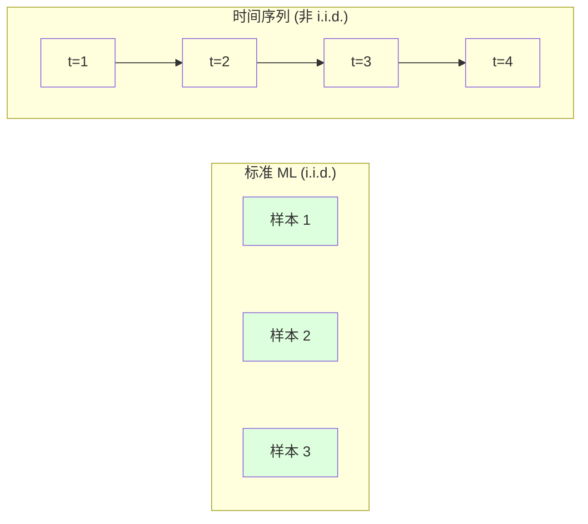
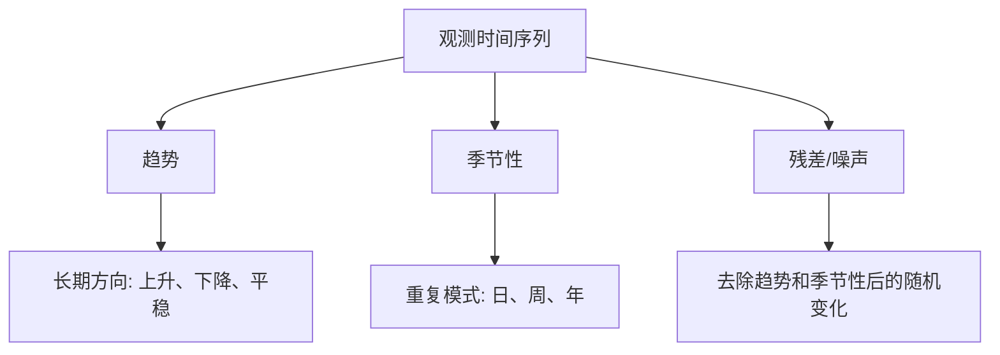
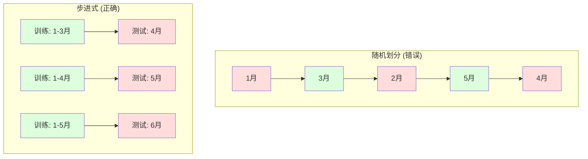

# 时间序列基础

> 过去的表现确实能预测未来的结果——前提是你先检查平稳性。

**类型:** 构建
**语言:** Python
**前置条件:** 阶段 2，第 01-09 课
**时间:** 约 90 分钟

## 学习目标

- 将时间序列分解为趋势、季节性和残差分量，并检验平稳性
- 实现滞后特征和滚动统计量，将时间序列转化为监督学习问题
- 构建步进式验证框架，防止未来数据泄露到训练中
- 解释为什么随机训练/测试划分对时间序列无效，并展示与正确时间划分之间的性能差距

## 问题

你拥有按时间排序的数据。每日销售额、每小时温度、每分钟 CPU 使用率、每周股价。你想预测下一个值、下周、下个季度。

你拿出标准机器学习工具箱：随机训练/测试划分、交叉验证、输入特征矩阵、输出预测。每一步都是错的。

时间序列打破了标准机器学习所依赖的假设。样本不是独立的——今天的温度依赖于昨天。随机划分会将未来信息泄露到过去。回溯测试中表现优异的特征在生产中会失败，因为它们依赖的模式随时间变化。

一个使用随机交叉验证能达到 95% 准确率的模型，使用正确的时间评估可能只有 55%。这个差异不是技术细节问题，而是模型在纸面上有效和在生产中有效的区别。

本课涵盖基础知识：时间数据有什么不同、如何诚实地评估模型、以及如何将时间序列转化为标准机器学习模型可以使用的特征。

## 核心概念

### 时间序列有什么不同

标准机器学习假设 i.i.d.——独立同分布。每个样本从相同的分布中独立抽取。时间序列违反了这两点：

- **不独立。** 今天的股价依赖于昨天。本周销售额与上周销售额相关。
- **不同分布。** 分布随时间变化。12 月的销售额看起来与 3 月不同。

这些违反不是小问题。它们改变了你构建特征的方式、评估模型的方式，以及哪些算法有效。



在标准机器学习中，样本可以互换。打乱顺序不会改变任何东西。在时间序列中，顺序决定一切。打乱会破坏信号。

### 时间序列的组成

每个时间序列是以下各项的组合：



- **趋势**：长期方向。收入年增长 10%。全球气温上升。
- **季节性**：固定间隔的重复模式。零售销售在 12 月飙升。空调使用在 7 月达到峰值。
- **残差**：去除趋势和季节性后剩余的部分。如果残差看起来像白噪声，说明分解捕获了信号。

### 平稳性

如果时间序列的统计特性（均值、方差、自相关）不随时间变化，则它是平稳的。大多数预测方法假设平稳性。

**为什么重要：** 非平稳序列的均值会漂移。在 1 月数据上训练的模型学到的均值与 2 月将表现的均值不同。它会有系统性的错误。

**如何检查：** 计算时间窗口内的滚动均值和滚动标准差。如果它们漂移，序列是非平稳的。

**如何修复：** 差分。不去直接建模原始值，而去建模连续值之间的变化：

```
diff[t] = value[t] - value[t-1]
```

如果一轮差分没有使序列平稳，再应用一次（二阶差分）。大多数现实世界的序列最多需要两轮差分。

**示例：**

原始序列：[100, 102, 106, 112, 120]
一阶差分：[2, 4, 6, 8]（仍在上升趋势）
二阶差分：[2, 2, 2]（常数——平稳）

原始序列有二次趋势。一阶差分将其变为线性趋势。二阶差分使其变为平坦。在实践中，你很少需要超过两轮差分。

**形式检验：** ADF 检验（Augmented Dickey-Fuller）是用于平稳性的标准统计检验。原假设是"序列是非平稳的"。p 值低于 0.05 意味着你可以拒绝原假设，得出平稳的结论。我们不从零实现 ADF（它需要渐近分布表），但我们代码中的滚动统计量方法提供了一个实用的可视化检查。

### 自相关

自相关衡量时间 t 的值与时间 t-k（过去 k 步）的值之间的相关程度。自相关函数（ACF）为每个滞后 k 绘制这种相关。

**ACF 告诉你的：**
- 序列的记忆有多远。如果 ACF 在滞后 5 后降至零，超过 5 步以前的值不相关。
- 季节性是否存在。如果 ACF 在滞后 12 处出现尖峰（月度数据），则存在年度季节性。
- 应该创建多少滞后特征。使用 ACF 变得可忽略之前的滞后步数。

**PACF（偏自相关函数）** 剔除间接相关。如果今天与 3 天前相关，但仅仅因为两者都与昨天相关，则 PACF 在滞后 3 处将为零，而 ACF 在滞后 3 处不会。

### 滞后特征：将时间序列转化为监督学习

标准机器学习模型需要一个特征矩阵 X 和一个目标 y。时间序列给你一个单列的值。桥梁是滞后特征。

将序列 [10, 12, 14, 13, 15] 并创建滞后-1 和滞后-2 特征：

| lag_2 | lag_1 | target |
|-------|-------|--------|
| 10    | 12    | 14     |
| 12    | 14    | 13     |
| 14    | 13    | 15     |

现在你有了一个标准的回归问题。任何机器学习模型（线性回归、随机森林、梯度提升）都可以从滞后变量预测目标。

你可以工程构建的额外特征：
- **滚动统计量：** 过去 k 个值的均值、标准差、最小值、最大值
- **日历特征：** 星期几、月份、是否节假日、是否周末
- **差分值：** 相对上一步的变化
- **扩展统计量：** 累积均值、累积和
- **比率特征：** 当前值 / 滚动均值（与近期平均值的偏离程度）
- **交互特征：** lag_1 * 星期几（动量上的工作日效应）

**多少滞后才够？** 使用自相关函数。如果 ACF 在滞后 10 之前均显著，至少使用 10 个滞后。如果存在周度季节性，包含滞后 7（可能还有 14）。更多的滞后给模型更多的历史记录，但也增加了需要拟合的特征数，增加了过拟合风险。

**目标对齐陷阱。** 创建滞后特征时，目标必须是时间 t 的值，所有特征必须使用时间 t-1 或更早的值。如果不小心将时间 t 的值作为特征，你得到一个完美的预测器——和一个完全无用的模型。这是时间序列特征工程中最常见的 bug。

### 步进式验证

这是本课最重要的概念。标准的 k 折交叉验证将样本随机分配到训练集和测试集。对于时间序列，这会泄露未来信息。



步进式验证：
1. 在时间 t 之前的数据上训练
2. 预测时间 t+1（或多步预测 t+1 到 t+k）
3. 向前滑动窗口
4. 重复

每个测试折仅包含在所有训练数据之后的数据。没有未来泄露。这能给你一个关于模型部署后实际表现的真实估计。

**扩展窗口** 使用所有历史数据进行训练（窗口增长）。**滑动窗口** 使用固定大小的训练窗口（窗口滑动）。当认为旧数据仍相关时使用扩展窗口。当世界变了，旧数据反而有害时使用滑动窗口。

### ARIMA 直观理解

ARIMA 是经典的时间序列模型。它有三个组成部分：

- **AR（自回归）：** 从过去的值进行预测。AR(p) 使用过去 p 个值。
- **I（积分）：** 差分以达到平稳性。I(d) 应用 d 轮差分。
- **MA（移动平均）：** 从过去的预测误差进行预测。MA(q) 使用过去 q 个误差。

ARIMA(p, d, q) 结合了所有三个组成部分。你基于 ACF/PACF 分析或自动搜索（auto-ARIMA）来选择 p、d、q。

我们不会从零实现 ARIMA——它需要数值优化，这超出了本课的范围。关键洞察是理解每个组成部分的作用，这样你可以解释 ARIMA 结果并知道何时使用它。

### 何时使用什么

| 方法 | 最适用场景 | 处理季节性 | 处理外部特征 |
|----------|---------|-------------------|------------------------|
| 滞后特征 + ML | 具有大量外部特征的表格数据 | 借助日历特征 | 是 |
| ARIMA | 单变量序列，短期 | SARIMA 变体 | 否（ARIMAX 有限） |
| 指数平滑 | 简单趋势 + 季节性 | 是（Holt-Winters） | 否 |
| Prophet | 商业预测，节假日 | 是（傅里叶项） | 有限 |
| 神经网络 (LSTM, Transformer) | 长序列，多个序列 | 自动学习 | 是 |

对于大多数实际问题，滞后特征 + 梯度提升是最强的起点。它自然地处理外部特征，不要求平稳性，并且容易调试。

### 预测范围与策略

单步预测预测未来一个时间步。多步预测预测多个步。有三种策略：

**递归（迭代）：** 预测前一步，将预测值作为输入用于下一步。简单但误差会累积——每一步预测都使用上一步的预测值，因此错误会叠加。

**直接：** 为每个预测范围训练单独的模型。模型-1 预测 t+1，模型-5 预测 t+5。没有误差累积，但每个模型的训练样本更少，并且它们不共享信息。

**多输出：** 训练一个模型，一次性输出所有预测范围。跨预测范围共享信息，但需要一个支持多输出的模型（或自定义损失函数）。

对于大多数实际问题，从递归开始用于较短范围（1-5 步），直接方法用于较长范围。

### 时间序列中的常见错误

| 错误 | 为什么发生 | 如何修复 |
|---------|---------------|-----------|
| 随机训练/测试划分 | 标准机器学习的习惯 | 使用步进式或时间划分 |
| 使用未来特征 | 错误地包含了时间 t 的特征 | 审计每个特征的时间对齐 |
| 过拟合季节性 | 模型记住了日历模式 | 在测试集中保留一个完整的季节周期 |
| 忽略尺度变化 | 收入翻倍但模式不变 | 建模百分比变化而非绝对值 |
| 太多滞后特征 | "更多历史记录更好" | 使用 ACF 确定相关滞后步数 |
| 不做差分 | "模型自己会搞定" | 树模型能处理趋势；线性模型需要平稳性 |

## 构建实现

`code/time_series.py` 中的代码从零实现了核心构建块。

### 滞后特征创建器

```python
def make_lag_features(series, n_lags):
    n = len(series)
    X = np.full((n, n_lags), np.nan)
    for lag in range(1, n_lags + 1):
        X[lag:, lag - 1] = series[:-lag]
    valid = ~np.isnan(X).any(axis=1)
    return X[valid], series[valid]
```

这将一维序列转换为特征矩阵，其中每行以过去 `n_lags` 个值作为特征，当前值作为目标。

### 步进式交叉验证

```python
def walk_forward_split(n_samples, n_splits=5, min_train=50):
    assert min_train < n_samples, "min_train must be less than n_samples"
    step = max(1, (n_samples - min_train) // n_splits)
    for i in range(n_splits):
        train_end = min_train + i * step
        test_end = min(train_end + step, n_samples)
        if train_end >= n_samples:
            break
        yield slice(0, train_end), slice(train_end, test_end)
```

每次划分确保训练数据严格在测试数据之前。训练窗口随每一折扩展。

### 简单自回归模型

纯粹的 AR 模型就是在滞后特征上的线性回归：

```python
class SimpleAR:
    def __init__(self, n_lags=5):
        self.n_lags = n_lags
        self.weights = None
        self.bias = None

    def fit(self, series):
        X, y = make_lag_features(series, self.n_lags)
        # 使用正规方程求解
        X_b = np.column_stack([np.ones(len(X)), X])
        theta = np.linalg.lstsq(X_b, y, rcond=None)[0]
        self.bias = theta[0]
        self.weights = theta[1:]
        return self
```

这从概念上与第 02 课的线性回归完全相同，但应用于同一变量的时间滞后版本。

### 平稳性检查

代码计算滚动统计量以从视觉和数值上评估平稳性：

```python
def check_stationarity(series, window=50):
    rolling_mean = np.array([
        series[max(0, i - window):i].mean()
        for i in range(1, len(series) + 1)
    ])
    rolling_std = np.array([
        series[max(0, i - window):i].std()
        for i in range(1, len(series) + 1)
    ])
    return rolling_mean, rolling_std
```

如果滚动均值漂移或滚动标准差变化，序列是非平稳的。应用差分后再次检查。

代码还通过比较序列的前半部分和后半部分来检查平稳性。如果均值相差超过半个标准差或方差比超过 2 倍，序列被标记为非平稳。

### 自相关

```python
def autocorrelation(series, max_lag=20):
    n = len(series)
    mean = series.mean()
    var = series.var()
    acf = np.zeros(max_lag + 1)
    for k in range(max_lag + 1):
        cov = np.mean((series[:n-k] - mean) * (series[k:] - mean))
        acf[k] = cov / var if var > 0 else 0
    return acf
```

## 使用

使用 sklearn，你可以直接将滞后特征用于任何回归器：

```python
from sklearn.linear_model import Ridge
from sklearn.ensemble import GradientBoostingRegressor

X, y = make_lag_features(series, n_lags=10)

for train_idx, test_idx in walk_forward_split(len(X)):
    model = Ridge(alpha=1.0)
    model.fit(X[train_idx], y[train_idx])
    predictions = model.predict(X[test_idx])
```

对于 ARIMA，使用 statsmodels：

```python
from statsmodels.tsa.arima.model import ARIMA

model = ARIMA(train_series, order=(5, 1, 2))
fitted = model.fit()
forecast = fitted.forecast(steps=30)
```

`time_series.py` 中的代码演示了这两种方法，并使用步进式验证进行比较。

### sklearn 的 TimeSeriesSplit

sklearn 提供了 `TimeSeriesSplit`，实现了步进式验证：

```python
from sklearn.model_selection import TimeSeriesSplit

tscv = TimeSeriesSplit(n_splits=5)
for train_index, test_index in tscv.split(X):
    X_train, X_test = X[train_index], X[test_index]
    y_train, y_test = y[train_index], y[test_index]
    model.fit(X_train, y_train)
    score = model.score(X_test, y_test)
```

这等同于我们从头实现的 `walk_forward_split`，但集成到了 sklearn 的交叉验证框架中。你也可以将其与 `cross_val_score` 配合使用：

```python
from sklearn.model_selection import cross_val_score

scores = cross_val_score(model, X, y, cv=TimeSeriesSplit(n_splits=5))
print(f"Mean score: {scores.mean():.4f} +/- {scores.std():.4f}")
```

### 评估指标

时间序列预测使用回归指标，但需要有时间感知的上下文：

- **MAE（平均绝对误差）：** |y_true - y_pred| 的平均值。易于用原始单位解释。"平均而言，预测偏差 3.2 度。"
- **RMSE（均方根误差）：** 均方误差的平方根。比 MAE 更严厉地惩罚大误差。当大误差比许多小误差更糟糕时使用。
- **MAPE（平均绝对百分比误差）：** |error / true_value| * 100 的平均值。尺度无关，可用于比较不同序列。但当真实值为零时未定义。
- **朴素基线比较：** 始终与简单基线比较。季节性朴素基线预测一个周期前的值（昨天、上周）。如果你的模型不能超过朴素基线，说明有问题。

### 滚动特征

代码演示了在滞后特征中加入滚动统计量（7 天和 14 天窗口的均值、标准差、最小值和最大值）。这些为模型提供了关于近期趋势和波动性的信息，这些是单靠滞后特征无法捕获的。

例如，如果滚动均值上升，表明有上行趋势。如果滚动标准差增大，表明波动性增加。这些是基于树的模型可以学习但线性模型无法捕获的模式。

## 交付成果

本课产出：
- `outputs/prompt-time-series-advisor.md` —— 用于框定时间序列问题的提示词
- `code/time_series.py` —— 滞后特征、步进式验证、自回归模型、平稳性检查

### 你必须超越的基线

在构建任何模型之前，先建立基线：

1. **最后一个值（持续性）。** 预测明天和今天一样。对于许多序列，这很难被超越。
2. **季节性朴素。** 预测今天与上周（或去年）同一天相同。如果你的模型无法超过这个基线，说明它没有学到任何超出季节性的有用模式。
3. **移动平均。** 预测过去 k 个值的平均值。可以平滑噪声但无法捕获突变。

如果你花哨的机器学习模型输给了季节性朴素基线，说明有 bug。最常见的原因：特征中存在未来泄露、评估方法错误、或者序列本身是随机不可预测的。

### 实践技巧

1. **从绘图开始。** 在任何建模之前，绘制原始序列。寻找趋势、季节性、异常值、结构性断点（行为的突变）。30 秒的可视化检查通常比一小时的自动化分析告诉你的更多。

2. **先差分，再建模。** 如果序列有明显的趋势，在创建滞后特征之前先做差分。基于树的模型可以处理趋势，但线性模型不能，而且差分从不有害。

3. **保留至少一个完整的季节周期。** 如果你有周度季节性，测试集需要至少一整周。如果是月度，至少一整月。否则你无法评估模型是否捕获了季节模式。

4. **在生产中监控。** 时间序列模型随着世界变化而退化。在滚动基础上跟踪预测误差。当误差开始增加时，在近期数据上重新训练模型。

5. **警惕制度变化。** 在大流行前数据上训练的模型无法预测大流行后的行为。将已知制度变化的指示器作为特征引入，或使用忘记旧数据的滑动窗口。

6. **对偏斜序列取对数变换。** 收入、价格和计数通常是右偏的。取对数可以稳定方差，使乘法模式变为加法模式，这是线性模型可以处理的。在对数空间中预测，然后通过取指数回到原始单位。

## 练习

1. **平稳性实验。** 生成一个具有线性趋势的序列。用滚动统计量检查平稳性。应用一阶差分。再次检查。二次趋势需要多少轮差分？

2. **滞后选择。** 在一个季节性序列上（周期=7）计算 ACF。哪些滞后具有最高的自相关？仅使用这些滞后创建滞后特征（而非连续滞后 1 到 7）。与使用滞后 1 到 7 相比，准确率是否提高？

3. **步进式 vs 随机划分。** 在滞后特征上训练 Ridge 回归。用随机 80/20 划分和步进式验证分别评估。随机划分高估了多少性能？

4. **特征工程。** 在滞后特征中加入滚动均值（窗口=7）、滚动标准差（窗口=7）和星期几特征。使用步进式验证比较有和没有这些额外特征时的准确率。

5. **多步预测。** 修改 AR 模型，使其预测未来 5 步而不是 1 步。比较两种策略：(a) 预测一步，将预测值作为下一步的输入（递归），和 (b) 为每个预测范围训练单独的模型（直接）。哪种更准确？

## 关键术语

| 术语 | 人们的说法 | 实际含义 |
|------|----------------|----------------------|
| 平稳性 | "统计量不随时间变化" | 序列的均值、方差和自相关结构在时间上保持恒定 |
| 差分 | "减去连续值" | 计算 y[t] - y[t-1] 以消除趋势并实现平稳性 |
| 自相关 (ACF) | "序列与自身的相关性" | 时间序列与其自身滞后副本之间的相关性，作为滞后的函数 |
| 偏自相关 (PACF) | "仅直接相关性" | 滞后 k 处的自相关，剔除所有更短滞后的影响 |
| 滞后特征 | "过去的值作为输入" | 使用 y[t-1], y[t-2], ..., y[t-k] 作为特征来预测 y[t] |
| 步进式验证 | "尊重时间的交叉验证" | 训练数据在时间上始终先于测试数据的评估方式 |
| ARIMA | "经典时间序列模型" | 自回归积分移动平均：结合了过去值 (AR)、差分 (I) 和过去误差 (MA) |
| 季节性 | "重复的日历模式" | 时间序列中与日历周期（日、周、年）相关的规律性、可预测的周期 |
| 趋势 | "长期方向" | 序列水平随时间持续上升或下降 |
| 扩展窗口 | "使用所有历史数据" | 训练集随每折增长的步进式验证 |
| 滑动窗口 | "固定大小的历史记录" | 训练集是向前滑动的固定长度窗口的步进式验证 |

## 进一步阅读

- [Hyndman and Athanasopoulos, Forecasting: Principles and Practice (3rd ed.)](https://otexts.com/fpp3/) —— 最好的免费时间序列预测教科书
- [scikit-learn Time Series Split](https://scikit-learn.org/stable/modules/generated/sklearn.model_selection.TimeSeriesSplit.html) —— sklearn 的步进式划分器
- [statsmodels ARIMA docs](https://www.statsmodels.org/stable/generated/statsmodels.tsa.arima.model.ARIMA.html) —— 带有诊断功能的 ARIMA 实现
- [Makridakis et al., The M5 Competition (2022)](https://www.sciencedirect.com/science/article/pii/S0169207021001874) —— 大规模预测竞赛，展示了机器学习方法 vs 统计方法
