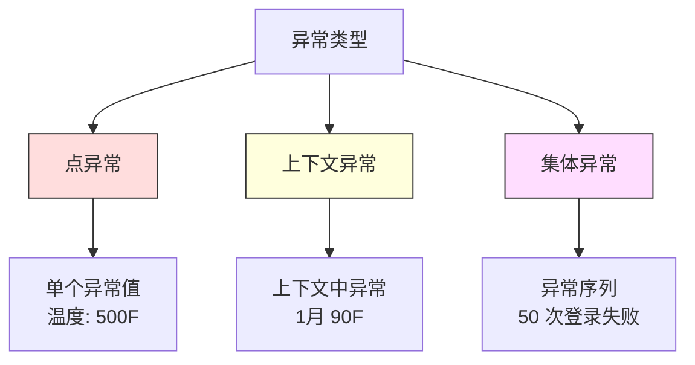
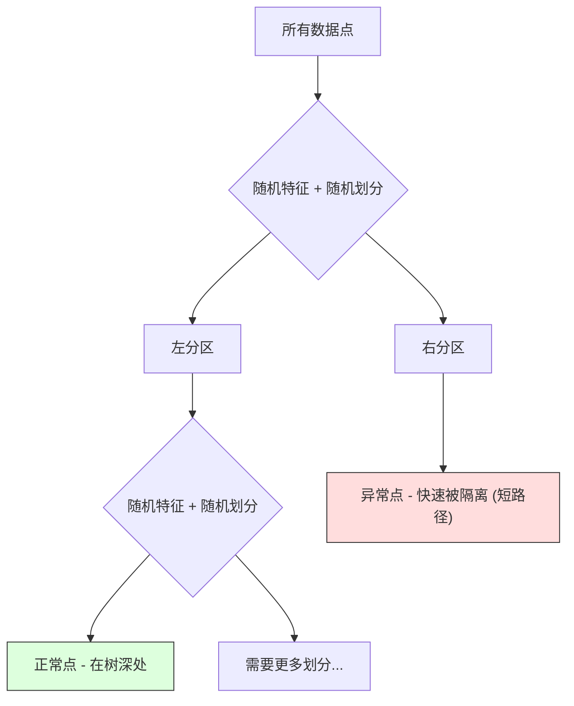

# 异常检测

> 正常很容易定义。异常就是所有不匹配正常的东西。

**类型:** 构建
**语言:** Python
**前置条件:** 阶段 2，第 01-09 课
**时间:** 约 75 分钟

## 学习目标

- 从零实现 Z-score、IQR 和隔离森林异常检测方法
- 区分点异常、上下文异常和集体异常，并为每种类型选择合适的检测方法
- 解释为什么异常检测被框架化为建模正常数据，而非分类异常
- 比较无监督异常检测与监督分类，并评估新异常覆盖范围与精确率之间的权衡

## 问题

一张信用卡下午 2 点在纽约使用，2:05 又在东京使用。一个工厂传感器读数为 150 度，而正常范围是 80-120。一台服务器每秒发送 50,000 个请求，而日均值只有 200。

这些都是异常。找到它们很重要。欺诈造成数十亿美元的损失。设备故障导致停机。网络入侵造成数据泄露。

挑战在于：你很少拥有异常的标注样本。欺诈仅占交易的 0.1%。设备故障一年只发生几次。你无法训练标准的分类器，因为"异常"类别中几乎没有可以学习的东西。即使你有一些标签，你见过的异常也不是你将遇到的唯一类型。明天的欺诈方案与今天的不同。

异常检测翻转了问题。不去学习什么是异常的，而是去学习什么是正常的。任何偏离正常的东西都是可疑的。这无需标签即可工作，能适应新类型的异常，并能扩展到海量数据集。

## 核心概念

### 异常的类型

并非所有异常都相同：

- **点异常。** 一个与上下文无关的异常单点。温度读数 500 度。一笔 50,000 美元的交易来自一个通常消费 50 美元的账户。
- **上下文异常。** 在给定上下文中异常的数据点。90 度的温度在夏天正常，在冬天异常。相同的值，不同的上下文。
- **集体异常。** 一组整体异常的数据点序列，尽管每个单独的点可能是正常的。五次登录失败是正常的。连续五十次是暴力攻击。

大多数方法检测点异常。上下文异常需要时间或位置特征。集体异常需要序列感知的方法。



### 无监督框架化

在标准分类中，你有两个类别的标签。在异常检测中，你通常面临三种情况之一：

1. **完全无监督。** 完全没有标签。你在所有数据上拟合检测器，期望异常足够稀少，不会污染"正常"模型。
2. **半监督。** 你有一个仅包含正常数据的干净数据集。你在这个干净数据上拟合，然后对其他所有数据进行评分。在可能的情况下，这是最强的设置。
3. **弱监督。** 你有少量标注的异常。用于评估，而非训练。无监督训练，然后对标注子集测量精确率和召回率。

关键洞察：异常检测从根本上不同于分类。你在建模正常数据的分布，而非两个类别之间的决策边界。

### 监督 vs 无监督：权衡

如果你确实有标注的异常，应该将它们用于训练（监督分类）还是仅用于评估（无监督检测）？

**监督方式（作为分类处理）：**
- 捕获你见过的那几种确切类型的异常
- 对已知异常类型有更高的精确率
- 完全遗漏新的异常类型
- 当新异常类型出现时需要重新训练
- 需要足够的异常样本（往往太少）

**无监督方式（建模正常，标记偏差）：**
- 捕获任何偏离正常的情况，包括新类型
- 不需要标注异常
- 更高的误报率（并非所有不寻常的事情都是坏的）
- 对分布偏移更鲁棒

在实践中，最好的系统结合两者：无监督检测用于广泛覆盖，监督模型用于已知的高优先级异常类型，人工审核用于模糊案例。

### Z-Score 方法

最简单的方法。计算每个特征的均值和标准差。标记任何距离均值超过 k 个标准差的点。

```text
z_score = (x - mean) / std
如果 |z_score| > 阈值，则判定为异常
```

默认阈值为 3.0（对于高斯分布，99.7% 的正常数据落在 3 个标准差之内）。

**优势：** 简单。快速。可解释（"这个值与正常相差 4.5 个标准差"）。

**劣势：** 假设数据服从正态分布。对训练数据中的异常值敏感（异常值会移动均值并放大标准差，使它们更难被检测到）。在多峰分布上失效。

**适用场景：** 数据大致呈钟形分布的单特征监控。服务器响应时间、制造公差、具有稳定基线的传感器读数。

**失效场景：** 多聚类数据（两个办事处的不同基线温度）、偏斜数据（交易金额中 1000 美元罕见但不异常）、训练集中有异常值的数据。

### IQR 方法

比 Z-score 更鲁棒。使用四分位距而非均值和标准差。

```
Q1 = 第 25 百分位数
Q3 = 第 75 百分位数
IQR = Q3 - Q1
下界 = Q1 - factor * IQR
上界 = Q3 + factor * IQR
如果 x < 下界 或 x > 上界，则判定为异常
```

默认因子为 1.5。

**优势：** 对异常值鲁棒（百分位数不受极端值影响）。适用于偏斜分布。无正态性假设。

**劣势：** 仅单变量（每次独立应用于一个特征）。无法检测仅在特征联合考虑时才异常的异常点（一个点可能每个特征单独看都正常，但在联合空间中异常）。

**实用说明：** IQR 中的 1.5 倍因子对应箱线图中的须线。须线之外的点是潜在的异常值。使用 3.0 而非 1.5 使检测器更保守（更少的标记、更少的误报）。正确的因子取决于你对误报的容忍度。

### 隔离森林

关键洞察：异常是少数且不同的。在随机划分数据时，异常更容易被隔离——它们需要更少的随机划分就能与其他数据分离。



**工作原理：**
1. 构建大量随机树（隔离森林）
2. 在每个节点，随机选择一个特征和该特征最小值和最大值之间的随机分割值
3. 持续分割直到每个点被隔离（在自己的叶节点中）
4. 异常点在所有树中具有更短的平均路径长度

**为什么有效：** 正常点位于密集区域。需要大量随机分割才能将一个正常点从其邻居中隔离出来。异常点位于稀疏区域。一两个随机分割就足以隔离它们。

异常分数基于所有树上的平均路径长度，并通过随机二叉搜索树的期望路径长度进行归一化：

```
score(x) = 2^(-average_path_length(x) / c(n))
```

其中 `c(n)` 是 n 个样本的期望路径长度。分数接近 1 表示异常。分数接近 0.5 表示正常。分数接近 0 表示非常正常（深陷密集聚类中）。

**优势：** 无分布假设。适用于高维数据。可扩展性好（因为每棵树使用子采样，在样本数量上呈次线性）。处理混合特征类型。

**劣势：** 难以检测密集区域中的异常（掩蔽效应）。当许多特征不相关时，随机分割效果较差。

**关键超参数：**
- `n_estimators`：树的数量。100 通常足够。更多树给出更稳定的分数但计算更慢。
- `max_samples`：每棵树的样本数。原始论文中默认为 256。更小的值使每棵树不太准确但增加多样性。子采样是隔离森林快速的原因——每棵树只看到数据的一小部分。
- `contamination`：预期的异常比例。仅用于设置阈值，不影响分数本身。

### 局部异常因子 (LOF)

LOF 将一个点周围的局部密度与其邻居周围的密度进行比较。稀疏区域中且被密集区域包围的点是异常的。

**工作原理：**
1. 对每个点，找到其 k 个最近邻
2. 计算局部可达密度（邻域有多密集）
3. 将每个点的密度与其邻居的密度比较
4. 如果一个点的密度显著低于其邻居，则是异常点

**LOF 分数：**
- LOF 接近 1.0 表示密度与邻居相似（正常）
- LOF 大于 1.0 表示密度低于邻居（可能异常）
- LOF 远大于 1.0（如 2.0+）表示密度显著较低（很可能是异常）

"局部"这个词至关重要。考虑一个有两个聚类的数据集：一个包含 1000 个点的密集聚类，一个包含 50 个点的稀疏聚类。稀疏聚类边缘上的点从全局角度看不异常——它有 50 个邻居。但如果它的直接邻居比它更密集，它从局部角度看是异常的。LOF 捕获了全局方法会遗漏的这种细微差别。

**优势：** 检测局部异常（在邻域内异常的点，即使从全局角度看并不异常）。适用于不同密度的聚类。

**劣势：** 在大数据集上较慢（朴素实现 O(n^2)）。对 k 的选择敏感。在非常高维度中效果不佳（维度灾难影响距离计算）。

### 方法比较

| 方法 | 假设 | 速度 | 处理高维 | 检测局部异常 |
|--------|------------|-------|-------------------|------------------------|
| Z-score | 正态分布 | 非常快 | 是（逐特征） | 否 |
| IQR | 无（逐特征） | 非常快 | 是（逐特征） | 否 |
| 隔离森林 | 无 | 快 | 是 | 部分 |
| LOF | 距离有意义 | 慢 | 差 | 是 |

### 评估挑战

评估异常检测器比评估分类器更难：

- **极端类别不平衡。** 对于 0.1% 的异常率，对所有数据预测"正常"可获得 99.9% 的准确率。准确率是无用的。
- **AUROC 具有误导性。** 在严重不平衡的情况下，即使模型在实际阈值处遗漏大多数异常，AUROC 可能看起来很好。
- **更好的指标：** Precision@k（前 k 个被标记的项目中有多少是真实异常）、AUPRC（精确率-召回率曲线下面积）、以及在固定误报率下的召回率。


### 异常检测流水线

在实践中，异常检测遵循以下工作流程：

1. **收集基线数据。** 理想情况下，是一个你知道没有（或很少有）异常的时期。
2. **特征工程。** 原始特征加上衍生特征（滚动统计量、时间特征、比率）。
3. **训练检测器。** 在基线数据上拟合。模型学习"正常"是什么样子。
4. **对新数据评分。** 每个新观测得到一个异常分数。
5. **阈值选择。** 选择分数截止值。这是一个商业决策：更高阈值意味着更少的误报但更多的遗漏异常。
6. **告警和调查。** 被标记的点进入人工审核或自动响应。
7. **反馈收集。** 记录被标记项是真实异常还是误报。使用这些数据来评估检测器并随时间调整阈值。

流水线永远不会"完成"。数据分布会偏移，新异常类型会出现，阈值需要调整。将异常检测视为一个活的系统，而非一次性的模型。

## 构建实现

`code/anomaly_detection.py` 中的代码从零实现了 Z-score、IQR 和隔离森林。

### Z-Score 检测器

```python
def zscore_detect(X, threshold=3.0):
    mean = X.mean(axis=0)
    std = X.std(axis=0)
    std[std == 0] = 1.0
    z = np.abs((X - mean) / std)
    return z.max(axis=1) > threshold
```

简单且向量化。如果任何特征超过阈值，标记该点。

### IQR 检测器

```python
def iqr_detect(X, factor=1.5):
    q1 = np.percentile(X, 25, axis=0)
    q3 = np.percentile(X, 75, axis=0)
    iqr = q3 - q1
    iqr[iqr == 0] = 1.0
    lower = q1 - factor * iqr
    upper = q3 + factor * iqr
    outside = (X < lower) | (X > upper)
    return outside.any(axis=1)
```

### 从零实现隔离森林

从零实现构建了随机划分特征空间的隔离树：

```python
class IsolationTree:
    def __init__(self, max_depth):
        self.max_depth = max_depth

    def fit(self, X, depth=0):
        n, p = X.shape
        if depth >= self.max_depth or n <= 1:
            self.is_leaf = True
            self.size = n
            return self
        self.is_leaf = False
        self.feature = np.random.randint(p)
        x_min = X[:, self.feature].min()
        x_max = X[:, self.feature].max()
        if x_min == x_max:
            self.is_leaf = True
            self.size = n
            return self
        self.threshold = np.random.uniform(x_min, x_max)
        left_mask = X[:, self.feature] < self.threshold
        self.left = IsolationTree(self.max_depth).fit(X[left_mask], depth + 1)
        self.right = IsolationTree(self.max_depth).fit(X[~left_mask], depth + 1)
        return self
```

隔离一个点所需的路径长度决定了其异常分数。更短的路径意味着更异常。

`IsolationForest` 类包装多棵树：

```python
class IsolationForest:
    def __init__(self, n_estimators=100, max_samples=256, seed=42):
        self.n_estimators = n_estimators
        self.max_samples = max_samples

    def fit(self, X):
        sample_size = min(self.max_samples, X.shape[0])
        max_depth = int(np.ceil(np.log2(sample_size)))
        for _ in range(self.n_estimators):
            idx = rng.choice(X.shape[0], size=sample_size, replace=False)
            tree = IsolationTree(max_depth=max_depth)
            tree.fit(X[idx])
            self.trees.append(tree)

    def anomaly_score(self, X):
        avg_path = 所有树上的平均路径长度
        scores = 2.0 ** (-avg_path / c(max_samples))
        return scores
```

归一化因子 `c(n)` 是在具有 n 个元素的二叉搜索树中不成功搜索的期望路径长度。它等于 `2 * H(n-1) - 2*(n-1)/n`，其中 `H` 是调和数。这种归一化确保分数在不同大小的数据集之间可比较。

### 演示场景

代码生成了多个测试场景：

1. **带有异常值的单聚类。** 一个 2D 高斯聚类，远离中心注入异常点。所有方法在这里都应该有效。
2. **多峰数据。** 三个不同大小和密度的聚类。聚类之间的点是异常的。Z-score 会有困难，因为逐特征的范围很宽。
3. **高维数据。** 50 个特征，但异常仅在其中的 5 个上不同。测试方法是否能在特征子集中找到异常。

每个演示使用精确率、召回率、F1 和 Precision@k 比较所有方法。

## 使用

使用 sklearn（使用库实现，而非从零实现）：

```python
from sklearn.ensemble import IsolationForest
from sklearn.neighbors import LocalOutlierFactor

iso = IsolationForest(n_estimators=100, contamination=0.05, random_state=42)
iso.fit(X_train)
predictions = iso.predict(X_test)

lof = LocalOutlierFactor(n_neighbors=20, contamination=0.05, novelty=True)
lof.fit(X_train)
predictions = lof.predict(X_test)
```

注意 `contamination` 设置了预期的异常比例。正确设置它很重要——太低会遗漏异常，太高会产生误报。

`anomaly_detection.py` 中的代码在相同数据上比较了从零实现和 sklearn 实现。

### sklearn 的 Contamination 参数

sklearn 中的 `contamination` 参数决定了将连续异常分数转换为二值预测的阈值。它不会改变底层的分数。

```python
iso_5 = IsolationForest(contamination=0.05)
iso_10 = IsolationForest(contamination=0.10)
```

两者产生相同的异常分数。但 `iso_5` 标记前 5% 而 `iso_10` 标记前 10%。如果你不知道真实的异常率（通常你不知道），设置 contamination 为 "auto"，并直接使用原始分数。根据误报和漏报之间的成本权衡设置你自己的阈值。

### 单类 SVM

另一种值得了解的无监督异常检测器。单类 SVM 在高维特征空间中（使用核技巧）围绕正常数据拟合一个边界。

```python
from sklearn.svm import OneClassSVM

oc_svm = OneClassSVM(kernel="rbf", gamma="auto", nu=0.05)
oc_svm.fit(X_train)
predictions = oc_svm.predict(X_test)
```

`nu` 参数近似于异常的比例。单类 SVM 在中小型数据集上效果很好，但无法扩展到非常大的数据（核矩阵呈二次增长）。

### 自编码器方法（预览）

自编码器是学习压缩和重建数据的神经网络。在正常数据上训练。在测试时，异常点会有高的重建误差，因为网络仅学习重建正常模式。

这将在阶段 3（深度学习）中详细介绍，但原理是相同的：建模什么是正常的，标记什么是偏离的。

### 集成异常检测

正如集成方法可以改进分类（第 11 课），组合多个异常检测器可以改进检测效果。最简单的方法：

1. 运行多个检测器（Z-score、IQR、隔离森林、LOF）
2. 将每个检测器的分数归一化到 [0, 1]
3. 对归一化分数取平均
4. 标记平均分数高于阈值的点

这减少了误报，因为不同方法有不同的失效模式。一个被所有四种方法标记的点几乎肯定是异常的。一个只被一种方法标记的点可能只是该方法的一个特性。

更复杂的集成可以根据每个检测器的估计可靠性进行加权（如果有包含已知异常的验证集可用）。

### 生产环境考量

1. **阈值漂移。** 随着数据分布变化，固定阈值会过时。监控异常分数的分布并定期调整。
2. **告警疲劳。** 太多的误报会使运维人员停止关注。从高阈值开始（更少但更可靠的告警），随着信任建立再降低阈值。
3. **集成方法。** 在生产中，组合多个检测器。只有当多个方法都认为异常时才标记一个点。这显著减少了误报。
4. **特征工程。** 原始特征很少足够。添加滚动统计量、比率、距离上次事件的时间，以及领域特定特征。一个好的特征集比检测器的选择更重要。
5. **反馈循环。** 当运维人员调查被标记项并确认或驳回它们时，将这些反馈回系统。随时间积累标注数据，以评估和改进检测器。

## 交付成果

本课产出：
- `outputs/skill-anomaly-detector.md` —— 选择正确检测器的决策技能
- `code/anomaly_detection.py` —— Z-score、IQR 和隔离森林从零实现，并与 sklearn 对比

### 选择阈值

异常分数是连续的。你需要一个阈值来做出二值决策。这是一个商业决策，而非技术决策。

考虑两种场景：
- **欺诈检测。** 漏掉欺诈代价高昂（退单、客户信任）。误报需要人工分析师花 5 分钟调查。将阈值设低以捕获更多欺诈，接受更多误报。
- **设备维护。** 一次误报意味着一次不必要的停机，成本 50,000 美元。一次漏检的故障意味着 500,000 美元的维修。设置阈值以平衡这些成本。

在两种情况下，最优阈值取决于误报和漏报之间的成本比。在不同阈值下绘制精确率和召回率，叠加成本函数，选择成本最低的点。

### 扩展到生产

对于生产中的实时异常检测：

1. **批量训练，在线评分。** 定期（每日、每周）在近期正常数据上训练模型。每条新数据到达时即时评分。
2. **特征计算必须匹配。** 如果你用 30 天的滚动统计量训练，则需要 30 天的历史数据来计算新观测的特征。缓冲所需的历史数据。
3. **分数分布监控。** 随时间跟踪异常分数的分布。如果分数中位数向上漂移，要么数据在变化，要么模型过时了。
4. **可解释性。** 当你标记一个异常时，说明原因。Z-score："特征 X 比正常高 4.2 个标准差。"隔离森林："该点平均在 3.1 次划分后被隔离（正常点需要 8.5 次）。"

## 练习

1. **阈值调优。** 使用阈值从 1.0 到 5.0，步长为 0.5，运行 Z-score 检测器。在每个阈值处绘制精确率和召回率。对你的数据来说，最佳平衡点在哪里？

2. **多变量异常。** 创建 2D 数据，其中每个特征单独看正常，但组合在一起是异常的（例如，远离主聚类对角线的点）。证明逐特征的 Z-score 会漏检这些异常，但隔离森林能捕获。

3. **从零实现 LOF。** 使用 k 近邻实现局部异常因子。在相同数据上比较 sklearn 的 LocalOutlierFactor。使用 k=10 和 k=50——k 的选择如何影响结果？

4. **流式异常检测。** 修改 Z-score 检测器以适应流式场景：在新点到达时更新运行中的均值和方差（Welford 在线算法）。在相同数据上与批量 Z-score 比较。

5. **真实世界评估。** 取一个包含已知异常的数据集（例如，Kaggle 上的信用卡欺诈数据）。使用 precision@100、precision@500 和 AUPRC 评估所有四种方法。哪种方法效果最好？为什么？

## 关键术语

| 术语 | 人们的说法 | 实际含义 |
|------|----------------|----------------------|
| 异常 | "异常值、不寻常的点" | 显著偏离正常数据预期模式的数据点 |
| 点异常 | "单个奇怪的值" | 无论上下文如何都显眼的不寻常个体观测 |
| 上下文异常 | "正常值，错误上下文" | 在给定上下文（时间、位置等）中异常但在其他上下文中可能正常的观测 |
| 隔离森林 | "用随机划分找异常" | 一种集成随机树的方法，使用比正常点更少的分割来隔离异常 |
| 局部异常因子 | "将密度与邻居比较" | 标记局部密度远低于其邻居的点的方法 |
| Z-score | "与均值的标准差距离" | (x - mean) / std，衡量一个点距离中心有多少个标准差 |
| IQR | "四分位距" | Q3 - Q1，衡量中间 50% 数据的散布度，用于鲁棒的异常检测 |
| Contamination | "期望的异常比例" | 一个告诉检测器应将多少比例的数据标记为异常的超参数 |
| Precision@k | "前 k 个标记中有多少是真的" | 仅对最可疑的 k 个点计算的精确率，用于不平衡异常检测 |
| AUPRC | "精确率-召回率曲线下面积" | 总结所有阈值下精确率-召回率表现的指标，对于不平衡数据优于 AUROC |

## 进一步阅读

- [Liu et al., Isolation Forest (2008)](https://cs.nju.edu.cn/zhouzh/zhouzh.files/publication/icdm08b.pdf) —— 原始的隔离森林论文
- [Breunig et al., LOF: Identifying Density-Based Local Outliers (2000)](https://dl.acm.org/doi/10.1145/342009.335388) —— 原始的 LOF 论文
- [scikit-learn Outlier Detection docs](https://scikit-learn.org/stable/modules/outlier_detection.html) —— 所有 sklearn 异常检测器的概述
- [Chandola et al., Anomaly Detection: A Survey (2009)](https://dl.acm.org/doi/10.1145/1541880.1541882) —— 异常检测方法的全面综述
- [Goldstein and Uchida, A Comparative Evaluation of Unsupervised Anomaly Detection Algorithms (2016)](https://journals.plos.org/plosone/article?id=10.1371/journal.pone.0152173) —— 10 种方法在真实数据集上的经验比较
