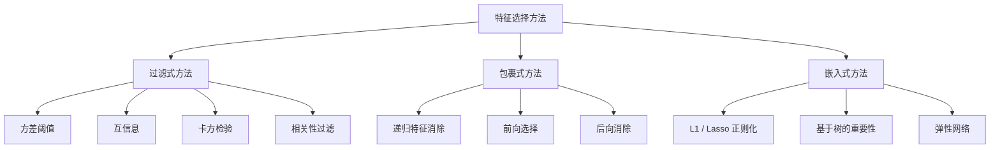
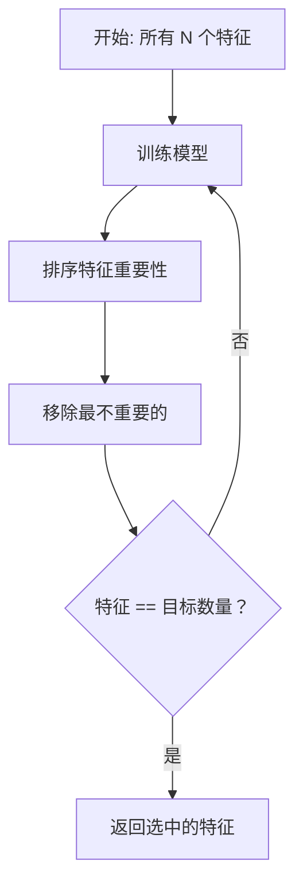
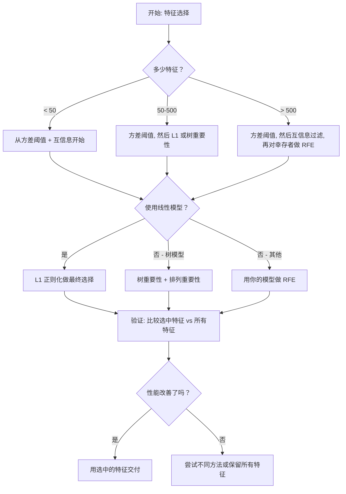

# 特征选择

> 更多特征并不更好。正确的特征才更好。

**类型:** 构建
**语言:** Python
**前置条件:** 阶段 2，第 01-09、08 课（特征工程）
**时间:** 约 75 分钟

## 学习目标

- 从零实现过滤式方法（方差阈值、互信息、卡方检验）和包裹式方法（RFE、前向选择）
- 解释为什么互信息能捕获相关性遗漏的非线性特征-目标关系
- 比较 L1 正则化（嵌入式选择）与 RFE（包裹式选择）并评估它们的计算权衡
- 构建一个结合多种方法的特征选择流水线，并在留出数据上证明泛化能力得到了改善

## 问题

你有 500 个特征。你的模型训练很慢，持续过拟合，没有人能解释它学到了什么。你添加更多特征希望能改善性能。结果变得更糟。

这就是维度灾难的实际体现。随着特征数量增长，特征空间的体积爆炸式增长。数据点变得稀疏。点之间的距离趋向一致。模型需要指数级更多的数据来找到真实模式。噪声特征淹没了信号特征。过拟合成为默认结果。

特征选择是解药。剥离噪声。移除冗余。保留那些携带关于目标的实际信息的特征。结果：更快的训练、更好的泛化能力、以及你真正能解释的模型。

目标不是使用所有可用的信息。而是使用正确的信息。

## 核心概念

### 特征选择的三大类别

每种特征选择方法都属于以下三类之一：



**过滤式方法**使用统计度量独立地对每个特征评分。不使用模型。快速，但遗漏特征交互。

**包裹式方法**训练一个模型来评估特征子集。使用模型性能作为评分标准。效果更好，但代价高，因为需要多次重新训练模型。

**嵌入式方法**将特征选择作为模型训练的一部分来完成。L1 正则化将权重驱动为零。决策树在最有用的特征上分裂。选择在拟合过程中发生，而非作为独立的步骤。

### 方差阈值

最简单的过滤器。如果一个特征在样本间几乎没有变化，它几乎不携带任何信息。

考虑一个特征在 1000 个样本中 999 个是 0.0。其方差接近零。没有模型能够使用它来区分类别。移除它。

```
方差(x) = mean((x - mean(x))^2)
```

设置一个阈值（如 0.01）。丢弃所有方差低于该值的特征。这在不查看目标变量的情况下就移除了常量或接近常量的特征。

何时使用：作为其他方法的预处理步骤。它以几乎零成本捕获了明显无用的特征。

局限性：一个特征可能具有高方差但仍然是纯噪声。方差阈值是必要的，但不是充分的。

### 互信息

互信息衡量了知道特征 X 的值能减少多少关于目标 Y 的不确定性。

```
I(X; Y) = sum_x sum_y p(x, y) * log(p(x, y) / (p(x) * p(y)))
```

如果 X 和 Y 独立，p(x, y) = p(x) * p(y)，因此对数项为零，I(X; Y) = 0。X 告诉你关于 Y 的信息越多，互信息越高。

优于相关性的关键优势：互信息捕获非线性关系。一个特征可能与目标的相关系数为零，但互信息很高，因为关系是二次的或周期性的。

对于连续特征，先离散化为分箱（基于直方图的估计）。分箱数量影响估计——太少的分箱丢失信息，太多的分箱增加噪声。一个常见的选择：sqrt(n) 个分箱或 Sturges 规则（1 + log2(n)）。


### 递归特征消除 (RFE)

RFE 是一种包裹式方法。它使用模型自身的特征重要性进行迭代剪枝：

1. 使用所有特征训练模型
2. 按重要性对特征排序（线性模型的系数，树的纯度减少量）
3. 移除最不重要的特征
4. 重复直到剩余所需数量的特征



RFE 考虑了特征交互，因为模型同时看到所有剩余特征。移除一个特征会改变其他特征的重要性。这使得它比过滤式方法更全面。

代价：你训练模型 N - target 次。有 500 个特征且目标是 10 个，那就是 490 轮训练。对于昂贵的模型，这很慢。你可以通过每步移除多个特征来加速（例如，每轮移除底部 10%）。

### L1 (Lasso) 正则化

L1 正则化将权重的绝对值加到损失函数中：

```
损失 = 预测误差 + alpha * sum(|w_i|)
```

alpha 参数控制特征剪枝的激进程度。更高的 alpha 意味着更多权重精确变为零。

为什么精确为零？L1 惩罚在权重空间中创建一个菱形的约束区域。最优解倾向于落在这个菱形的角上，其中一个或多个权重为零。L2 正则化（岭回归）创建一个圆形约束，权重会缩小但很少精确为零。

这是嵌入式特征选择：模型在训练过程中学习忽略哪些特征。权重为零的特征被有效移除。

优势：单次训练运行，处理相关特征（选择一个并将其他置零），内置在大多数线性模型实现中。

局限性：仅适用于线性模型。无法捕获非线性特征重要性。

### 基于树的特征重要性

决策树及其集成（随机森林、梯度提升）自然地排序特征。每次分裂减少不纯度（分类用基尼系数或熵，回归用方差）。产生更大不纯度减少的特征更重要。

对于有 T 棵树的随机森林：

```
重要性(特征_j) = (1/T) * 对所有树求和 
    所有在特征_j 上分裂的节点求和 
        (n_samples * 不纯度减少量)
```

这为每个特征给出归一化的重要性分数。它自动处理非线性关系和特征交互。

警示：基于树的重要性偏向具有许多唯一值的特征（高基数）。一个随机 ID 列会因为完美分离每个样本而看起来重要。使用排列重要性作为健全性检查。

### 排列重要性

一种模型无关的方法：

1. 训练模型并记录在验证数据上的基线性能
2. 对每个特征：随机打乱其值，测量性能下降
3. 下降越大，特征越重要

如果打乱一个特征不会损害性能，模型就不依赖它。如果性能崩溃，该特征至关重要。

排列重要性避免了基于树的重要性的基数偏差。但它很慢：每个特征一次完整评估，多次重复以保证稳定性。

### 方法对比表

| 方法 | 类型 | 速度 | 非线性 | 特征交互 |
|--------|------|-------|-----------|---------------------|
| 方差阈值 | 过滤式 | 非常快 | 否 | 否 |
| 互信息 | 过滤式 | 快 | 是 | 否 |
| 相关性过滤 | 过滤式 | 快 | 否 | 否 |
| RFE | 包裹式 | 慢 | 取决于模型 | 是 |
| L1 / Lasso | 嵌入式 | 快 | 否（线性） | 否 |
| 树重要性 | 嵌入式 | 中等 | 是 | 是 |
| 排列重要性 | 模型无关 | 慢 | 是 | 是 |

### 决策流程图



## 构建实现

### 步骤 1：生成具有已知特征结构的合成数据

```python
import numpy as np


def make_feature_selection_data(n_samples=500, seed=42):
    rng = np.random.RandomState(seed)

    x1 = rng.randn(n_samples)
    x2 = rng.randn(n_samples)
    x3 = rng.randn(n_samples)
    x4 = x1 + 0.1 * rng.randn(n_samples)
    x5 = x2 + 0.1 * rng.randn(n_samples)

    informative = np.column_stack([x1, x2, x3, x4, x5])

    correlated = np.column_stack([
        x1 * 0.9 + 0.1 * rng.randn(n_samples),
        x2 * 0.8 + 0.2 * rng.randn(n_samples),
        x3 * 0.7 + 0.3 * rng.randn(n_samples),
        x1 * 0.5 + x2 * 0.5 + 0.1 * rng.randn(n_samples),
        x2 * 0.6 + x3 * 0.4 + 0.1 * rng.randn(n_samples),
    ])

    noise = rng.randn(n_samples, 10) * 0.5

    X = np.hstack([informative, correlated, noise])
    y = (2 * x1 - 1.5 * x2 + x3 + 0.5 * rng.randn(n_samples) > 0).astype(int)

    feature_names = (
        [f"info_{i}" for i in range(5)]
        + [f"corr_{i}" for i in range(5)]
        + [f"noise_{i}" for i in range(10)]
    )

    return X, y, feature_names
```

我们了解真值：特征 0-4 是有信息量的（其中 3 和 4 是 0 和 1 的相关副本），特征 5-9 与有信息量特征相关，特征 10-19 是纯噪声。一个好的选择方法应将 0-4 排名最高，10-19 排名最低。

### 步骤 2：方差阈值

```python
def variance_threshold(X, threshold=0.01):
    variances = np.var(X, axis=0)
    mask = variances > threshold
    return mask, variances
```

### 步骤 3：互信息（离散）

```python
def discretize(x, n_bins=10):
    min_val, max_val = x.min(), x.max()
    if max_val == min_val:
        return np.zeros_like(x, dtype=int)
    bin_edges = np.linspace(min_val, max_val, n_bins + 1)
    binned = np.digitize(x, bin_edges[1:-1])
    return binned


def mutual_information(X, y, n_bins=10):
    n_samples, n_features = X.shape
    mi_scores = np.zeros(n_features)

    y_vals, y_counts = np.unique(y, return_counts=True)
    p_y = y_counts / n_samples

    for f in range(n_features):
        x_binned = discretize(X[:, f], n_bins)
        x_vals, x_counts = np.unique(x_binned, return_counts=True)
        p_x = dict(zip(x_vals, x_counts / n_samples))

        mi = 0.0
        for xv in x_vals:
            for yi, yv in enumerate(y_vals):
                joint_mask = (x_binned == xv) & (y == yv)
                p_xy = np.sum(joint_mask) / n_samples
                if p_xy > 0:
                    mi += p_xy * np.log(p_xy / (p_x[xv] * p_y[yi]))
        mi_scores[f] = mi

    return mi_scores
```

### 步骤 4：递归特征消除

```python
def simple_logistic_importance(X, y, lr=0.1, epochs=100):
    n_samples, n_features = X.shape
    w = np.zeros(n_features)
    b = 0.0

    for _ in range(epochs):
        z = X @ w + b
        pred = 1.0 / (1.0 + np.exp(-np.clip(z, -500, 500)))
        error = pred - y
        w -= lr * (X.T @ error) / n_samples
        b -= lr * np.mean(error)

    return w, b


def rfe(X, y, n_features_to_select=5, lr=0.1, epochs=100):
    n_total = X.shape[1]
    remaining = list(range(n_total))
    rankings = np.ones(n_total, dtype=int)
    rank = n_total

    while len(remaining) > n_features_to_select:
        X_subset = X[:, remaining]
        w, _ = simple_logistic_importance(X_subset, y, lr, epochs)
        importances = np.abs(w)

        least_idx = np.argmin(importances)
        original_idx = remaining[least_idx]
        rankings[original_idx] = rank
        rank -= 1
        remaining.pop(least_idx)

    for idx in remaining:
        rankings[idx] = 1

    selected_mask = rankings == 1
    return selected_mask, rankings
```

### 步骤 5：L1 特征选择

```python
def soft_threshold(w, alpha):
    return np.sign(w) * np.maximum(np.abs(w) - alpha, 0)


def l1_feature_selection(X, y, alpha=0.1, lr=0.01, epochs=500):
    n_samples, n_features = X.shape
    w = np.zeros(n_features)
    b = 0.0

    for _ in range(epochs):
        z = X @ w + b
        pred = 1.0 / (1.0 + np.exp(-np.clip(z, -500, 500)))
        error = pred - y

        gradient_w = (X.T @ error) / n_samples
        gradient_b = np.mean(error)

        w -= lr * gradient_w
        w = soft_threshold(w, lr * alpha)
        b -= lr * gradient_b

    selected_mask = np.abs(w) > 1e-6
    return selected_mask, w
```

### 步骤 6：基于树的重要性（简单决策树）

```python
def gini_impurity(y):
    if len(y) == 0:
        return 0.0
    classes, counts = np.unique(y, return_counts=True)
    probs = counts / len(y)
    return 1.0 - np.sum(probs ** 2)


def best_split(X, y, feature_idx):
    values = np.unique(X[:, feature_idx])
    if len(values) <= 1:
        return None, -1.0

    best_threshold = None
    best_gain = -1.0
    parent_gini = gini_impurity(y)
    n = len(y)

    for i in range(len(values) - 1):
        threshold = (values[i] + values[i + 1]) / 2.0
        left_mask = X[:, feature_idx] <= threshold
        right_mask = ~left_mask

        n_left = np.sum(left_mask)
        n_right = np.sum(right_mask)

        if n_left == 0 or n_right == 0:
            continue

        gain = parent_gini - (n_left / n) * gini_impurity(y[left_mask]) - (n_right / n) * gini_impurity(y[right_mask])

        if gain > best_gain:
            best_gain = gain
            best_threshold = threshold

    return best_threshold, best_gain


def tree_importance(X, y, n_trees=50, max_depth=5, seed=42):
    rng = np.random.RandomState(seed)
    n_samples, n_features = X.shape
    importances = np.zeros(n_features)

    for _ in range(n_trees):
        sample_idx = rng.choice(n_samples, size=n_samples, replace=True)
        feature_subset = rng.choice(n_features, size=max(1, int(np.sqrt(n_features))), replace=False)

        X_boot = X[sample_idx]
        y_boot = y[sample_idx]

        tree_imp = _build_tree_importance(X_boot, y_boot, feature_subset, max_depth)
        importances += tree_imp

    total = importances.sum()
    if total > 0:
        importances /= total

    return importances


def _build_tree_importance(X, y, feature_subset, max_depth, depth=0):
    n_features = X.shape[1]
    importances = np.zeros(n_features)

    if depth >= max_depth or len(np.unique(y)) <= 1 or len(y) < 4:
        return importances

    best_feature = None
    best_threshold = None
    best_gain = -1.0

    for f in feature_subset:
        threshold, gain = best_split(X, y, f)
        if gain > best_gain:
            best_gain = gain
            best_feature = f
            best_threshold = threshold

    if best_feature is None or best_gain <= 0:
        return importances

    importances[best_feature] += best_gain * len(y)

    left_mask = X[:, best_feature] <= best_threshold
    right_mask = ~left_mask

    importances += _build_tree_importance(X[left_mask], y[left_mask], feature_subset, max_depth, depth + 1)
    importances += _build_tree_importance(X[right_mask], y[right_mask], feature_subset, max_depth, depth + 1)

    return importances
```

### 步骤 7：运行所有方法并比较

代码文件在相同的合成数据集上运行所有五种方法，并打印一个比较表，显示每种方法选择了哪些特征。

## 使用

使用 scikit-learn，特征选择已内建到流水线中：

```python
from sklearn.feature_selection import (
    VarianceThreshold,
    mutual_info_classif,
    RFE,
    SelectFromModel,
)
from sklearn.linear_model import Lasso, LogisticRegression
from sklearn.ensemble import RandomForestClassifier

vt = VarianceThreshold(threshold=0.01)
X_filtered = vt.fit_transform(X)

mi_scores = mutual_info_classif(X, y)
top_k = np.argsort(mi_scores)[-10:]

rfe_selector = RFE(LogisticRegression(), n_features_to_select=10)
rfe_selector.fit(X, y)
X_rfe = rfe_selector.transform(X)

lasso_selector = SelectFromModel(Lasso(alpha=0.01))
lasso_selector.fit(X, y)
X_lasso = lasso_selector.transform(X)

rf = RandomForestClassifier(n_estimators=100)
rf.fit(X, y)
importances = rf.feature_importances_
```

从零实现精确展示了每种方法内部发生了什么。方差阈值只是计算 `var(X, axis=0)` 并应用一个掩码。互信息是在列联表中统计联合频率和边际频率。RFE 是一个循环：训练、排序、剪枝。L1 是带有软阈值步骤的梯度下降。树重要性累积跨分裂的不纯度减少量。没有魔法——只有统计量和循环。

sklearn 的版本增加了鲁棒性（例如，mutual_info_classif 使用 k-NN 密度估计而非分箱）、速度（C 实现）和流水线集成。

## 交付成果

本课产出：
- `outputs/skill-feature-selector.md` —— 选择正确特征选择方法的快速参考决策树

## 练习

1. **前向选择**：实现 RFE 的逆操作。从零个特征开始。每一步，添加最能改善模型性能的特征。当添加特征不再有帮助时停止。将选中的特征与 RFE 结果比较。哪个更快？哪个给出更好的结果？

2. **稳定性选择**：运行 L1 特征选择 50 次，每次在数据的随机 80% 子样本上，使用略有不同的 alpha 值。统计每个特征被选中的频率。在 > 80% 的运行中被选中的特征是"稳定的"。将稳定特征与单次运行 L1 选择比较。哪个更可靠？

3. **多重共线性检测**：计算所有特征的相关矩阵。实现一个函数，给定相关性阈值（如 0.9），从每对高度相关的特征中移除一个（保留与目标的互信息更高的那个）。在合成数据集上测试，验证它移除了冗余的相关特征。

4. **特征选择流水线**：将方差阈值、互信息过滤和 RFE 链接成一个流水线。首先移除接近零方差的特征，然后保留互信息前 50% 的特征，再对幸存者运行 RFE。将此流水线与单独在所有特征上运行 RFE 进行比较。流水线更快吗？同样准确吗？

5. **从零实现排列重要性**：实现排列重要性。对每个特征，打乱其值 10 次，测量 F1 分数的平均下降。将排序与基于树的重要性比较。找到它们不一致的案例并解释原因（提示：相关特征）。

## 关键术语

| 术语 | 人们的说法 | 实际含义 |
|------|----------------|----------------------|
| 过滤式方法 | "独立对特征评分" | 使用统计度量对特征进行排名的方法，不训练模型，孤立地评估每个特征 |
| 包裹式方法 | "用模型来选择特征" | 通过训练模型并使用其性能作为选择标准，来评估特征子集的特征选择方法 |
| 嵌入式方法 | "模型在训练过程中选择特征" | 特征选择作为模型拟合的一部分发生，如 L1 正则化将权重驱动为零 |
| 互信息 | "一个变量告诉你多少关于另一个变量的信息" | 衡量知道 X 后对 Y 不确定性的减少程度，捕获线性和非线性依赖关系 |
| 递归特征消除 | "训练、排序、剪枝、重复" | 一种迭代包裹式方法，训练模型、移除最不重要的特征，重复直至达到目标数量 |
| L1 / Lasso 正则化 | "杀死特征的惩罚项" | 将权重的绝对值之和加到损失函数中，将不重要特征的权重精确驱动为零 |
| 方差阈值 | "移除常量特征" | 丢弃样本间方差低于指定阈值的特征，过滤掉不携带信息的特征 |
| 特征重要性 | "哪些特征最重要" | 指示每个特征对模型预测贡献大小的分数，通过分裂增益（树）或系数幅度（线性）计算 |
| 排列重要性 | "打乱并测量损害" | 通过随机打乱每个特征的值并测量模型性能的下降来评估特征重要性 |
| 维度灾难 | "太多特征，不够的数据" | 添加特征会指数级增加特征空间体积的现象，使数据变得稀疏、距离变得无意义 |

## 进一步阅读

- [An Introduction to Variable and Feature Selection (Guyon & Elisseeff, 2003)](https://jmlr.org/papers/v3/guyon03a.html) —— 特征选择方法的奠基性综述，至今仍被广泛引用
- [scikit-learn Feature Selection Guide](https://scikit-learn.org/stable/modules/feature_selection.html) —— 过滤式、包裹式和嵌入式方法的实用参考，附有代码示例
- [Stability Selection (Meinshausen & Buhlmann, 2010)](https://arxiv.org/abs/0809.2932) —— 将子采样与特征选择结合，以获得鲁棒、可复现的结果
- [Beware Default Random Forest Importances (Strobl et al., 2007)](https://bmcbioinformatics.biomedcentral.com/articles/10.1186/1471-2105-8-25) —— 展示了基于树的重要性中的基数偏差，并提出条件重要性作为替代方案
