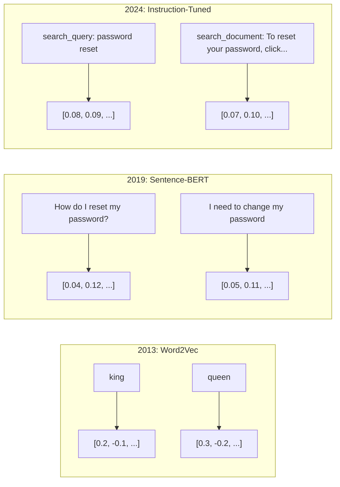
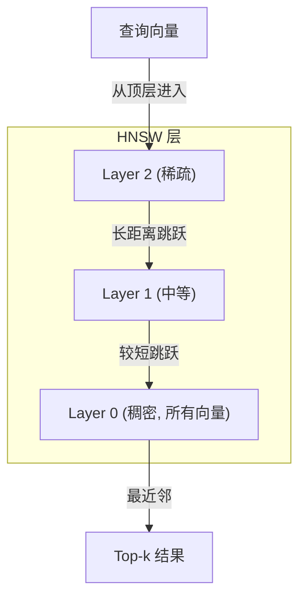

# Embedding 与向量表示

> 文本是离散的。数学是连续的。每当你让一个大语言模型（LLM）查找"相似"文档、比较语义或超越关键词进行搜索时，你都在依赖连接这两个世界的桥梁。这座桥梁就是 embedding。如果你不理解 embedding，你就不理解现代 AI。你只是在使用它。

**类型：** 构建
**语言：** Python
**前置要求：** 第 11 阶段第 01 课（Prompt Engineering）
**时间：** 约 75 分钟
**相关：** 第 5 阶段 · 第 22 课（Embedding 模型深度解析）涵盖稠密 vs 稀疏 vs 多向量、Matryoshka 截断和按维度选择模型。本课聚焦生产级流水线（向量数据库、HNSW、相似度数学）。在选择模型之前请阅读第 5 阶段 · 第 22 课。

## 学习目标

- 使用 API 提供商和开源模型生成文本 embedding，并计算它们之间的余弦相似度
- 解释为什么 embedding 能解决关键词搜索无法处理的词汇不匹配问题
- 构建一个按语义而非精确关键词匹配来检索文档的语义搜索索引
- 使用检索基准（precision@k, recall）评估 embedding 质量，并为你的任务选择合适的 embedding 模型

## 问题

你有 10,000 张支持工单。一位客户写道"我的付款没有通过"。你需要找到类似的过往工单。关键词搜索找到包含"付款"和"没有通过"的工单，但它遗漏了"交易失败"、"扣款被拒"和"账单错误"。这些工单用完全不同的词语描述的是完全相同的问题。

这就是词汇不匹配问题。人类语言有几十种表达同一件事的方式。关键词搜索将每个词视为一个没有含义的独立符号。它无法知道"被拒"和"没有通过"指的是同一个概念。

你需要一种文本表示方式，其中含义（而非拼写）决定相似度。你需要一种方法，将"我的付款没有通过"和"交易被拒"在某个数学空间中放在一起，同时将"我的付款及时到账"远远推开——尽管它们共享"付款"这个词。

这种表示方式就是 embedding。

## 概念

### 什么是 Embedding？

Embedding 是一个稠密（dense）浮点数向量，用于表示文本的含义。"稠密"这个词很重要——每个维度都携带信息，不像稀疏表示（bag-of-words, TF-IDF）那样大多数维度为零。

"The cat sat on the mat" 变成类似 `[0.023, -0.041, 0.087, ..., 0.012]` 的形式——根据模型不同，这是一个包含 768 到 3072 个数字的列表。这些数字编码了含义。你从不直接检查它们，你比较它们。

### Word2Vec 的突破

2013 年，Tomas Mikolov 和谷歌的同事们发布了 Word2Vec。核心洞察：训练一个神经网络从词的邻居预测词（或从词预测邻居），隐藏层的权重就变成了有意义的向量表示。

著名的结果：

```
king - man + woman = queen
```

词向量的向量算术捕捉了语义关系。从"man"到"woman"的方向与从"king"到"queen"的方向大致相同。这是该领域意识到几何可以编码含义的时刻。

Word2Vec 产生 300 维的向量。每个词获得一个向量，无论上下文如何。"river bank"（河岸）和"bank account"（银行账户）中的"bank"有相同的 embedding。这一局限推动了此后十年的研究。

### 从词到句子

词 embedding 表示单个 token。生产系统需要将整个句子、段落或文档 embedding 化。出现了四种方法：

**平均法（Averaging）**：取句子中所有词向量的平均值。成本低、有损耗，对于短文本来说效果出奇地不错。完全丢失了词序——"dog bites man"和"man bites dog"获得完全相同的 embedding。

**CLS token**：Transformer 模型（BERT, 2018 年）输出一个特殊的 [CLS] token embedding 来表示整个输入。比平均法更好，但 [CLS] token 是为下一句预测而训练的，而非相似度。

**对比学习（Contrastive learning）**：显式地训练模型将相似对推近、将不相似对推远。Sentence-BERT（Reimers & Gurevych, 2019）使用这种方法，成为现代 embedding 模型的基础。给定"How do I reset my password?"和"I need to change my password"，模型学习到这些应该具有几乎相同的向量。

**指令微调 embedding（Instruction-tuned embeddings）**：最新的方法。像 E5 和 GTE 这样的模型接受一个任务前缀（"search_query:", "search_document:"），告诉模型要产生什么类型的 embedding。这使得一个模型可以服务于多个任务。



### 现代 Embedding 模型

市场已经收敛到少数几个生产级选项（MTEB 评分截至 2026 年初，MTEB v2）：

| 模型 | 提供商 | 维度 | MTEB | 上下文 | 每百万 token 成本 |
|-------|----------|-----------|------|---------|------------------|
| Gemini Embedding 2 | Google | 3072 (Matryoshka) | 67.7 (retrieval) | 8192 | $0.15 |
| embed-v4 | Cohere | 1024 (Matryoshka) | 65.2 | 128K | $0.12 |
| voyage-4 | Voyage AI | 1024/2048 (Matryoshka) | 66.8 | 32K | $0.12 |
| text-embedding-3-large | OpenAI | 3072 (Matryoshka) | 64.6 | 8192 | $0.13 |
| text-embedding-3-small | OpenAI | 1536 (Matryoshka) | 62.3 | 8192 | $0.02 |
| BGE-M3 | BAAI | 1024 (dense+sparse+ColBERT) | 63.0 multilingual | 8192 | Open-weight |
| Qwen3-Embedding | Alibaba | 4096 (Matryoshka) | 66.9 | 32K | Open-weight |
| Nomic-embed-v2 | Nomic | 768 (Matryoshka) | 63.1 | 8192 | Open-weight |

MTEB（Massive Text Embedding Benchmark）v2 覆盖了检索、分类、聚类、reranking 和摘要等 100 多项任务。分数越高越好。到 2026 年，开源权重模型（Qwen3-Embedding, BGE-M3）在大多数维度上与闭源托管模型持平或超越。Gemini Embedding 2 在纯检索方面领先；Voyage/Cohere 在特定领域（金融、法律、代码）领先。在做出选择之前，始终在你自己的查询上进行基准测试。

### 相似度度量

给定两个 embedding 向量，有三种方法来衡量它们的相似程度：

**余弦相似度（Cosine similarity）**：两个向量之间夹角的余弦值。范围从 -1（完全相反）到 1（完全相同方向）。忽略幅度——一个 10 词的句子和一个 500 词的文档如果指向相同方向，可以得到 1.0 的分数。这是 90% 用例的默认选择。

```
cosine_sim(a, b) = dot(a, b) / (||a|| * ||b||)
```

**点积（Dot product）**：两个向量的原始内积。当向量被归一化（单位长度）时，等同于余弦相似度。计算速度更快。OpenAI 的 embedding 是归一化的，所以点积和余弦给出相同的排序。

```
dot(a, b) = sum(a_i * b_i)
```

**欧几里得距离（Euclidean / L2 distance）**：向量空间中的直线距离。越小 = 越相似。对幅度差异敏感。当空间中的绝对位置很重要（而不仅仅是方向）时使用。

```
L2(a, b) = sqrt(sum((a_i - b_i)^2))
```

何时使用哪种：

| 度量 | 适用场景 | 避免场景 |
|--------|----------|------------|
| 余弦相似度 | 比较不同长度的文本；大多数检索任务 | 幅度携带信息时 |
| 点积 | Embedding 已经归一化；追求最大速度 | 向量幅度变化较大时 |
| 欧几里得距离 | 聚类；空间最近邻问题 | 比较长度差异巨大的文档时 |

### 向量数据库与 HNSW

暴力相似度搜索将查询与每个存储的向量进行比较。对于 100 万个 1536 维的向量，每个查询需要 15 亿次乘加运算。太慢了。

向量数据库通过近似最近邻（Approximate Nearest Neighbor, ANN）算法解决这个问题。主流的算法是 HNSW（Hierarchical Navigable Small World，分层可导航小世界）：

1. 构建一个多层向量图
2. 顶层稀疏——远距离簇之间的长程连接
3. 底层稠密——附近向量之间的细粒度连接
4. 搜索从顶层开始，逐层贪心下降以精确化
5. 在 O(log n) 时间内返回近似 top-k 结果，而非 O(n)

HNSW 以少量的精度损失（通常 95-99% 召回率）换取巨大的速度提升。在 1000 万个向量上，暴力搜索需要数秒，HNSW 只需毫秒。



生产级选项：

| 数据库 | 类型 | 最适合 | 最大规模 |
|----------|------|----------|-----------|
| Pinecone | 托管 SaaS | 零运维生产环境 | 数十亿 |
| Weaviate | 开源 | 自托管、混合搜索 | 1 亿+ |
| Qdrant | 开源 | 高性能、过滤 | 1 亿+ |
| ChromaDB | 嵌入式 | 原型开发、本地开发 | 100 万 |
| pgvector | Postgres 扩展 | 已经在使用 Postgres | 1000 万 |
| FAISS | 库 | 进程内、研究 | 10 亿+ |

### Chunking 策略

文档太长，无法作为单个向量进行 embedding。一个 50 页的 PDF 涵盖几十个主题——它的 embedding 变成了所有内容的平均值，与任何具体内容都不相似。你将文档拆分成 chunk（文本块），并对每个 chunk 分别进行 embedding。

**固定大小 chunking（Fixed-size chunking）**：每 N 个 token 切分一次，带有 M 个 token 的重叠。简单且可预测。当文档没有清晰结构时效果很好。512 token 的 chunk，50 token 重叠：chunk 1 是 token 0-511，chunk 2 是 token 462-973。

**按句子 chunking（Sentence-based chunking）**：在句子边界处拆分，将句子分组直到达到 token 上限。每个 chunk 至少包含一个完整句子。比固定大小更好，因为你永远不会把一个完整思路切成两半。

**递归 chunking（Recursive chunking）**：首先尝试在最大边界处拆分（章节标题）。如果仍然太大，尝试段落边界。然后是句子边界。然后是字符限制。这就是 LangChain 的 `RecursiveCharacterTextSplitter`，对混合格式的语料库效果很好。

**语义 chunking（Semantic chunking）**：对每个句子进行 embedding，然后将 embedding 相似的连续句子分组。当 embedding 相似度低于阈值时，开始一个新的 chunk。计算开销大（需要对每个句子单独 embedding），但产生最连贯的 chunk。

| 策略 | 复杂度 | 质量 | 最适合 |
|----------|-----------|---------|----------|
| 固定大小 | 低 | 尚可 | 非结构化文本、日志 |
| 按句子 | 低 | 好 | 文章、邮件 |
| 递归 | 中 | 好 | Markdown、HTML、混合文档 |
| 语义 | 高 | 最佳 | 对检索质量要求极高的场景 |

大多数系统的甜点区间：256-512 token 的 chunk，50 token 的重叠。

### Bi-Encoder 与 Cross-Encoder

Bi-encoder 独立地将查询和文档进行 embedding，然后比较向量。速度快——你对查询做一次 embedding，然后与预先计算好的文档 embedding 进行比较。这是你用于检索的方式。

Cross-encoder 将查询和文档作为单个输入，输出一个相关性分数。速度慢——它对每个查询-文档对通过完整模型进行处理。但精度更高，因为它可以同时在查询和文档 token 之间进行注意力交互。

生产级模式：bi-encoder 检索 top-100 候选，cross-encoder 将其重排（rerank）为 top-10。这就是检索-然后-重排（retrieve-then-rerank）流水线。


Reranking 模型：Cohere Rerank 3.5（$2/千次查询）、BGE-reranker-v2（免费，开源）、Jina Reranker v2（免费，开源）。

### Matryoshka Embedding

传统的 embedding 是全有或全无。一个 1536 维向量使用 1536 个浮点数。你不能将它截断到 256 维而不重新训练。

Matryoshka 表示学习（Kusupati et al., 2022）解决了这个问题。模型被训练成前 N 个维度捕获最重要的信息，就像俄罗斯套娃一样。将一个 1536 维的 Matryoshka embedding 截断到 256 维会损失一些精度，但仍然可以使用。

OpenAI 的 text-embedding-3-small 和 text-embedding-3-large 通过 `dimensions` 参数支持 Matryoshka 截断。请求 256 维而非 1536 维可将存储减少 6 倍，在 MTEB 基准上大约有 3-5% 的精度损失。

### 二值量化（Binary Quantization）

一个 1536 维的 embedding 以 float32 存储时使用 6,144 字节。乘以 1000 万个文档：仅向量就 61 GB。

二值量化将每个浮点数转换为一个比特：正值变成 1，负值变成 0。存储从 6,144 字节降到 192 字节——减少 32 倍。相似度使用汉明距离（Hamming distance，计算不同比特数）来计算，CPU 可以用一条指令完成。

检索召回率的精度损失大约在 5-10%。常见模式：对数百万向量进行第一轮搜索时使用二值量化，然后用全精度向量对 top-1000 重新评分。这可以在 32 倍的内存节省下获得 95%+ 的全精度精度。

## 构建

我们从头构建一个语义搜索引擎。没有向量数据库，没有外部 embedding API。纯 Python 加 numpy 进行数学计算。

### 第 1 步：文本 Chunking

```python
def chunk_text(text, chunk_size=200, overlap=50):
    words = text.split()
    chunks = []
    start = 0
    while start < len(words):
        end = start + chunk_size
        chunk = " ".join(words[start:end])
        chunks.append(chunk)
        start += chunk_size - overlap
    return chunks


def chunk_by_sentences(text, max_chunk_tokens=200):
    sentences = text.replace("\n", " ").split(".")
    sentences = [s.strip() + "." for s in sentences if s.strip()]
    chunks = []
    current_chunk = []
    current_length = 0
    for sentence in sentences:
        sentence_length = len(sentence.split())
        if current_length + sentence_length > max_chunk_tokens and current_chunk:
            chunks.append(" ".join(current_chunk))
            current_chunk = []
            current_length = 0
        current_chunk.append(sentence)
        current_length += sentence_length
    if current_chunk:
        chunks.append(" ".join(current_chunk))
    return chunks
```

### 第 2 步：从头构建 Embedding

我们使用带 L2 归一化的 TF-IDF 实现一个简单的稠密 embedding。这不是神经网络 embedding，但它遵循相同的契约：文本进，固定大小向量出，相似文本产生相似向量。

```python
import math
import numpy as np
from collections import Counter

class SimpleEmbedder:
    def __init__(self):
        self.vocab = []
        self.idf = []
        self.word_to_idx = {}

    def fit(self, documents):
        vocab_set = set()
        for doc in documents:
            vocab_set.update(doc.lower().split())
        self.vocab = sorted(vocab_set)
        self.word_to_idx = {w: i for i, w in enumerate(self.vocab)}
        n = len(documents)
        self.idf = np.zeros(len(self.vocab))
        for i, word in enumerate(self.vocab):
            doc_count = sum(1 for doc in documents if word in doc.lower().split())
            self.idf[i] = math.log((n + 1) / (doc_count + 1)) + 1

    def embed(self, text):
        words = text.lower().split()
        count = Counter(words)
        total = len(words) if words else 1
        vec = np.zeros(len(self.vocab))
        for word, freq in count.items():
            if word in self.word_to_idx:
                tf = freq / total
                vec[self.word_to_idx[word]] = tf * self.idf[self.word_to_idx[word]]
        norm = np.linalg.norm(vec)
        if norm > 0:
            vec = vec / norm
        return vec
```

### 第 3 步：相似度函数

```python
def cosine_similarity(a, b):
    dot = np.dot(a, b)
    norm_a = np.linalg.norm(a)
    norm_b = np.linalg.norm(b)
    if norm_a == 0 or norm_b == 0:
        return 0.0
    return float(dot / (norm_a * norm_b))


def dot_product(a, b):
    return float(np.dot(a, b))


def euclidean_distance(a, b):
    return float(np.linalg.norm(a - b))
```

### 第 4 步：使用暴力搜索的向量索引

```python
class VectorIndex:
    def __init__(self):
        self.vectors = []
        self.texts = []
        self.metadata = []

    def add(self, vector, text, meta=None):
        self.vectors.append(vector)
        self.texts.append(text)
        self.metadata.append(meta or {})

    def search(self, query_vector, top_k=5, metric="cosine"):
        scores = []
        for i, vec in enumerate(self.vectors):
            if metric == "cosine":
                score = cosine_similarity(query_vector, vec)
            elif metric == "dot":
                score = dot_product(query_vector, vec)
            elif metric == "euclidean":
                score = -euclidean_distance(query_vector, vec)
            else:
                raise ValueError(f"Unknown metric: {metric}")
            scores.append((i, score))
        scores.sort(key=lambda x: x[1], reverse=True)
        results = []
        for idx, score in scores[:top_k]:
            results.append({
                "text": self.texts[idx],
                "score": score,
                "metadata": self.metadata[idx],
                "index": idx
            })
        return results

    def size(self):
        return len(self.vectors)
```

### 第 5 步：语义搜索引擎

```python
class SemanticSearchEngine:
    def __init__(self, chunk_size=200, overlap=50):
        self.embedder = SimpleEmbedder()
        self.index = VectorIndex()
        self.chunk_size = chunk_size
        self.overlap = overlap

    def index_documents(self, documents, source_names=None):
        all_chunks = []
        all_sources = []
        for i, doc in enumerate(documents):
            chunks = chunk_text(doc, self.chunk_size, self.overlap)
            all_chunks.extend(chunks)
            name = source_names[i] if source_names else f"doc_{i}"
            all_sources.extend([name] * len(chunks))
        self.embedder.fit(all_chunks)
        for chunk, source in zip(all_chunks, all_sources):
            vec = self.embedder.embed(chunk)
            self.index.add(vec, chunk, {"source": source})
        return len(all_chunks)

    def search(self, query, top_k=5, metric="cosine"):
        query_vec = self.embedder.embed(query)
        return self.index.search(query_vec, top_k, metric)

    def search_with_scores(self, query, top_k=5):
        results = self.search(query, top_k)
        return [
            {
                "text": r["text"][:200],
                "source": r["metadata"].get("source", "unknown"),
                "score": round(r["score"], 4)
            }
            for r in results
        ]
```

### 第 6 步：比较相似度度量

```python
def compare_metrics(engine, query, top_k=3):
    results = {}
    for metric in ["cosine", "dot", "euclidean"]:
        hits = engine.search(query, top_k=top_k, metric=metric)
        results[metric] = [
            {"score": round(h["score"], 4), "preview": h["text"][:80]}
            for h in hits
        ]
    return results
```

## 使用

使用生产级 embedding API 时，架构保持不变。只有 embedder 改变：

```python
from openai import OpenAI

client = OpenAI()

def openai_embed(texts, model="text-embedding-3-small", dimensions=None):
    kwargs = {"model": model, "input": texts}
    if dimensions:
        kwargs["dimensions"] = dimensions
    response = client.embeddings.create(**kwargs)
    return [item.embedding for item in response.data]
```

使用 OpenAI 进行 Matryoshka 截断——相同模型、更少维度、更低存储：

```python
full = openai_embed(["semantic search query"], dimensions=1536)
compact = openai_embed(["semantic search query"], dimensions=256)
```

256 维向量使用 6 倍更少的存储。对于 1000 万个文档，这是 10 GB 对比 61 GB。在标准基准上的精度损失大约为 3-5%。

使用 Cohere 进行 reranking：

```python
import cohere

co = cohere.ClientV2()

results = co.rerank(
    model="rerank-v3.5",
    query="What is the refund policy?",
    documents=["Full refund within 30 days...", "No refunds after 90 days..."],
    top_n=3
)
```

使用本地 embedding（不依赖 API）：

```python
from sentence_transformers import SentenceTransformer

model = SentenceTransformer("BAAI/bge-small-en-v1.5")
embeddings = model.encode(["semantic search query", "another document"])
```

我们构建的 VectorIndex 类可以与以上任何一种配合使用。替换 embedding 函数即可，搜索逻辑保持不变。

## 交付

本课产出：
- `outputs/prompt-embedding-advisor.md` —— 用于为特定用例选择 embedding 模型和策略的 prompt
- `outputs/skill-embedding-patterns.md` —— 教授 agent 如何在生产中有效使用 embedding 的技能

## 练习

1. **度量比较**：对示例文档运行相同的 5 个查询，分别使用余弦相似度、点积和欧几里得距离。记录每种度量的 top-3 结果。哪些查询在度量之间有分歧？为什么？

2. **Chunk 大小实验**：分别用 50、100、200 和 500 个词作为 chunk 大小对示例文档进行索引。对每种大小运行 5 个查询并记录 top-1 相似度分数。绘制 chunk 大小与检索质量之间的关系曲线。找出更大的 chunk 开始有损质量的那个点。

3. **Matryoshka 模拟**：构建一个产生 500 维向量的 SimpleEmbedder。截断到 50、100、200 和 500 维。衡量每次截断对检索召回率的影响。这模拟了 Matryoshka 的行为，而不需要真正的训练技巧。

4. **二值量化**：取出搜索引擎中的 embedding，将它们转换为二进制（正值为 1，负值为 0），并实现汉明距离搜索。将 top-10 结果与全精度余弦相似度的结果进行比较。衡量重叠百分比。

5. **按句子 chunking**：用 `chunk_by_sentences` 替换固定大小 chunking。运行相同的查询并比较检索分数。尊重句子边界是否改进了结果？

## 关键术语

| 术语 | 人们的说法 | 实际含义 |
|------|----------------|----------------------|
| Embedding | "把文本变成数字" | 一个稠密向量，其中几何上的邻近性编码了语义相似度 |
| Word2Vec | "最初的 embedding" | 2013 年通过预测上下文词学习词向量的模型；证明了向量算术可以编码含义 |
| 余弦相似度 | "两个向量有多相似" | 两个向量之间夹角的余弦值；1 = 相同方向，0 = 正交，-1 = 完全相反 |
| HNSW | "快速向量搜索" | 分层可导航小世界图——多层结构实现 O(log n) 的近似最近邻搜索 |
| Bi-encoder | "分别 embed，快速比较" | 独立地将查询和文档编码为向量；支持预计算和快速检索 |
| Cross-encoder | "慢但精确的 reranker" | 将查询-文档对作为整体通过完整模型处理；精度更高，无法预计算 |
| Matryoshka embedding | "可截断向量" | 训练时前 N 个维度捕获最重要信息的 embedding，支持可变大小存储 |
| 二值量化 | "1-bit embedding" | 将浮点向量转换为二进制（仅保留符号位），使用汉明距离搜索，实现 32 倍存储缩减 |
| Chunking | "为 embedding 拆分文档" | 将文档拆分为 256-512 token 的片段，使每个片段可以被独立地 embedding 和检索 |
| 向量数据库 | "embedding 的搜索引擎" | 为存储向量和在大规模下执行近似最近邻搜索而优化的数据存储 |
| 对比学习 | "通过比较进行训练" | 一种训练方法，将相似对的 embedding 推近，将不相似对的 embedding 推远 |
| MTEB | "embedding 基准" | Massive Text Embedding Benchmark——跨 8 类任务的 56 个数据集；比较 embedding 模型的标准 |

## 拓展阅读

- Mikolov et al., "Efficient Estimation of Word Representations in Vector Space" (2013) —— Word2Vec 论文，用 king-queen 类比开启了 embedding 革命
- Reimers & Gurevych, "Sentence-BERT: Sentence Embeddings using Siamese BERT-Networks" (2019) —— 如何训练用于句子级相似度的 bi-encoder，现代 embedding 模型的基础
- Kusupati et al., "Matryoshka Representation Learning" (2022) —— 可变维度 embedding 背后的技术，OpenAI 在 text-embedding-3 中采用了该技术
- Malkov & Yashunin, "Efficient and Robust Approximate Nearest Neighbor using Hierarchical Navigable Small World Graphs" (2018) —— HNSW 论文，大多数生产级向量搜索背后的算法
- OpenAI Embeddings Guide (platform.openai.com/docs/guides/embeddings) —— text-embedding-3 模型的实用参考，包括 Matryoshka 维度缩减
- MTEB Leaderboard (huggingface.co/spaces/mteb/leaderboard) —— 实时基准，比较所有 embedding 模型在不同任务和语言上的表现
- [Muennighoff et al., "MTEB: Massive Text Embedding Benchmark" (EACL 2023)](https://arxiv.org/abs/2210.07316) —— 定义了排行榜报告的 8 个任务类别（分类、聚类、配对分类、reranking、检索、STS、摘要、bitext mining）的基准；在信任任何单一 MTEB 分数之前请先阅读。
- [Sentence Transformers 文档](https://www.sbert.net/) —— bi-encoder vs cross-encoder、池化策略以及本课实现的 ingest-split-embed-store RAG 流水线的权威参考。
