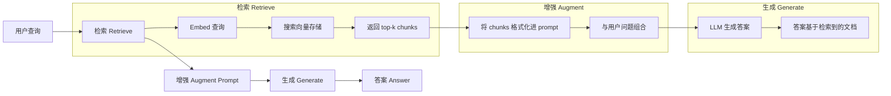
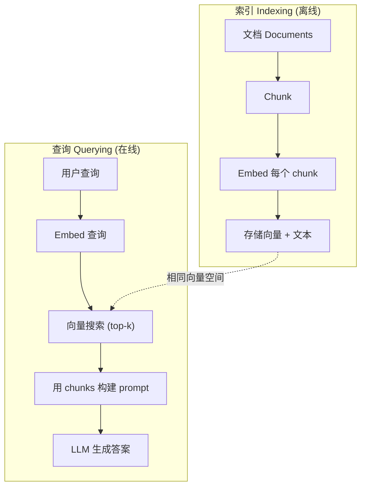

# RAG（检索增强生成）

> 你的 LLM 知道训练截止日期之前的一切。但它对你的公司文档、你的代码库或上周的会议记录一无所知。RAG 通过检索相关文档并将它们塞进 prompt 来解决这个问题。这是生产级 AI 中部署最广泛的模式。如果要从本课程中只构建一样东西，那就构建一个 RAG 流水线。

**类型：** 构建
**语言：** Python
**前置要求：** 第 10 阶段（从头构建 LLM），第 11 阶段第 01-05 课
**时间：** 约 90 分钟
**相关：** 第 5 阶段 · 第 23 课（RAG 的 Chunking 策略）涵盖六种 chunking 算法及其各自的适用场景。第 5 阶段 · 第 22 课（Embedding 模型深度解析）用于选择 embedder。第 11 阶段 · 第 07 课（Advanced RAG）涵盖混合搜索、reranking 和查询转换。

## 学习目标

- 构建完整的 RAG 流水线：文档加载、chunking、embedding、向量存储、检索和生成
- 使用向量数据库（ChromaDB、FAISS 或 Pinecone）并进行正确的索引来实现语义搜索
- 解释为什么 RAG 比微调更适合知识密集型应用（成本、时效性、可归因性）
- 使用检索指标（precision, recall）和生成指标（faithfulness, relevance）评估 RAG 质量

## 问题

你为公司构建了一个聊天机器人。客户问"企业计划的退款政策是什么？"LLM 回答了一个关于典型 SaaS 退款政策的通用答案。而实际的政策埋在一份 200 页的内部 wiki 中，规定企业客户有 60 天的窗口期，支持按比例退款。LLM 从未见过这份文档。它无法知道没有被训练过的内容。

微调是一种解决方案。拿 LLM 来，在内部文档上训练它，然后部署更新后的模型。这可以工作，但有严重问题。微调每次训练需要数千美元的计算成本。模型在文档发生变化的那一刻就过时了。你无法知道模型引用了哪个来源。而且如果公司下个月收购了另一个产品线，你还得再次微调。

RAG 是另一种解决方案。保持模型不变。当有提问时，在文档存储中搜索相关段落，将它们粘贴到问题之前的 prompt 中，然后让模型使用这些段落作为上下文来回答。文档存储可以在几分钟内更新。你可以看到究竟检索了哪些文档。模型本身从未改变。这就是为什么 RAG 是生产中的主导模式：它更便宜、更新、更可审计，并且适用于任何 LLM。

## 概念

### RAG 模式

整个模式可以归纳为四个步骤：



查询 -> 检索 -> 增强 prompt -> 生成。每个 RAG 系统都遵循此模式。不同生产级 RAG 系统之间的差异在于每个步骤的细节：如何做 chunking、如何做 embedding、如何搜索、以及如何构建 prompt。

### 为什么 RAG 优于微调

| 关注点 | 微调 | RAG |
|---------|------------|-----|
| 成本 | 每次训练 $1,000-$100,000+ | 每次查询 $0.01-$0.10（embedding + LLM） |
| 时效性 | 重新训练前一直过时 | 通过重新索引文档在几分钟内更新 |
| 可审计性 | 无法追溯答案到来源 | 可以显示精确检索到的段落 |
| 幻觉（Hallucination） | 仍然自由地产生幻觉 | 基于检索到的文档 |
| 数据隐私 | 训练数据被烘焙进权重 | 文档保留在你自己的向量存储中 |

微调永久地改变模型的权重。RAG 临时地改变模型的上下文。对于大多数应用来说，临时上下文正是你想要的。

微调胜出的唯一场景：当你需要模型采用特定的风格、语气或推理模式，而这种效果无法仅通过 prompting 达到时。对于事实性知识检索，RAG 每次都赢。

### Embedding 模型

Embedding 模型将文本转换为稠密向量。相似文本在这个高维空间中产生彼此接近的向量。"How do I reset my password?"和"I need to change my password"产生几乎相同的向量，尽管共享的词语很少。"The cat sat on the mat"产生一个非常不同的向量。

常见 embedding 模型（2026 年阵容——完整分析见第 5 阶段 · 第 22 课）：

| 模型 | 维度 | 提供商 | 备注 |
|-------|-----------|----------|-------|
| text-embedding-3-small | 1536 (Matryoshka) | OpenAI | 大多数用例中性价比最佳 |
| text-embedding-3-large | 3072 (Matryoshka) | OpenAI | 精度更高，可截断到 256/512/1024 |
| Gemini Embedding 2 | 3072 (Matryoshka) | Google | MTEB 检索最佳；8K 上下文 |
| voyage-4 | 1024/2048 (Matryoshka) | Voyage AI | 领域变体（代码、金融、法律） |
| Cohere embed-v4 | 1024 (Matryoshka) | Cohere | 多语言能力强，128K 上下文 |
| BGE-M3 | 1024 (dense + sparse + ColBERT) | BAAI (open-weight) | 一个模型三种视图 |
| Qwen3-Embedding | 4096 (Matryoshka) | Alibaba (open-weight) | 开源权重中检索得分最高 |
| all-MiniLM-L6-v2 | 384 | Open-weight (Sentence Transformers) | 原型开发基线 |

在本课中，我们使用 TF-IDF 构建自己的简单 embedding。不是因为 TF-IDF 是生产系统使用的东西，而是因为它使概念具体化：文本进去，向量出来，相似文本产生相似向量。

### 向量相似度

给定两个向量，如何衡量相似度？三种选择：

**余弦相似度（Cosine similarity）**：两个向量之间夹角的余弦值。范围从 -1（完全相反）到 1（完全相同）。忽略幅度，只关心方向。这是 RAG 的默认选择。

```
cosine_sim(a, b) = dot(a, b) / (||a|| * ||b||)
```

**点积（Dot product）**：原始内积。更大的向量获得更高分数。当幅度携带信息时有用（更长的文档可能更相关）。

```
dot(a, b) = sum(a_i * b_i)
```

**L2（欧几里得）距离**：向量空间中的直线距离。距离越小 = 越相似。对幅度差异敏感。

```
L2(a, b) = sqrt(sum((a_i - b_i)^2))
```

余弦相似度是标准。它通过用幅度进行归一化，优雅地处理不同长度的文档。当人们说"向量搜索"时，他们几乎总是指余弦相似度。

### Chunking 策略

文档太长，无法作为单个向量进行 embedding。一个 50 页的 PDF 可能产生糟糕的 embedding，因为它包含了几十个主题。相反，你将文档拆分成 chunk，并对每个 chunk 分别进行 embedding。

**固定大小 chunking**：每 N 个 token 切分一次。简单且可预测。512 token 的 chunk、50 token 重叠意味着 chunk 1 是 token 0-511，chunk 2 是 token 462-973，以此类推。重叠确保你不会在不幸的边界处切断句子。

**语义 chunking**：在自然边界处拆分。段落、章节或 markdown 标题。每个 chunk 是一个连贯的意义单元。实现更复杂，但产生更好的检索效果。

**递归 chunking**：首先尝试在最大边界处拆分（章节标题）。如果一个章节仍然太大，在段落边界处拆分。如果一个段落仍然太大，在句子边界处拆分。这就是 LangChain RecursiveCharacterTextSplitter 的方法，在实践中效果很好。

Chunk 大小比人们以为的更重要：

- 太小（64-128 token）：每个 chunk 缺乏上下文。"上季度增长了 15%"如果没有上下文说明"它"指什么，就毫无意义。
- 太大（2048+ token）：每个 chunk 涵盖多个主题，稀释了相关性。当你搜索收入数据时，你会得到一个 10% 关于收入、90% 关于员工人数的 chunk。
- 甜点区间（256-512 token）：有足够的上下文来做到自包含，又足够聚焦以保证相关性。

大多数生产级 RAG 系统使用 256-512 token 的 chunk，带有 50 token 的重叠。Anthropic 的 RAG 指南推荐这个范围。

### 向量数据库

一旦有了 embedding，你需要一个地方来存储和搜索它们。选项：

| 数据库 | 类型 | 最适合 |
|----------|------|----------|
| FAISS | 库（进程内） | 原型开发、小型到中型数据集 |
| Chroma | 轻量级数据库 | 本地开发、小型部署 |
| Pinecone | 托管服务 | 无需运维负担的生产环境 |
| Weaviate | 开源数据库 | 自托管生产环境 |
| pgvector | Postgres 扩展 | 已经在使用 Postgres |
| Qdrant | 开源数据库 | 高性能自托管 |

在本课中，我们构建一个简单的内存向量存储。它将向量存储在一个列表中，执行暴力余弦相似度搜索。这相当于使用平坦索引（flat index）的 FAISS。它可以扩展到大约 100,000 个向量，超过之后会变慢。生产系统使用近似最近邻（ANN）算法，如 HNSW，在毫秒内搜索数百万个向量。

### 完整流水线



索引阶段每个文档运行一次（或在文档更新时运行）。查询阶段在每个用户请求时运行。在生产环境中，索引可能花费数小时处理数百万个文档，而查询必须在亚秒内响应。

### 实际数字

大多数生产级 RAG 系统使用以下参数：

- **k = 5 到 10** 个每次查询检索的 chunk
- **Chunk 大小 = 256 到 512 token**，带有 50 token 的重叠
- **上下文预算**：每次查询 2,500-5,000 token 的检索内容
- **总 prompt**：约 8,000-16,000 token（系统 prompt + 检索到的 chunk + 对话历史 + 用户查询）
- **Embedding 维度**：384-3072，取决于模型
- **索引吞吐量**：使用 API embedding 每秒 100-1,000 个文档
- **查询延迟**：检索 50-200ms，生成 500-3000ms

## 构建

### 第 1 步：文档 Chunking

```python
def chunk_text(text, chunk_size=200, overlap=50):
    words = text.split()
    chunks = []
    start = 0
    while start < len(words):
        end = start + chunk_size
        chunk = " ".join(words[start:end])
        chunks.append(chunk)
        start += chunk_size - overlap
    return chunks
```

### 第 2 步：TF-IDF Embedding

我们构建一个简单的 embedding 函数。TF-IDF（词频-逆文档频率）不是神经网络 embedding，但它以一种捕捉词语重要性的方式将文本转换为向量。文档中的高频词获得更高的 TF。语料库中的罕见词获得更高的 IDF。二者的乘积给出一个向量，其中重要的、有区分度的词具有较高的值。

```python
import math
from collections import Counter

def build_vocabulary(documents):
    vocab = set()
    for doc in documents:
        vocab.update(doc.lower().split())
    return sorted(vocab)

def compute_tf(text, vocab):
    words = text.lower().split()
    count = Counter(words)
    total = len(words)
    return [count.get(word, 0) / total for word in vocab]

def compute_idf(documents, vocab):
    n = len(documents)
    idf = []
    for word in vocab:
        doc_count = sum(1 for doc in documents if word in doc.lower().split())
        idf.append(math.log((n + 1) / (doc_count + 1)) + 1)
    return idf

def tfidf_embed(text, vocab, idf):
    tf = compute_tf(text, vocab)
    return [t * i for t, i in zip(tf, idf)]
```

### 第 3 步：余弦相似度搜索

```python
def cosine_similarity(a, b):
    dot = sum(x * y for x, y in zip(a, b))
    norm_a = math.sqrt(sum(x * x for x in a))
    norm_b = math.sqrt(sum(x * x for x in b))
    if norm_a == 0 or norm_b == 0:
        return 0.0
    return dot / (norm_a * norm_b)

def search(query_embedding, stored_embeddings, top_k=5):
    scores = []
    for i, emb in enumerate(stored_embeddings):
        sim = cosine_similarity(query_embedding, emb)
        scores.append((i, sim))
    scores.sort(key=lambda x: x[1], reverse=True)
    return scores[:top_k]
```

### 第 4 步：Prompt 构建

这就是 RAG 中"增强"（augmented）发生的地方。将检索到的 chunk 格式化到 prompt 中，要求 LLM 基于提供的上下文进行回答。

```python
def build_rag_prompt(query, retrieved_chunks):
    context = "\n\n---\n\n".join(
        f"[Source {i+1}]\n{chunk}"
        for i, chunk in enumerate(retrieved_chunks)
    )
    return f"""Answer the question based ONLY on the following context.
If the context doesn't contain enough information, say "I don't have enough information to answer that."

Context:
{context}

Question: {query}

Answer:"""
```

### 第 5 步：完整的 RAG 流水线

```python
class RAGPipeline:
    def __init__(self):
        self.chunks = []
        self.embeddings = []
        self.vocab = []
        self.idf = []

    def index(self, documents):
        all_chunks = []
        for doc in documents:
            all_chunks.extend(chunk_text(doc))
        self.chunks = all_chunks
        self.vocab = build_vocabulary(all_chunks)
        self.idf = compute_idf(all_chunks, self.vocab)
        self.embeddings = [
            tfidf_embed(chunk, self.vocab, self.idf)
            for chunk in all_chunks
        ]

    def query(self, question, top_k=5):
        query_emb = tfidf_embed(question, self.vocab, self.idf)
        results = search(query_emb, self.embeddings, top_k)
        retrieved = [(self.chunks[i], score) for i, score in results]
        prompt = build_rag_prompt(
            question, [chunk for chunk, _ in retrieved]
        )
        return prompt, retrieved
```

### 第 6 步：生成（模拟）

在生产环境中，这里是调用 LLM API 的地方。在本课中，我们通过从检索到的上下文中提取最相关的句子来模拟生成。

```python
def simple_generate(prompt, retrieved_chunks):
    query_words = set(prompt.lower().split("question:")[-1].split())
    best_sentence = ""
    best_score = 0
    for chunk in retrieved_chunks:
        for sentence in chunk.split("."):
            sentence = sentence.strip()
            if not sentence:
                continue
            words = set(sentence.lower().split())
            overlap = len(query_words & words)
            if overlap > best_score:
                best_score = overlap
                best_sentence = sentence
    return best_sentence if best_sentence else "I don't have enough information."
```

## 使用

使用真实的 embedding 模型和 LLM，代码几乎没有变化：

```python
from openai import OpenAI

client = OpenAI()

def embed(text):
    response = client.embeddings.create(
        model="text-embedding-3-small",
        input=text
    )
    return response.data[0].embedding

def generate(prompt):
    response = client.chat.completions.create(
        model="gpt-4o-mini",
        messages=[{"role": "user", "content": prompt}],
        temperature=0
    )
    return response.choices[0].message.content
```

或者使用 Anthropic：

```python
import anthropic

client = anthropic.Anthropic()

def generate(prompt):
    response = client.messages.create(
        model="claude-sonnet-4-20250514",
        max_tokens=1024,
        messages=[{"role": "user", "content": prompt}]
    )
    return response.content[0].text
```

流水线保持相同。替换 embedding 函数。替换生成函数。检索逻辑、chunking、prompt 构建——无论使用什么模型，所有这些都完全相同。

对于大规模向量存储，将暴力搜索替换为真正的向量数据库：

```python
import chromadb

client = chromadb.Client()
collection = client.create_collection("my_docs")

collection.add(
    documents=chunks,
    ids=[f"chunk_{i}" for i in range(len(chunks))]
)

results = collection.query(
    query_texts=["What is the refund policy?"],
    n_results=5
)
```

Chroma 在内部处理 embedding（默认使用 all-MiniLM-L6-v2），并将向量存储在本地数据库中。相同的模式，不同的底层实现。

## 交付

本课产出：
- `outputs/prompt-rag-architect.md` —— 用于为特定用例设计 RAG 系统的 prompt
- `outputs/skill-rag-pipeline.md` —— 教授 agent 如何构建和调试 RAG 流水线的技能

## 练习

1. 用一个简单的 bag-of-words 方法（二元：词出现为 1，不出现为 0）替换 TF-IDF embedding。在示例文档上比较检索质量。TF-IDF 应该优于 bag-of-words，因为它对罕见词赋予更高的权重。

2. 实验 chunk 大小：在相同的文档集上尝试 50、100、200 和 500 个词。对每种大小运行相同的 5 个查询，计算有多少查询在 top-3 中返回了相关的 chunk。找到检索质量达到峰值的甜点区间。

3. 为每个 chunk 添加元数据（源文档名称、chunk 位置）。修改 prompt 模板以包含来源归因，使 LLM 引用其来源。

4. 实现一个简单的评估：给定 10 个问答对，将每个问题通过 RAG 流水线运行，衡量检索到的 chunk 中包含答案的比例。这就是检索召回率 Recall@k。

5. 构建一个对话感知的 RAG 流水线：维护最近 3 轮交换的历史记录，并将它们与检索到的 chunk 一起包含在 prompt 中。用追问问题（如在询问定价后问"那企业版呢？"）进行测试。

## 关键术语

| 术语 | 人们的说法 | 实际含义 |
|------|----------------|----------------------|
| RAG | "能读你文档的 AI" | 检索相关文档，将其粘贴到 prompt 中，生成基于这些文档的答案 |
| Embedding | "将文本转换为数字" | 文本的稠密向量表示，其中相似的含义产生相似的向量 |
| 向量数据库 | "AI 的搜索引擎" | 为存储向量和按相似度查找最近邻而优化的数据存储 |
| Chunking | "将文档拆成片段" | 将文档拆分为较小的片段（通常 256-512 token），使每个片段可以独立进行 embedding 和检索 |
| 余弦相似度 | "两个向量有多相似" | 两个向量之间夹角的余弦值；1 = 相同方向，0 = 正交，-1 = 完全相反 |
| Top-k 检索 | "获取 k 个最佳匹配" | 从向量存储中返回与查询最相似的 k 个 chunk |
| 上下文窗口 | "LLM 能看到多少文本" | LLM 在单次请求中能处理的最大 token 数；检索到的 chunk 必须适应该窗口 |
| 增强生成 | "使用给定上下文回答" | 使用检索到的文档作为上下文生成回答，而非仅仅依赖训练学到的知识 |
| TF-IDF | "词重要性评分" | 词频乘以逆文档频率；根据词在语料库中的区分度进行加权 |
| 索引 | "为搜索准备文档" | Chunking、embedding 和存储文档的离线过程，使其能够在查询时被搜索 |

## 拓展阅读

- Lewis et al., "Retrieval-Augmented Generation for Knowledge-Intensive NLP Tasks" (2020) —— 来自 Facebook AI Research 的原始 RAG 论文，形式化了检索-然后-生成的模式
- Anthropic 的 RAG 文档 (docs.anthropic.com) —— 关于 chunk 大小、prompt 构建和评估的实用指南
- Pinecone Learning Center, "What is RAG?" —— 关于 RAG 流水线的清晰可视化解释，包含生产级考虑因素
- Sentence-BERT: Reimers & Gurevych (2019) —— all-MiniLM embedding 模型背后的论文，展示如何为语义相似度训练 bi-encoder
- [Karpukhin et al., "Dense Passage Retrieval for Open-Domain Question Answering" (EMNLP 2020)](https://arxiv.org/abs/2004.04906) —— DPR 论文，证明稠密 bi-encoder 检索在开放域问答上优于 BM25，为现代 RAG 检索器奠定了基础。
- [LlamaIndex 高级概念](https://docs.llamaindex.ai/en/stable/getting_started/concepts.html) —— 构建 RAG 流水线时需要了解的主要概念：数据加载器、节点解析器、索引、检索器、响应合成器。
- [LangChain RAG 教程](https://python.langchain.com/docs/tutorials/rag/) —— 另一个方向的编排器；以 chain-of-runnables 的视角展示相同的检索-然后-生成模式。
