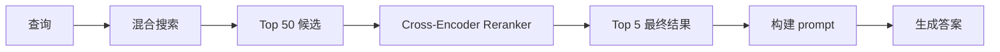
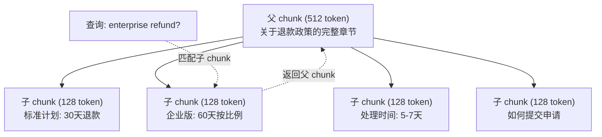
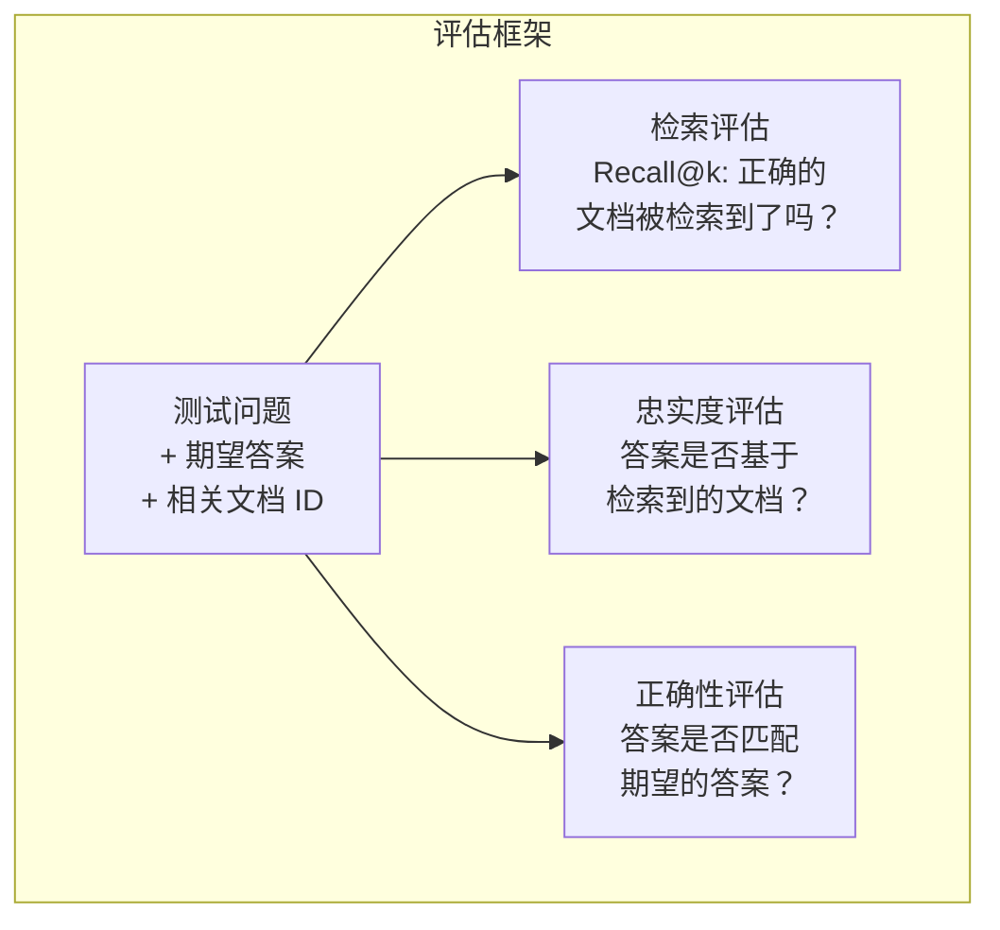

# Advanced RAG（Chunking, Reranking, 混合搜索）

> 基本 RAG 检索 top-k 个最相似的 chunk。这对简单问题有效。但对于多跳推理、模糊查询和大规模语料库就会崩溃。Advanced RAG 是让一个在 10 个文档上可用的 demo 和一个在 1000 万个文档上可用的系统之间的区别。

**类型：** 构建
**语言：** Python
**前置要求：** 第 11 阶段，第 06 课（RAG）
**时间：** 约 90 分钟
**相关：** 第 5 阶段 · 第 23 课（RAG 的 Chunking 策略）涵盖全部六种 chunking 算法——递归、语义、句子、父文档、延迟 chunking、上下文检索——附 Vectara/Anthropic 基准。本课在此基础上构建：混合搜索、reranking、查询转换。

## 学习目标

- 实现高级 chunking 策略（语义、递归、父-子模式），以保留文档结构和上下文
- 构建混合搜索流水线，将 BM25 关键词匹配与语义向量搜索以及 cross-encoder reranker 相结合
- 应用查询转换技术（HyDE、multi-query、step-back）来改进对模糊或复杂问题的检索
- 诊断和修复常见的 RAG 失败：检索到错误的 chunk、答案不在上下文中、多跳推理崩溃

## 问题

你在第 06 课中构建了一个基本 RAG 流水线。它对小规模语料库上的直接问题有效。现在尝试这些问题：

**模糊查询**："What was revenue last quarter?"（上季度收入是多少？）语义搜索返回关于收入战略、收入预测和 CFO 对收入增长看法的 chunk。所有这些在语义上都与"revenue"一词相似，但都不包含实际数字。正确的 chunk 写着"$47.2M in Q3 2025"，但用的是"earnings"（盈利）而非"revenue"（收入）这个词。embedding 模型认为"revenue strategy"（收入战略）比"Q3 earnings were $47.2M"更接近查询。

**多跳问题**："Which team had the highest customer satisfaction score improvement?"（哪个团队的客户满意度分数提升最大？）这需要找到每个团队的满意度分数，比较它们，并识别最大值。没有一个单一的 chunk 包含答案。信息分散在团队报告中。

**大规模语料库问题**：你有 200 万个 chunk。正确答案在 chunk #1,847,293 中。你的 top-5 检索返回 chunk #14、#89,201、#1,200,000、#44 和 #901,333。在 embedding 空间中很近，但没有一个包含答案。在这种规模下，近似最近邻搜索引入的误差足以将相关结果挤出 top-k。

基本 RAG 失败的原因在于：向量相似度并不等同于相关性。一个 chunk 可能在语义上与查询相似，但对回答查询并无帮助。Advanced RAG 通过四种技术来解决这个问题：混合搜索（加入关键词匹配）、reranking（更仔细地评分候选）、查询转换（搜索前先修正查询）以及更好的 chunking（以合适的粒度检索）。

## 概念

### 混合搜索：语义 + 关键词

语义搜索（向量相似度）擅长理解含义。"How do I cancel my subscription?"能匹配到"Steps to terminate your plan"，尽管它们没有共享任何词。但它会错过精确匹配。"Error code E-4021"可能无法匹配到包含"E-4021"的 chunk，如果 embedding 模型把它当作噪声处理的话。

关键词搜索（BM25）恰恰相反。它擅长精确匹配。"E-4021"完美匹配。但如果文档说的是"terminate your plan"，"cancel my subscription"就返回零结果。

混合搜索两者都运行，然后合并结果。

**BM25**（Best Matching 25）是标准的关键词搜索算法。自 1990 年代以来，它一直是搜索引擎的基石。公式如下：

```
BM25(q, d) = sum over terms t in q:
    IDF(t) * (tf(t,d) * (k1 + 1)) / (tf(t,d) + k1 * (1 - b + b * |d| / avgdl))
```

其中 tf(t,d) 是词项 t 在文档 d 中的词频，IDF(t) 是逆文档频率，|d| 是文档长度，avgdl 是平均文档长度，k1 控制词频饱和（默认 1.2），b 控制长度归一化（默认 0.75）。

通俗来说：当文档包含查询词（尤其是罕见词）时，BM25 给它更高的分数，但对重复词项有边际递减效应。一个包含 50 次"revenue"一词的文档，其相关性并非包含 1 次的文档的 50 倍。

### 倒数排名融合（RRF）

你有两个排序列表：一个来自向量搜索，一个来自 BM25。如何将它们合并？倒数排名融合（Reciprocal Rank Fusion）是标准方法。

```
RRF_score(d) = sum over rankings R:
    1 / (k + rank_R(d))
```

其中 k 是一个常数（通常为 60），用于防止排名第一的结果占据绝对主导地位。

一个在向量搜索中排名 #1、在 BM25 中排名 #5 的文档得分为：1/(60+1) + 1/(60+5) = 0.0164 + 0.0154 = 0.0318

一个在向量搜索中排名 #3、在 BM25 中排名 #2 的文档得分为：1/(60+3) + 1/(60+2) = 0.0159 + 0.0161 = 0.0320

RRF 自然地平衡两种信号。在两个列表中都排名靠前的文档获得最佳分数。在一个列表中排名 #1 但在另一个列表中不存在的文档获得中等分数。这种方法很鲁棒，因为它使用排名而非原始分数，因此两个系统之间分数分布的差异无关紧要。

### Reranking

检索（无论是向量、关键词还是混合）速度快但不精确。它使用 bi-encoder：查询和每个文档独立进行 embedding，然后比较。Embedding 只需计算一次并缓存。这可以扩展到数百万个文档。

Reranking 使用 cross-encoder：查询和一个候选文档一起被送入模型，模型输出相关性分数。模型同时看到两个文本，可以捕捉它们之间的细粒度交互。即使 bi-encoder 错过了连接，cross-encoder 也能理解"What were Q3 earnings?"与包含"$47.2M in Q3"的 chunk 高度相关。

权衡：cross-encoder 比 bi-encoder 慢 100-1000 倍，因为它将查询-文档对作为整体处理。你无法为 100 万个文档预计算 cross-encoder 分数。解决方案：检索一个更大的候选集（混合搜索的 top-50），然后用 cross-encoder 进行 rerank 得到最终的 top-5。



常见 reranking 模型（2026 年阵容）：
- Cohere Rerank 3.5：托管 API，多语言，在混合语料上召回增益最佳
- Voyage rerank-2.5：托管 API，托管选项中延迟最低
- Jina-Reranker-v2 Multilingual：开源权重，100+ 语言
- bge-reranker-v2-m3：开源权重，强大的基线
- cross-encoder/ms-marco-MiniLM-L-6-v2：开源权重，可在 CPU 上运行为原型使用
- ColBERTv2 / Jina-ColBERT-v2：延迟交互多向量 reranker——评分时 O(tokens) 而非 O(docs)

### 查询转换

有时候问题不在于检索，而在于查询本身。"What was that thing about the new policy change?"（那个关于新政策变更的东西是什么？）是一个非常糟糕的搜索查询。它不包含任何具体词项。Embedding 是模糊的。没有任何检索系统能从中找到正确的文档。

**查询改写（Query rewriting）**：将用户的查询改写为更好的搜索查询。LLM 可以做到这一点：

```
User: "What was that thing about the new policy change?"
Rewritten: "Recent policy changes and updates"
```

**HyDE（Hypothetical Document Embeddings，假设文档 Embedding）**：不直接用查询搜索，而是生成一个假设答案，将其进行 embedding，然后搜索相似的真实文档。

```
Query: "What is the refund policy for enterprise?"
Hypothetical answer: "Enterprise customers are eligible for a full refund
within 60 days of purchase. Refunds are pro-rated based on the remaining
subscription period and processed within 5-7 business days."
```

将假设答案进行 embedding，然后搜索与之相似的真实文档。直觉：假设答案在 embedding 空间中比原始问题更接近真实答案。问题和答案有不同的语言结构。通过生成假设答案，你弥合了 embedding 中"问题空间"和"答案空间"之间的差距。

HyDE 在检索之前增加了一次 LLM 调用。这会使延迟增加 500-2000ms。当在原始查询上检索质量很差时，这是值得的。

### 父-子 Chunking

标准 chunking 强加了一种权衡：小 chunk 用于精确检索，大 chunk 用于充足的上下文。父-子 chunking 消除了这种权衡。

索引小 chunk（128 token）用于检索。当一个小 chunk 被检索到时，返回其父 chunk（512 token）用于 prompt。小 chunk 精确匹配查询。父 chunk 提供足够的上下文让 LLM 生成好的答案。



查询"enterprise refund?"精确匹配子 chunk C2。但 prompt 收到的是完整的父 chunk P，其中包含有关处理时间和提交流程的周围上下文。

### 元数据过滤

在执行向量搜索之前，按元数据过滤语料库：日期、来源、类别、作者、语言。这缩小了搜索空间并防止不相干的结果。

"上个月安全政策发生了什么变化？"应该只搜索过去 30 天内安全类别的文档。没有元数据过滤，你会搜索整个语料库，可能检索到一个碰巧在语义上相似的 2 年前的安全文档。

生产级 RAG 系统在每个 chunk 旁边存储元数据：来源文档、创建日期、类别、作者、版本。向量数据库支持在相似度搜索之前按元数据预过滤，这对大规模性能至关重要。

### 评估

你构建了一个 RAG 系统。你怎么知道它是否好用？三个指标：

**检索相关性（Recall@k）**：对于一组带有已知相关文档的测试问题，相关文档出现在 top-k 结果中的比例是多少？如果某个问题的答案在 chunk #47 中，chunk #47 是否出现在 top-5 中？

**忠实度（Faithfulness）**：生成的答案是否基于检索到的文档？如果检索到的 chunk 说"60 天退款窗口"而模型说"90 天退款窗口"，那就是忠实度失败。尽管模型有正确的上下文，仍然产生了幻觉。

**答案正确性（Answer correctness）**：生成的答案是否匹配期望的答案？这是端到端的指标。它综合了检索质量和生成质量。

一个简单的忠实度检查：取生成答案中的每个断言，验证它（在实质上）是否出现在检索到的 chunk 中。如果答案包含一个不在任何检索到的 chunk 中的事实，那很可能是幻觉。



## 构建

### 第 1 步：BM25 实现

```python
import math
from collections import Counter

class BM25:
    def __init__(self, k1=1.2, b=0.75):
        self.k1 = k1
        self.b = b
        self.docs = []
        self.doc_lengths = []
        self.avg_dl = 0
        self.doc_freqs = {}
        self.n_docs = 0

    def index(self, documents):
        self.docs = documents
        self.n_docs = len(documents)
        self.doc_lengths = []
        self.doc_freqs = {}

        for doc in documents:
            words = doc.lower().split()
            self.doc_lengths.append(len(words))
            unique_words = set(words)
            for word in unique_words:
                self.doc_freqs[word] = self.doc_freqs.get(word, 0) + 1

        self.avg_dl = sum(self.doc_lengths) / self.n_docs if self.n_docs else 1

    def score(self, query, doc_idx):
        query_words = query.lower().split()
        doc_words = self.docs[doc_idx].lower().split()
        doc_len = self.doc_lengths[doc_idx]
        word_counts = Counter(doc_words)
        score = 0.0

        for term in query_words:
            if term not in word_counts:
                continue
            tf = word_counts[term]
            df = self.doc_freqs.get(term, 0)
            idf = math.log((self.n_docs - df + 0.5) / (df + 0.5) + 1)
            numerator = tf * (self.k1 + 1)
            denominator = tf + self.k1 * (1 - self.b + self.b * doc_len / self.avg_dl)
            score += idf * numerator / denominator

        return score

    def search(self, query, top_k=10):
        scores = [(i, self.score(query, i)) for i in range(self.n_docs)]
        scores.sort(key=lambda x: x[1], reverse=True)
        return scores[:top_k]
```

### 第 2 步：倒数排名融合

```python
def reciprocal_rank_fusion(ranked_lists, k=60):
    scores = {}
    for ranked_list in ranked_lists:
        for rank, (doc_id, _) in enumerate(ranked_list):
            if doc_id not in scores:
                scores[doc_id] = 0.0
            scores[doc_id] += 1.0 / (k + rank + 1)
    fused = sorted(scores.items(), key=lambda x: x[1], reverse=True)
    return fused
```

### 第 3 步：混合搜索流水线

```python
def hybrid_search(query, chunks, vector_embeddings, vocab, idf, bm25_index, top_k=5, fusion_k=60):
    query_emb = tfidf_embed(query, vocab, idf)
    vector_results = search(query_emb, vector_embeddings, top_k=top_k * 3)
    bm25_results = bm25_index.search(query, top_k=top_k * 3)
    fused = reciprocal_rank_fusion([vector_results, bm25_results], k=fusion_k)
    return fused[:top_k]
```

### 第 4 步：简单 Reranker

在生产环境中，你会使用 cross-encoder 模型。在此我们构建一个 reranker，使用词重叠、词项重要性和短语匹配来评分查询-文档相关性。

```python
def rerank(query, candidates, chunks):
    query_words = set(query.lower().split())
    stop_words = {"the", "a", "an", "is", "are", "was", "were", "what", "how",
                  "why", "when", "where", "do", "does", "for", "of", "in", "to",
                  "and", "or", "on", "at", "by", "it", "its", "this", "that",
                  "with", "from", "be", "has", "have", "had", "not", "but"}
    query_terms = query_words - stop_words

    scored = []
    for doc_id, initial_score in candidates:
        chunk = chunks[doc_id].lower()
        chunk_words = set(chunk.split())

        term_overlap = len(query_terms & chunk_words)

        query_bigrams = set()
        q_list = [w for w in query.lower().split() if w not in stop_words]
        for i in range(len(q_list) - 1):
            query_bigrams.add(q_list[i] + " " + q_list[i + 1])
        bigram_matches = sum(1 for bg in query_bigrams if bg in chunk)

        position_boost = 0
        for term in query_terms:
            pos = chunk.find(term)
            if pos != -1 and pos < len(chunk) // 3:
                position_boost += 0.5

        rerank_score = (
            term_overlap * 1.0
            + bigram_matches * 2.0
            + position_boost
            + initial_score * 5.0
        )
        scored.append((doc_id, rerank_score))

    scored.sort(key=lambda x: x[1], reverse=True)
    return scored
```

### 第 5 步：HyDE（假设文档 Embedding）

```python
def hyde_generate_hypothesis(query):
    templates = {
        "what": "The answer to '{query}' is as follows: Based on our documentation, {topic} involves specific policies and procedures that define how the process works.",
        "how": "To address '{query}': The process involves several steps. First, you need to initiate the request. Then, the system processes it according to the defined rules.",
        "default": "Regarding '{query}': Our records indicate specific details and policies related to this topic that provide a comprehensive answer."
    }
    query_lower = query.lower()
    if query_lower.startswith("what"):
        template = templates["what"]
    elif query_lower.startswith("how"):
        template = templates["how"]
    else:
        template = templates["default"]

    topic_words = [w for w in query.lower().split()
                   if w not in {"what", "is", "the", "how", "do", "does", "a", "an",
                                "for", "of", "to", "in", "on", "at", "by", "and", "or"}]
    topic = " ".join(topic_words) if topic_words else "this topic"

    return template.format(query=query, topic=topic)


def hyde_search(query, chunks, vector_embeddings, vocab, idf, top_k=5):
    hypothesis = hyde_generate_hypothesis(query)
    hypothesis_emb = tfidf_embed(hypothesis, vocab, idf)
    results = search(hypothesis_emb, vector_embeddings, top_k)
    return results, hypothesis
```

### 第 6 步：父-子 Chunking

```python
def create_parent_child_chunks(text, parent_size=200, child_size=50):
    words = text.split()
    parents = []
    children = []
    child_to_parent = {}

    parent_idx = 0
    start = 0
    while start < len(words):
        parent_end = min(start + parent_size, len(words))
        parent_text = " ".join(words[start:parent_end])
        parents.append(parent_text)

        child_start = start
        while child_start < parent_end:
            child_end = min(child_start + child_size, parent_end)
            child_text = " ".join(words[child_start:child_end])
            child_idx = len(children)
            children.append(child_text)
            child_to_parent[child_idx] = parent_idx
            child_start += child_size

        parent_idx += 1
        start += parent_size

    return parents, children, child_to_parent
```

### 第 7 步：忠实度评估

```python
def evaluate_faithfulness(answer, retrieved_chunks):
    answer_sentences = [s.strip() for s in answer.split(".") if len(s.strip()) > 10]
    if not answer_sentences:
        return 1.0, []

    grounded = 0
    ungrounded = []
    context = " ".join(retrieved_chunks).lower()

    for sentence in answer_sentences:
        words = set(sentence.lower().split())
        stop_words = {"the", "a", "an", "is", "are", "was", "were", "and", "or",
                      "to", "of", "in", "for", "on", "at", "by", "it", "this", "that"}
        content_words = words - stop_words
        if not content_words:
            grounded += 1
            continue

        matched = sum(1 for w in content_words if w in context)
        ratio = matched / len(content_words) if content_words else 0

        if ratio >= 0.5:
            grounded += 1
        else:
            ungrounded.append(sentence)

    score = grounded / len(answer_sentences) if answer_sentences else 1.0
    return score, ungrounded


def evaluate_retrieval_recall(queries_with_relevant, retrieval_fn, k=5):
    total_recall = 0.0
    results = []

    for query, relevant_indices in queries_with_relevant:
        retrieved = retrieval_fn(query, k)
        retrieved_indices = set(idx for idx, _ in retrieved)
        relevant_set = set(relevant_indices)
        hits = len(retrieved_indices & relevant_set)
        recall = hits / len(relevant_set) if relevant_set else 1.0
        total_recall += recall
        results.append({
            "query": query,
            "recall": recall,
            "hits": hits,
            "total_relevant": len(relevant_set)
        })

    avg_recall = total_recall / len(queries_with_relevant) if queries_with_relevant else 0
    return avg_recall, results
```

## 使用

使用真实的 cross-encoder 进行 reranking：

```python
from sentence_transformers import CrossEncoder

reranker = CrossEncoder("cross-encoder/ms-marco-MiniLM-L-6-v2")

def rerank_with_cross_encoder(query, candidates, chunks, top_k=5):
    pairs = [(query, chunks[doc_id]) for doc_id, _ in candidates]
    scores = reranker.predict(pairs)
    scored = list(zip([doc_id for doc_id, _ in candidates], scores))
    scored.sort(key=lambda x: x[1], reverse=True)
    return scored[:top_k]
```

使用 Cohere 的托管 reranker：

```python
import cohere

co = cohere.Client()

def rerank_with_cohere(query, candidates, chunks, top_k=5):
    docs = [chunks[doc_id] for doc_id, _ in candidates]
    response = co.rerank(
        model="rerank-english-v3.0",
        query=query,
        documents=docs,
        top_n=top_k
    )
    return [(candidates[r.index][0], r.relevance_score) for r in response.results]
```

使用真实 LLM 进行 HyDE：

```python
import anthropic

client = anthropic.Anthropic()

def hyde_with_llm(query):
    response = client.messages.create(
        model="claude-sonnet-4-20250514",
        max_tokens=256,
        messages=[{
            "role": "user",
            "content": f"Write a short paragraph that would be a good answer to this question. Do not say you don't know. Just write what the answer would look like.\n\nQuestion: {query}"
        }]
    )
    return response.content[0].text
```

使用 Weaviate 进行生产级混合搜索：

```python
import weaviate

client = weaviate.connect_to_local()

collection = client.collections.get("Documents")
response = collection.query.hybrid(
    query="enterprise refund policy",
    alpha=0.5,
    limit=10
)
```

alpha 参数控制平衡：0.0 = 纯关键词（BM25），1.0 = 纯向量，0.5 = 等权重。大多数生产系统使用 0.3 到 0.7 之间的 alpha。

## 交付

本课产出：
- `outputs/prompt-advanced-rag-debugger.md` —— 用于诊断和修复 RAG 质量问题的 prompt
- `outputs/skill-advanced-rag.md` —— 用于构建带有混合搜索和 reranking 的生产级 RAG 的技能

## 练习

1. 在示例文档上比较 BM25 vs 向量搜索 vs 混合搜索。对于 5 个测试查询中的每一个，记录哪种方法在第一位返回最相关的 chunk。混合搜索应该至少在 5 个中有 3 个胜出。

2. 实现元数据过滤。为每个文档添加一个"category"字段（security, billing, api, product）。在运行向量搜索之前，将 chunk 过滤到只包含相关类别。用"使用了什么加密方式？"进行测试，验证它只搜索 security 类别的 chunk。

3. 使用第 06 课的简单生成函数构建完整的 HyDE 流水线。在所有 5 个测试查询上比较直接查询搜索和 HyDE 搜索的检索质量（top-3 相关性）。对于模糊查询，HyDE 应该改善结果。

4. 在示例文档上实现父-子 chunking 策略。使用 child_size=30 和 parent_size=100。用子 chunk 搜索，但在 prompt 中返回父 chunk。比较生成的答案与 chunk_size=50 的标准 chunking 的效果。

5. 创建一个评估数据集：10 个问题及已知答案 chunk。分别衡量以下方案的 Recall@3、Recall@5 和 Recall@10：(a) 仅向量搜索，(b) 仅 BM25，(c) 混合搜索，(d) 混合搜索 + reranking。绘制结果并识别 reranking 在哪里帮助最大。

## 关键术语

| 术语 | 人们的说法 | 实际含义 |
|------|----------------|----------------------|
| BM25 | "关键词搜索" | 一种概率排序算法，按词频、逆文档频率和文档长度归一化对文档进行评分 |
| 混合搜索 | "两全其美" | 并行运行语义（向量）和关键词（BM25）搜索，然后用排名融合合并结果 |
| 倒数排名融合 | "合并排序列表" | 通过将所有列表中每个文档的 1/(k + rank) 求和来合并多个排序列表 |
| Reranking | "第二轮评分" | 使用更昂贵的 cross-encoder 模型对初次检索的候选集进行重新评分 |
| Cross-encoder | "联合查询-文档模型" | 将查询和文档作为单个输入的模型，产生相关性分数；比 bi-encoder 更精确，但对全语料搜索太慢 |
| Bi-encoder | "独立 embedding 模型" | 独立地将查询和文档进行 embedding 的模型；因 embedding 可预计算而速度快，但不如 cross-encoder 精确 |
| HyDE | "用假答案搜索" | 生成一个针对查询的假设答案，将其进行 embedding，然后搜索与之相似的真实文档 |
| 父-子 chunking | "小搜索，大上下文" | 索引小 chunk 用于精确检索，但返回更大的父 chunk 以提供足够的上下文 |
| 元数据过滤 | "搜索前先缩小范围" | 在运行向量搜索之前按属性（日期、来源、类别）过滤文档，以减少搜索空间 |
| 忠实度 | "它是否保持基于事实" | 生成的答案是否被检索到的文档所支撑，而非从模型的训练数据中幻觉出来 |

## 拓展阅读

- Robertson & Zaragoza, "The Probabilistic Relevance Framework: BM25 and Beyond" (2009) —— BM25 的权威参考文献，解释了公式背后的概率基础
- Cormack et al., "Reciprocal Rank Fusion Outperforms Condorcet and Individual Rank Learning Methods" (2009) —— 原始 RRF 论文，证明它优于更复杂的融合方法
- Gao et al., "Precise Zero-Shot Dense Retrieval without Relevance Labels" (2022) —— HyDE 论文，证明假设文档 embedding 在没有任何训练数据的情况下改善检索效果
- Nogueira & Cho, "Passage Re-ranking with BERT" (2019) —— 证明在 BM25 之上使用 cross-encoder reranking 显著提升检索质量
- [Khattab et al., "DSPy: Compiling Declarative Language Model Calls into Self-Improving Pipelines" (2023)](https://arxiv.org/abs/2310.03714) —— 将 prompt 构建和权重选择视为检索流水线上的优化问题；阅读此论文来了解"编程 LLM"而非"prompt LLM"
- [Edge et al., "From Local to Global: A Graph RAG Approach to Query-Focused Summarization" (Microsoft Research 2024)](https://arxiv.org/abs/2404.16130) —— GraphRAG 论文：实体-关系提取 + Leiden 社区发现用于面向查询的摘要；全局 vs 局部检索的区分
- [Asai et al., "Self-RAG: Learning to Retrieve, Generate, and Critique through Self-Reflection" (ICLR 2024)](https://arxiv.org/abs/2310.11511) —— 带有反思 token 的自评估 RAG；超越静态检索-然后-生成的 agentic 前沿
- [LangChain Query Construction 博客](https://blog.langchain.dev/query-construction/) —— 如何将自然语言查询转换为结构化数据库查询（Text-to-SQL, Cypher）作为预检索步骤
